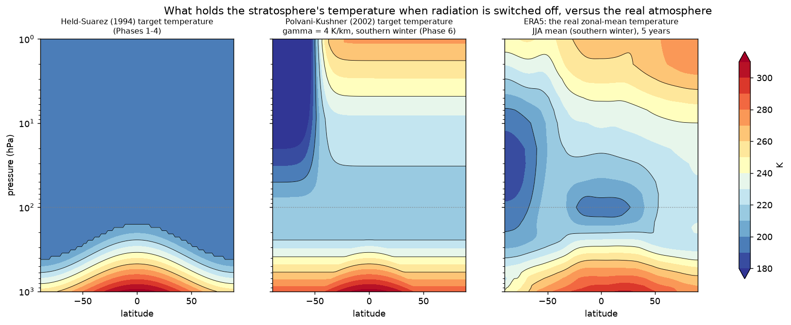

# Held-Suarez, Polvani-Kushner, and full physics: what holds the atmosphere up, in simple words

This note explains the three ways jcm-strat can supply the "physics" of the atmosphere, why we
started with the simplest one, what it cost us, and where the middle option stands. It is written
for someone who knows the atmosphere but not this code. The numbers are from the phase records
under `docs/outputs/`; the figure is made by `scripts/plot_equilibrium_temperature.py`.

## 1. Dynamics versus physics

A climate model has two halves.

- **Dynamics** moves air around: it solves the equations for wind, pressure and temperature on
  the rotating sphere. In jcm-strat this is the Dinosaur semi-Lagrangian dynamical core. It is
  cheap, well understood, and it is what transports our tracers.
- **Physics** is everything that heats, cools, moistens or drags the air without moving it:
  sunlight and infrared radiation, convection (thunderstorms), clouds and rain, turbulence near
  the surface, the exchange with the ocean and land, and the drag of small gravity waves the grid
  cannot see. In a full model these are separate parameterisations, each with its own code,
  inputs and cost.

Physics is what gives the atmosphere its temperature structure: warm surface, cold tropopause,
a stratosphere that warms upward because ozone absorbs sunlight, a very cold winter pole where
no sunlight arrives. Dynamics then converts those temperature contrasts into winds and
circulations, including the two things a stratospheric aerosol model lives on: the polar-night
jet in winter and the slow Brewer-Dobson circulation that lifts air in the tropics and pushes it
poleward and down.

## 2. The trick: replace physics by "pull the temperature towards a target"

If you switch all physics off, the model has nothing to hold its temperature structure and it
decays into something unphysical. The classic shortcut is **Newtonian relaxation**: at every
point, nudge the temperature towards a prescribed target temperature T_eq with a chosen time
scale τ,

    dT/dt = -(T - T_eq) / τ   (plus a simple friction near the surface)

This costs almost nothing, and it does not care about water, ozone, clouds or sunlight. The whole
question is what T_eq looks like. The two named options differ only in that.

*Left: the Held-Suarez target. Middle: the Polvani-Kushner target for a southern-hemisphere
winter. Right: what ERA5 actually shows for the same season. Dotted line at 100 hPa: roughly the
tropopause. Compare the stratospheres above it.*

### Held-Suarez (1994)

Held and Suarez designed T_eq to test the **troposphere** of dynamical cores: warm equator, cold
poles, a realistic decrease of temperature with height, relaxed in 40 days (4 days near the
tropical surface). Above the tropopause they simply did not bother: the target is clamped to a
flat **200 K at every latitude and every height**. There are no seasons.

What that means for the stratosphere (left panel): it is a uniform 200 K block. No warming with
height, no cold winter pole, no warm summer pole, and therefore **no polar-night jet** (winds need
temperature contrasts) and only a weak Brewer-Dobson circulation. It is a perfectly good
troposphere test and a deliberately empty stratosphere.

This is what jcm-strat Phases 1 to 4 ran, chosen because it needs zero new code and gives the
cleanest speed number. The record shows exactly the expected price: 35 K root-mean-square
temperature error against ERA5 between 100 and 1 hPa, 34 K too cold in the tropics at 10 hPa,
a winter wind at 60°N and 10 hPa of −4 m/s where ERA5 has 10 to 35 m/s, and an age of air that
is 1.5 years too old in the tropics because the tropical upwelling is too weak.

### Polvani-Kushner (2002)

Polvani and Kushner kept the Held-Suarez troposphere and replaced the empty stratosphere with two
ingredients (middle panel):

1. **A real-looking vertical profile.** Instead of 200 K everywhere, the target follows the
   US Standard Atmosphere: cold tropopause, then temperature *increasing* with height through the
   stratosphere as ozone heating would produce.
2. **A polar vortex in the winter hemisphere.** Poleward of about 50° in the winter hemisphere the
   target cools with height at a chosen lapse rate γ (2 to 4 K per km). A cold polar cap next to a
   warmer mid-latitude stratosphere is exactly the temperature contrast that drives the
   polar-night jet, so a jet appears, and with it the wave-driven variability the real
   stratosphere has: sudden warmings, a stronger Brewer-Dobson circulation.

Still no water, no clouds, no radiation code, no ozone, no aerosol heating. Still one line of
maths and no measurable extra cost. In the original paper the winter never ends (a perpetual
southern winter); the jcm-strat version (Phase 6, `strat_pk`) adds a calendar so the vortex
forms and decays with the seasons in each hemisphere, fades the vortex cooling out above 3 hPa,
and relaxes the stratosphere in 15 days rather than 40, which is close to the real radiative
damping time there.

What the Phase 6 record shows for this configuration: temperature error against ERA5 down from
35 K to 6.7 K over 100 to 1 hPa; the December to February wind at 60°N and 10 hPa 38 m/s against
ERA5's 38; the southern winter jet within 15 percent; two of the three observed sudden warmings of
2005 to 2009 reproduced within weeks of their dates; age of air at 30 km almost on top of CLaMS.
Two biases remain and are understood: the tropical lower stratosphere is about 10 K too warm
because the standard atmosphere has one tropopause temperature for all latitudes, and the
uppermost levels are off by 10 to 30 K depending on season. Both are properties of the target
profile, and both can be improved by a better target.

### Full physics (ECHAM in JCM)

The real thing: RRTMGP radiation with ozone, water vapour, carbon dioxide and aerosol; Tiedtke
convection; cloud fraction and cloud microphysics; turbulent diffusion; a land and ocean surface
scheme; Hines and orographic gravity-wave drag. Temperature is set by actual heating and cooling
rates, so the stratosphere warms with height, the winter pole cools because it is dark, the summer
pole warms, and the response to an aerosol layer (heating where it sits, cooling below) comes out
of the radiation code instead of being assumed.

The price is cost and complexity. Radiation alone dominates the run time: full ECHAM physics on
our grid runs one simulated year in about 7 to 8 hours on an H100 (about 3 hours when the
radiation is called less often), against 5 to 10 minutes for the two relaxation options. It also
needs a water cycle to be meaningful, so convection and clouds come with it, and it needs
boundary conditions (sea-surface temperature, ozone climatology, emissions) that must be
prepared and can go wrong. In jcm-strat a full-physics reference year under the same ERA5
nudging is being run on the Phase 6 branch precisely to measure what the real radiation buys over
Polvani-Kushner.

## 3. Side by side

| | Held-Suarez | Polvani-Kushner | Full physics (ECHAM) |
|---|---|---|---|
| What sets the stratospheric temperature | a fixed 200 K everywhere | an analytic profile: standard atmosphere plus a cold winter polar cap | radiation with real gases and aerosol |
| Vertical structure above the tropopause | none (isothermal) | warms with height, as observed | warms with height, as observed |
| Polar-night jet | no | yes, strength set by γ and τ | yes, from first principles |
| Seasons | none | added by hand (jcm-strat version) | yes |
| Sudden stratospheric warmings | impossible | yes, some | yes |
| QBO (section 5) | no | no (must be nudged) | only with fine tropical levels and tuned gravity-wave drag |
| Brewer-Dobson circulation | too weak | close to observed | observed |
| Water, clouds, convection | none | none | yes |
| Response of the stratosphere to aerosol heating | none | none (would need a heating term) | yes, from the radiation code |
| Extra inputs needed | none | none | ozone, gases, SST, emissions |
| Cost per simulated year (one H100, T63L95) | about 10 min | about 10 min | 3 to 8 h |
| Error vs ERA5, 100 to 1 hPa, temperature | 35 K | 6.7 K | being measured |
| Where in jcm-strat | Phases 1 to 4 | Phase 6 | Phase 0 baseline; Phase 6 reference year; issue 2 |

## 4. Which one for what

- **Held-Suarez** answers "how fast can the transport possibly be, and is the tracer machinery
  right". It did that: the mass fixer bug, the segment chaining and the 10-minutes-per-year
  number all came out of a model that runs anywhere and never crashes. It should not be used for
  any statement about stratospheric circulation or age of air.
- **Polvani-Kushner** answers "how realistic can transport be without paying for radiation". It
  gives a defensible circulation for a few extra lines of code and no extra cost, and it is now
  the configuration for passive-tracer and age-of-air work. Its limits are the ones of any
  prescribed target: it cannot respond to an aerosol layer, and its biases are baked in.
- **Full physics** is needed the moment the aerosol has to heat the stratosphere and the
  circulation has to respond, which is the point of the whole project. The plan is to bring
  radiation back with prescribed trace gases first (issue 2), then aerosol (issue 9), using the
  Polvani-Kushner configuration as the cheap control that isolates what each addition changes.

## 5. The QBO: the tropical oscillation the relaxation targets do not contain

The explanations above are about the time-mean state. The tropical stratosphere also has a
regular swing of the wind that no relaxation target contains, and it matters a great deal for
aerosol.

**The QBO (quasi-biennial oscillation)** lives in the lower and middle tropical stratosphere,
roughly 70 to 10 hPa (18 to 32 km). The zonal wind there alternates between easterlies and
westerlies with an irregular period of about 28 months, and each new wind regime appears near
30 km and descends at about a kilometre a month. It is driven from below: tropical waves
(Kelvin, Rossby-gravity and small gravity waves) travel up from the convective troposphere and
deposit their momentum where they break, and the breaking level moves down with the wind it
creates. A model gets a QBO only if it resolves or parameterises those waves well enough and has
fine vertical resolution in the tropical lower stratosphere (about 500 to 700 m spacing); at
95 levels on this grid we have roughly 1 km, and the dry model has no convection to launch the
waves, so it has no QBO. The record confirms this: the equatorial wind sits in steady easterlies
of 12 to 14 m/s (Phase 6 addendum).

Why it matters for tracers: the QBO modulates tropical upwelling and the strength of the
subtropical mixing barrier. In the easterly phase the tropical pipe is more isolated and upwelling
faster; in the westerly phase air leaks more readily to mid-latitudes. For an aerosol layer
injected at 20 to 25 km this changes how long it stays in the tropics and how fast it spreads to
the extratropics; after Pinatubo the observed lifetime differed by tens of percent between phases,
and SAI studies routinely report QBO-phase dependence of the aerosol burden. A model without a
QBO produces one fixed mixing regime, and its age of air in the tropics is biased accordingly.
Because the QBO is not going to appear on its own in this configuration, the standard fix is to
nudge the tropical stratospheric wind towards observations (issue 6, now unblocked because the
CDS ERA5 data reaches 1 hPa).

In short: no relaxation target, Held-Suarez or Polvani-Kushner, produces a QBO; it affects the
transport question directly and has to be supplied by nudging.
