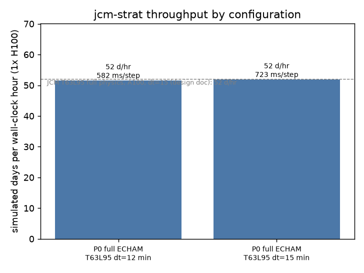
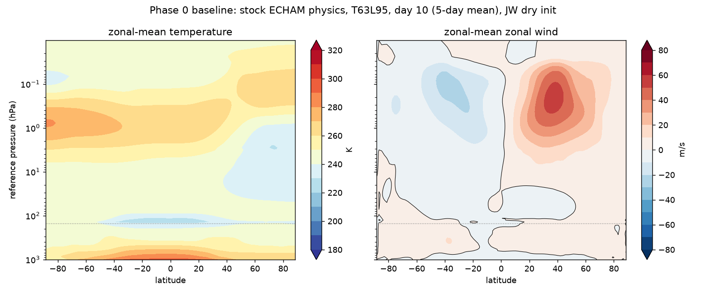

# Phase 0 — environment and baseline

Status: **complete** (2026-09-02). Branch `phase0-environment-baseline`.

## What was done

1. Repository created at `/data/JCM_stripped/jcm-strat` (GitHub: `reflective-org/jcm-strat`).
2. Upstreams pinned as submodules:
   - `external/jax-gcm` @ `849893b` — climate-analytics-lab/jax-gcm, branch `dev`, 2026-09-01
   - `external/dinosaur` @ `bd99e39b` — shoyer/dinosaur, branch `semi-lagrangian`, 2026-08-24
3. `uv` 0.12.9 installed to `~/.local/bin` (the only file this project puts on the root disk).
4. `scripts/bootstrap_env.sh` run; log in `bootstrap_env.log` beside this file (6.0 GB venv).
5. Labels and issues #1–#15 created on GitHub for the deferred work (Part 2 of PLANS.md).

## Environment acceptance (`scripts/check_env.sh`)

All checks pass (2026-09-02 22:25 UTC) after one fix: `libcuda.so.1` lives under the
containerised driver mount `/run/nvidia/driver/usr/lib/x86_64-linux-gnu`, off the loader path,
so the first attempt silently ran JAX on CPU (`cuInit` error 303). `scripts/env.sh` now exports
`LD_LIBRARY_PATH` to that directory; the check asserts a `CudaDevice`.

| check | result |
|---|---|
| Python | 3.11.16 (uv-managed, in `cache/uv-python`) |
| JAX | 0.10.2 + jax-cuda12-plugin 0.10.2, one `CudaDevice(id=0)` visible under `env.sh` |
| dinosaur | 1.4.0, installed from `external/dinosaur` @ `bd99e39b`, `semi_lagrangian` importable, `semi_lagrangian_available()` True |
| jcm | 2.1.0b0 from `external/jax-gcm` @ `849893be` |
| caches | `UV_CACHE_DIR`, `HF_HOME`, `JCM_ERA5_CACHE`, `SCRATCH` all under the repo; root disk unchanged at 97% |
| venv size | 6.0 GB (`.venv`), 116 MB uv caches |

Lock file: `env/requirements.lock`. Driver 580.126.20, 8x H100 80GB present, GPU 0 used.

## Smoke runs (stock JCM, nothing of ours)

| run | command | wall | result |
|---|---|---|---|
| `smoke_hs` | `scripts/launch.sh smoke_hs physics=held_suarez grid=held_suarez_t31_l8 run=smoke` | 2 min 25 s incl. compile | exit 0, `smoke_run.nc` written (0.8 MB); provenance line confirms `1xNVIDIA H100 80GB HBM3` |
| `smoke_echam_l95` | `scripts/launch.sh smoke_echam_l95 physics=echam grid=echam_t63_l95_hybrid run=smoke terrain=from_file terrain.file=hf://bundles/t63/terrain.nc forcing=from_file forcing.file=hf://bundles/t63/forcing_pd.nc` | 7 min 13 s incl. compile + bundle download | exit 0, `smoke_run.nc` written (468 MB, 1 day, hourly output); ozone auto-resolved to `hf://bundles/t63_l95/ozone_pd.nc`; HF cache 90 MB |

Notes: the T31L8 Held-Suarez grid has no ozone bundle on the mirror (expected; HS has no
radiation, the warning is harmless). JCM's provenance line reports `dinosaur=<sha>+dirty`
using the git SHA of *our* repo because the run's working directory is inside it — cosmetic,
the actual dinosaur commit is asserted by `check_env.sh`.

## Baseline throughput (stock JCM, full ECHAM physics, T63L95, 10 days)

The "before" number every later phase is measured against. Stock `physics=echam` (RRTMGP
radiation, Tiedtke convection, clouds, TKE diffusion, surface, Hines + SSO gravity waves) on the
95-level high-top grid, `run=longrun` (sponge on, 5-day averages), `init=jw init.rh=0.0`,
real terrain and present-day forcing from the mirror. Two 5-day chunks; chunk 0 includes JIT
compile, so the steady-state number is chunk 1 alone.

```
scripts/launch.sh base_echam_l95_10d      physics=echam grid=echam_t63_l95_hybrid run=longrun \
    run.total_time=10 run.chunk_days=5 init=jw init.rh=0.0 \
    terrain=from_file terrain.file=hf://bundles/t63/terrain.nc \
    forcing=from_file forcing.file=hf://bundles/t63/forcing_pd.nc
scripts/launch.sh base_echam_l95_10d_dt15 <same> run.time_step=15
```

| run | dt [min] | chunk 0 (5 d, incl. compile) | chunk 1 (5 d, steady) | **days / hr** | **ms / step** | health |
|---|---|---|---|---|---|---|
| `base_echam_l95_10d` | 12 | 368 s | 349 s | **51.6** | **582** | 0/137 NaN vars; T 223–302 K |
| `base_echam_l95_10d_dt15` | 15 | 358 s | 347 s | **51.9** | **723** | 0/137 NaN vars; T 224–302 K |

Reference (JCM design doc, A100-40GB, T63L95 full science, dt = 15 min): **52 days/hr**.

Reading:

- **Per step the H100 is no faster than the A100 at this configuration** (723 ms vs the
  ~720 ms implied by 52 days/hr at dt = 15). Wall time per simulated day is essentially
  independent of dt (51.6 vs 51.9 days/hr) — exactly the design doc's finding that radiation,
  firing on a fixed 2 h interval, dominates: shorter steps add cheap dynamics steps between
  expensive radiation calls. **The speed lever for Approach A is removing physics, not the
  time step.** That is what Phase 1 tests.
- Acceptance was "≥ 52 days/hr". We are at 51.6–51.9, within measurement noise of the
  reference (single 5-day chunk, includes writing a 468 MB output file). The environment is
  sound: GPU device confirmed, no CPU fallback.
- Compile cost is small (~10–20 s) thanks to the persistent JAX compilation cache under
  `scratch/jcm-jax-cache`, warmed by the smoke run.
- Output volume: 468 MB per 5-day chunk with hourly-resolution diagnostics (137 variables).
  Later phases restrict output.

Plots (tracked beside this file):

- `throughput.png` — the throughput bar chart; every later phase adds a bar.
- `baseline_zonal_mean_day10.png` — zonal-mean T and u at day 10 (5-day mean). A 10-day
  spin-up from the dry JW state: no NaNs, plausible vertical structure, jets still forming. A
  sanity check only, not a climatology.




## Acceptance

| check | threshold | result |
|---|---|---|
| `scripts/check_env.sh` | all PASS | PASS (after the `LD_LIBRARY_PATH` fix) |
| smoke runs | both finish | both exit 0 |
| resolved configs committed | `docs/resolved_configs/` | 4 files |
| baseline throughput | ≥ 52 days/hr (A100 reference) | 51.6 (dt 12) / 51.9 (dt 15) — within noise |
| root disk | unchanged | 97 % before and after (uv binary only, 49 MB) |
| GPU policy | GPU 0 only, sequential | all runs on GPU 0, one at a time |

## Decisions taken in this phase

See KEY_DECISIONS.md rows 1–4, 11–14. Deferred work filed as issues #1–#15 (DEFERRED.md).

## Decisions taken in this phase

See KEY_DECISIONS.md rows 1–4, 11, 12.
