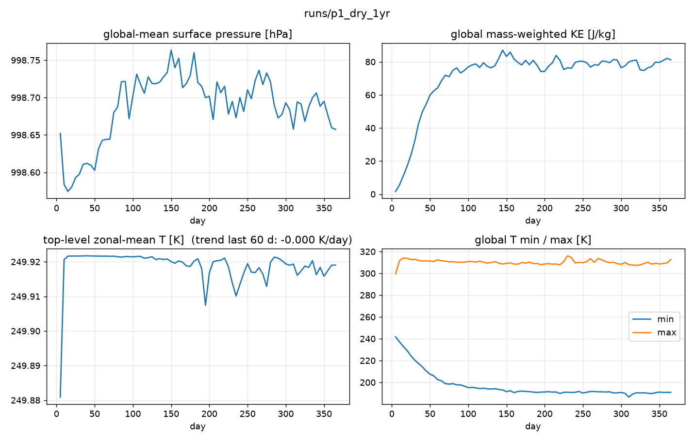
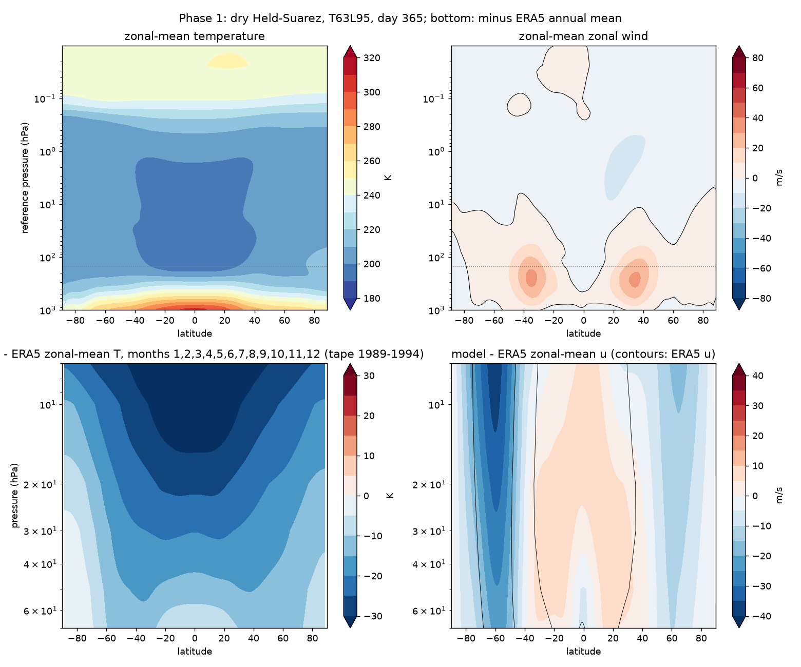
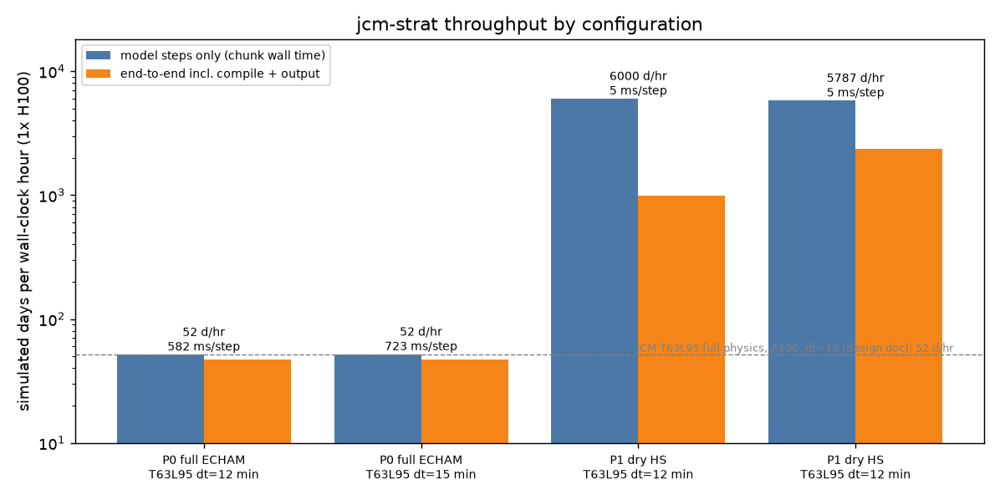

# Phase 1 — strip the physics: dry Held-Suarez on the L95 high-top grid

Status: runs complete, awaiting review (auto-generated results below).

## Question this phase answers

How much faster is the model once every tropospheric physics term is gone, and does the
stratosphere survive with only Held-Suarez relaxation and the upper sponge holding it?

## Configuration

`+experiment=p1_dry` = `physics=strat_dry` (Held-Suarez only) on `grid=echam_t63_l95_hybrid`,
`run=longrun` (dt 12 min, 10-level sponge, `target_T_K=250`), `init=jw init.rh=0.0`, real
terrain, no forcing file, no nudging, no tracers. The planned gravity-wave-drag variant
could not be composed with Held-Suarez (issue #20) and was dropped from this phase.

## Runs

| run | command | wall | result |
|---|---|---|---|
| `p1_dry_30d` | `scripts/launch.sh p1_dry_30d +experiment=p1_dry run.total_time=30 run.chunk_days=10` | 109 s incl. compile | exit 0, 0 NaN, p_s drift -0.05 hPa, top-level T flat at 249.9 K |
| `p1_dry_1yr` | `scripts/launch.sh p1_dry_1yr +experiment=p1_dry run.total_time=365` | see results | see results |

## Acceptance (from PLANS.md)

| check | threshold | result |
|---|---|---|
| 365 days, no NaN | 0 NaN vars every chunk | _pending_ |
| global-mean surface pressure drift | < 0.1 hPa over the year | _pending_ |
| subtropical jets present | qualitative, zonal-mean u | _pending_ |
| top-level zonal-mean dT/dt, last 60 days | < 0.5 K/day | _pending_ |
| throughput vs Phase 0 baseline (51.6 days/hr) | ≥ 2× | _pending_ |

## Results (auto-generated by scripts/pipeline.sh)

One-year run, dt 12 min, 30-day chunks. Held-Suarez has no seasonal cycle, so the
ERA5 comparison row uses the 1989-1994 annual mean of the zonal-mean tape (7-70 hPa).

### p1_dry_1yr

```
run:            runs/p1_dry_1yr
dt:             12.0 min
chunk 0:        30 d in 31 s (includes compile)
steady state:   335 d in 208 s over 12 chunk(s)
throughput:     5786.9 simulated days / hour
per step:       5 ms
end-to-end:     365 d in 555 s incl. compile + output = 2368 days / hour  (13 chunks)
run:                    runs/p1_dry_1yr  (13 chunk files, 73 saves, day 5-365)
global-mean ps:         998.652 -> 998.657 hPa   drift +0.0053 hPa
global KE (J/kg):       1.7 -> 81.2
top-level zonal-mean T: mean(last 60 d) 249.9 K, trend -0.000 K/day
T range:                min 186.5 K  max 316.1 K
model - ERA5 over 7-70 hPa: RMS dT = 21.3 K, RMS du = 12.5 m/s
```





