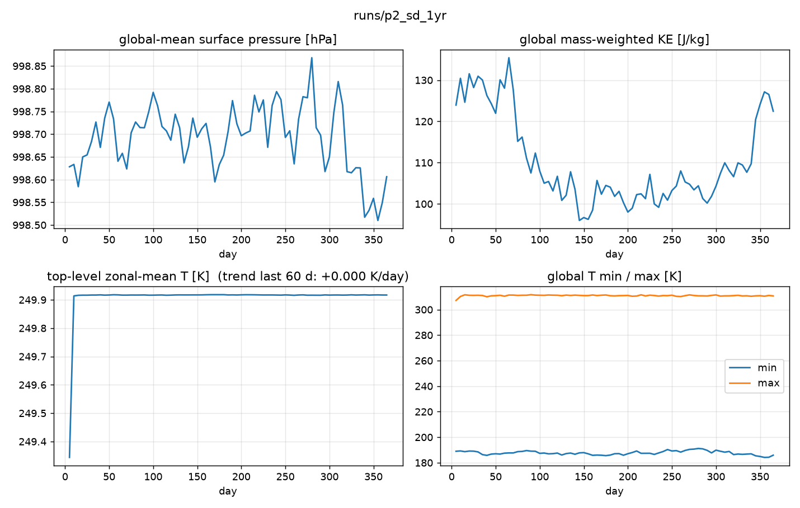
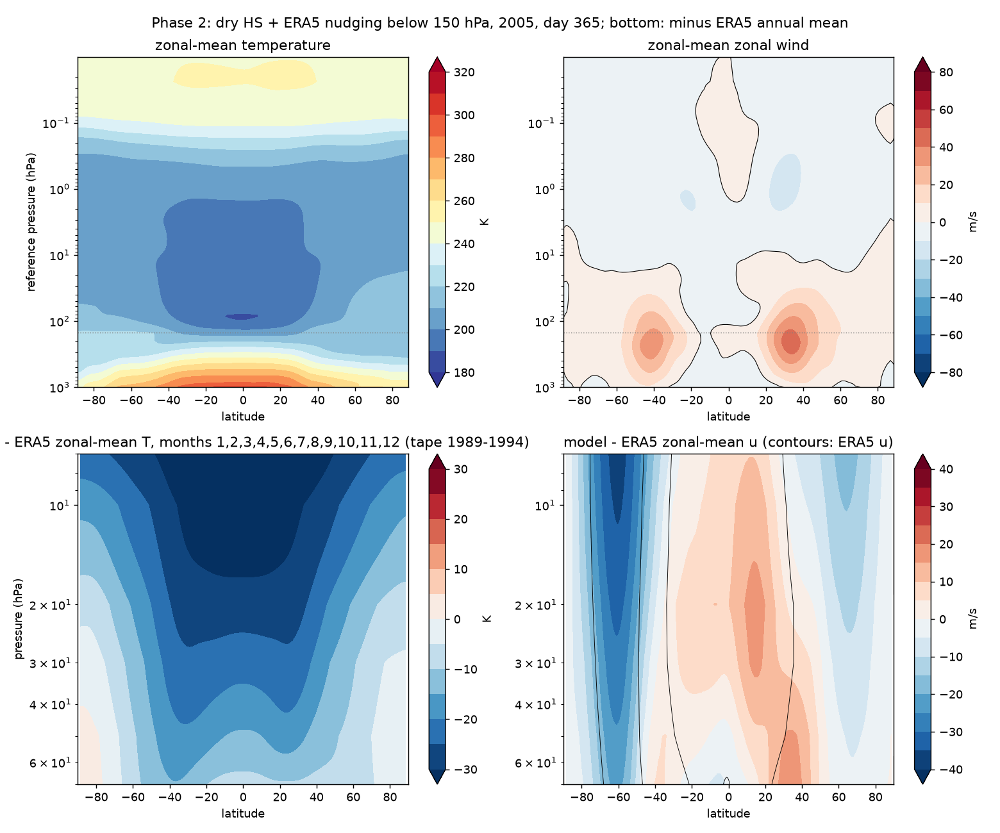
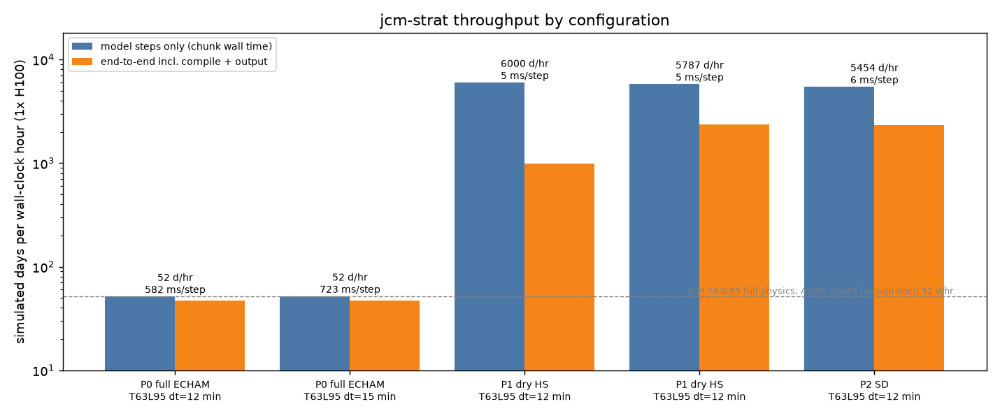

# Phase 2 — specified dynamics: troposphere nudged to ERA5, stratosphere free

Status: runs complete, awaiting review (auto-generated results below).

## Configuration

`+experiment=p2_sd`: Phase-1 dry physics; `init=era5` and `nudging=era5` from WeatherBench2
(6-hourly, 13 levels 50-1000 hPa); winds and temperature nudged with tau = 6 h below
150 hPa (hard cutoff, KEY_DECISIONS #8, issue #1); bottom 2 levels free; start 2005-01-01.

## Runs

| run | days | purpose |
|---|---|---|
| `p2_sd_90d` | 90 | check run |
| `p2_sd_1yr` | 365 | the Phase-2 run (2005) |

## Acceptance (from PLANS.md)

| check | threshold | result |
|---|---|---|
| 365 days stable | 0 NaN vars every chunk | see summary below |
| 500 hPa zonal-mean u RMSE vs ERA5 | < 3 m/s | needs the nudging-check script (issue) |
| zonal-mean T RMSE vs ERA5 below 150 hPa | < 3 K | needs the nudging-check script (issue) |
| no kink at 150 hPa | qualitative | zonal-mean plot |
| Jan-2006 SSW | qualitative | needs daily output (issue) |
| throughput | within 10% of Phase 1 | throughput row |

## Results (auto-generated by scripts/pipeline.sh)

The ERA5 row compares the 2005 model year with the 1989-1994 annual mean of the zonal-mean tape (7-70 hPa).

### p2_sd_1yr

```
run:            runs/p2_sd_1yr
dt:             12.0 min
chunk 0:        30 d in 31 s (includes compile)
steady state:   335 d in 221 s over 12 chunk(s)
throughput:     5454.5 simulated days / hour
per step:       6 ms
end-to-end:     365 d in 565 s incl. compile + output = 2326 days / hour  (13 chunks)
run:                    runs/p2_sd_1yr  (13 chunk files, 73 saves, day 5-365)
global-mean ps:         998.628 -> 998.606 hPa   drift -0.0219 hPa
global KE (J/kg):       123.9 -> 122.5
top-level zonal-mean T: mean(last 60 d) 249.9 K, trend +0.000 K/day
T range:                min 184.1 K  max 311.7 K
model - ERA5 over 7-70 hPa: RMS dT = 21.4 K, RMS du = 12.8 m/s
```





