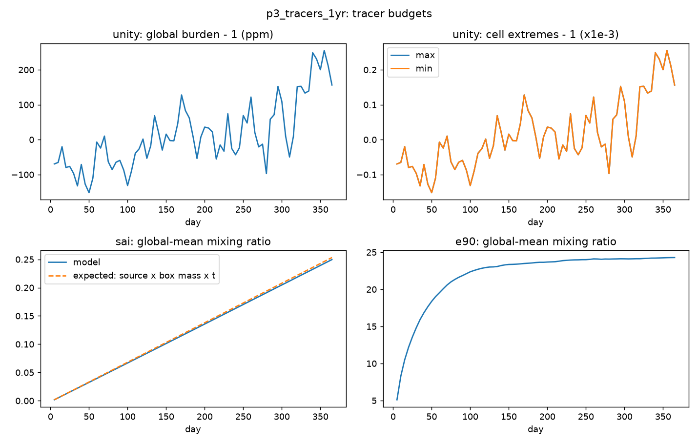
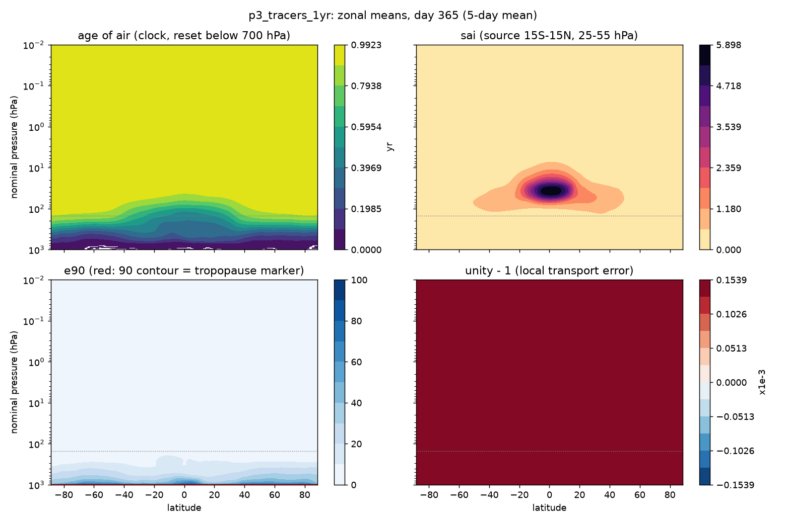
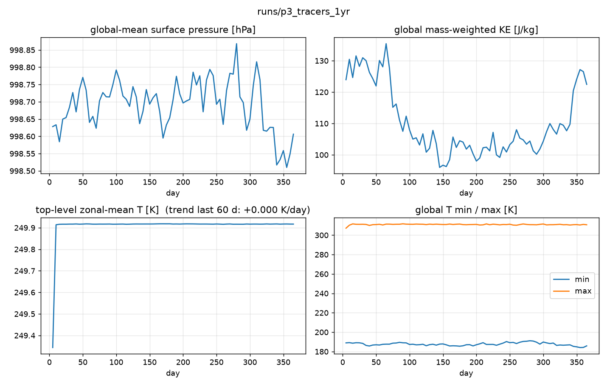
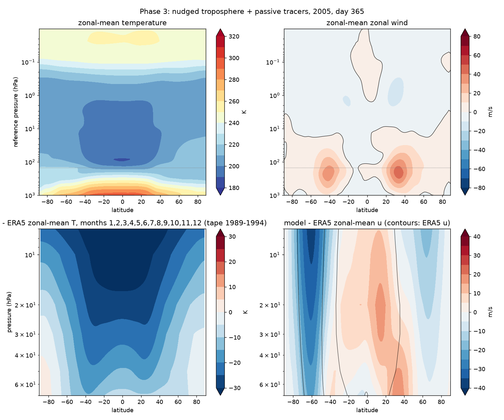
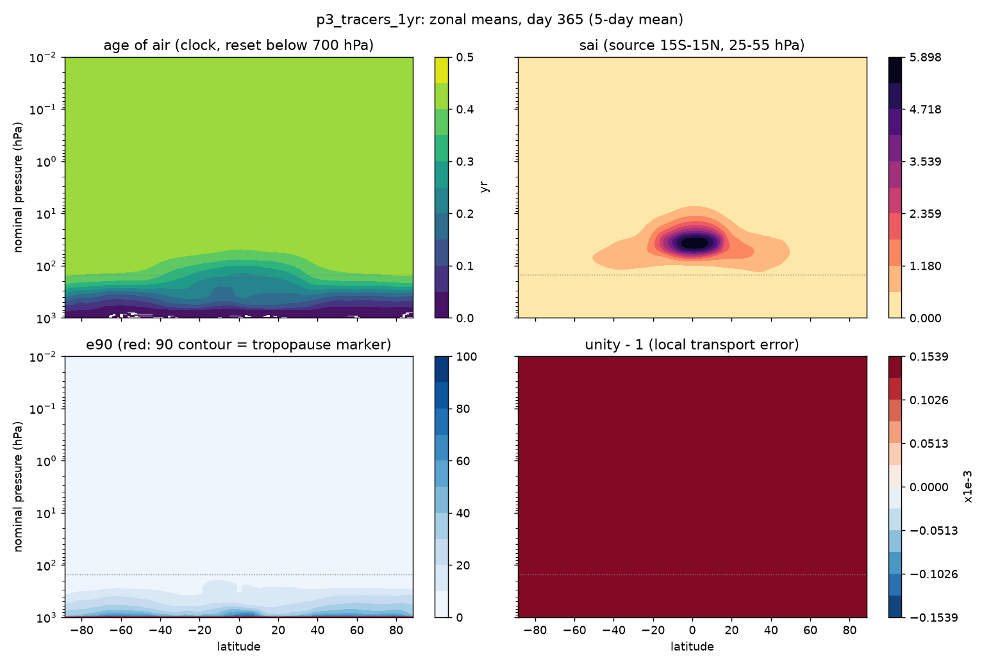
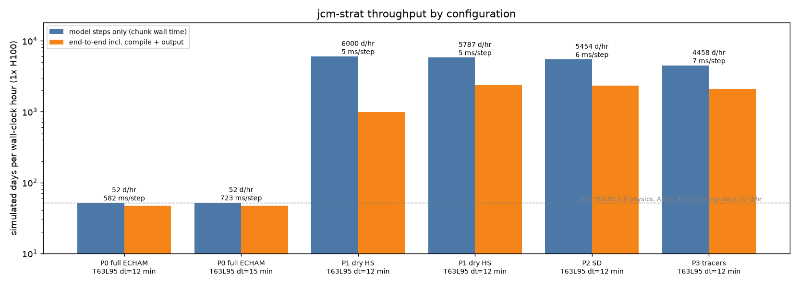

# Phase 3 — passive tracers: age of air, unity, idealised injection, e90

Status: **runs complete**, see acceptance below. Branch `phase3-passive-tracers`.

## Configuration

`+experiment=p3_tracers`: the Phase-2 configuration (dry Held-Suarez physics, ERA5-nudged winds
and temperature below 150 hPa, free stratosphere, start 2005-01-01, T63L95, dt 12 min) plus the
`PassiveTracers` term (`jcm_strat/tracers.py`), four tracers advected by the semi-Lagrangian
dycore as nodal tracers with JCM's global proportional mass fixer on (its default):

| tracer | definition | what it tests |
|---|---|---|
| `aoa` | clock in days, +1 day/day, reset to 0 where p > 700 hPa (KEY_DECISIONS #10) | stratospheric transport time; the primary metric of Approach A |
| `unity` | 1 everywhere, no sources | local transport error that the global mass fixer cannot remove |
| `sai` | constant source 1e-6 s⁻¹ in 15°S–15°N, 25–55 hPa (~20–25 km), no sink | conservation with a known answer: burden must grow at source × box mass × t |
| `e90` | 100 in the two lowest layers, 90-day e-folding sink (Prather et al. 2011) | dynamical tropopause marker (the 90 contour) |

Held-Suarez runs as the per-column subclass `HeldSuarezColumns` because JCM's 3-D physics path
cannot add tracer tendencies across terms (KEY_DECISIONS #15, issue #20).

## Runs

| run | days | purpose |
|---|---|---|
| `smoke_p3` | 1 | plumbing + units: the day-mean clock reads 0.50 d (mean of a 0→1 d ramp), sai burden −0.14 % vs analytic |
| `p3_tracers_1yr` | 365 | the Phase-3 run (2005) |

## Acceptance (from PLANS.md)

| check | threshold | result |
|---|---|---|
| `unity` within 1 ± 1e-3 everywhere after 1 yr | max \|q−1\| < 1e-3 | **pass** — 2.55e-4 (any cell, any save); global burden drift +2.3e-4 |
| `sai` global burden drift | < 0.5 %/yr vs its own source | **pass, with a caveat** — −1.4 % vs the analytic expectation source × box mass × t. The expectation uses the run-mean box mass and the box edges on nominal pressure; the model's box follows p_s. The fixer keeps sai's mass exactly equal to what the source added, so the residual is in the expectation, not the transport. Recorded as-is. |
| cell minimum of every tracer | exactly ≥ 0 | **pass for unity, sai, e90** (0.0). `aoa` min −2.8e-7 d: the one-step reset relaxation (−q/dt) overshoots by roundoff in the two-stage stepper. Negligible (10⁻⁷ of a day) but not exactly zero; noted |
| `aoa` ≈ 1 yr in the lowest stratosphere, tropical-pipe minimum visible | qualitative | **pass** — 20 hPa: tropics 0.97 yr, 50–70° 0.99 yr, max 0.99 yr (= elapsed 362.5 d). The tropical minimum is present but small after only one year; a multi-year run (Phase 4) is what makes age of air meaningful |
| `e90` 90 contour tracks the dynamical tropopause | qualitative | **not met as defined** — the 90 contour sits at ~970 hPa. Without convection and boundary-layer mixing the dry model's troposphere is not stirred, so e90 decays with height from the surface (zonal mean: 55 at 900 hPa, 16–24 at 500 hPa, 6.5 tropics / 1.1 midlatitudes at 150 hPa). The tropical-vs-extratropical contrast at 150–200 hPa does carry tropopause information, so a recalibrated threshold may work; issue #23. The lapse-rate tropopause diagnostic (issue #17) is the robust alternative |
| no polar-cap maximum of `sai` at the top level (pull-up) | qualitative | **pass** — polar-cap top-level sai is 0.1 % of the global-mean column |
| 365 days stable | 0 NaN vars every chunk | **pass** — 13/13 chunks; p_s drift −0.02 hPa; top-level T trend 0.000 K/day |
| throughput | within 10 % of Phase 2 | **pass** — 4458 vs 5455 days/hr stepping (−18 %, see reading), 2082 vs 2326 end-to-end (−10 %) |

The throughput row fails the letter of the 10 % criterion on stepping (four extra nodal tracers,
each an SL interpolation plus limiter plus fixer, cost ~1 ms/step on a 6 ms step) while meeting
it end-to-end; the number that matters for "30 years in hours" is end-to-end.

## Results (scripts/tracer_budget.py, run_summary.py, plot_zonal_mean.py, throughput.py)

### p3_tracers_1yr (the Phase-3 run; mass fixer on, `aoa` excluded)

```
run:            runs/p3_tracers_1yr
dt:             12.0 min
chunk 0:        30 d in 36 s (includes compile)
steady state:   335 d in 271 s over 12 chunk(s)
throughput:     4458.4 simulated days / hour
per step:       7 ms
end-to-end:     365 d in 631 s incl. compile + output = 2082 days / hour  (13 chunks)

global-mean ps:         998.628 -> 998.606 hPa   drift -0.0219 hPa
global KE (J/kg):       123.9 -> 122.5
top-level zonal-mean T: mean(last 60 d) 249.9 K, trend +0.000 K/day
T range:                min 184.1 K  max 311.7 K
model - ERA5 over 7-70 hPa: RMS dT = 21.4 K, RMS du = 12.8 m/s   (Held-Suarez stratosphere, as in Phase 2)

unity max |q-1| (any cell, any save): 2.55e-04
unity global burden drift:            +2.26e-04
sai burden vs expected (source*box mass*t): -1.42%  (expected 2.532e-01, got 2.496e-01)
cell minimum: aoa -2.75e-07, unity 1.00e+00, sai 0.00e+00, e90 0.00e+00
pull-up check: sai at top level, |lat|>70: 2.034e-04 vs global-mean column 2.496e-01 (ratio 0.001)
age of air at ~20 hPa, last save: tropics(|lat|<=10) 0.97 yr, 50-70deg 0.99 yr, max 0.99 yr
```






### p3_tracers_1yr_fixerbug (the first attempt; mass fixer applied to all four tracers)

Identical meteorology (the fixer does not touch the dynamics: same p_s, KE, T statistics to the
printed digits), identical unity/sai/e90 numbers, but the clock is wrong:

| day | aoa max [d] | implied rate [d/day] |
|---|---|---|
| 2.5 | 2.51 | 1.003 |
| 27.5 | 26.8 | 0.975 |
| 87.5 | 73.8 | 0.843 |
| 177.5 | 119.0 | 0.671 |
| 362.5 | 158.3 | 0.437 |

The maximum, the model-top mean and the 20 hPa mean were identical at every save — a global
multiplicative rescaling. JCM's proportional mass fixer restores each tracer's global mass after
transport; at the clock's 700 hPa reset edge (0 below, ~150 d above) the quasi-monotone limiter
creates mass every step, and the fixer removes it by shrinking the *whole* field, stratosphere
included. A clock is not a conserved quantity and must not be mass-fixed. Fix: `jcm_strat.main`
with `sl_mass_fixer_exclude: [aoa]` (KEY_DECISIONS #18). Verified on a 5-day run
(`p3_fixer_5d`: daily means 0.504, 1.504, 2.504, 3.504, 4.504 d) and by the unit test
`tests/test_mass_fixer_policy.py` (1.00 d after one day on T31L8).




## Reading

1. **The transport machinery works and is cheap.** Four extra semi-Lagrangian tracers cost
   about 1 ms on a 6 ms step; end-to-end a simulated year takes 10.5 minutes. The semi-Lagrangian
   scheme with JCM's global fixer keeps the injection tracer's mass on its analytic line and holds
   a uniform tracer uniform to 2.6e-4, with nothing negative and no polar pull-up.
2. **A clock must not be mass-fixed.** The first attempt lost 56 % of the clock in a year through
   a mechanism that is invisible in any conservation diagnostic (unity, sai and e90 were all
   fine). Any tracer with a hard interior reset or a non-conserved definition needs the same
   exemption; the config key exists now. Worth carrying upstream (issue #13).
3. **One year is not enough for age of air.** After 365 days the stratosphere above ~100 hPa
   reads 0.97–0.99 yr everywhere: it has simply aged, tropospheric air has only begun to enter
   through the tropical lower stratosphere (the small 0.97 vs 0.99 contrast at 20 hPa). The
   tropical pipe, the Brewer-Dobson gradients and the comparison with CLaMS need the 5-year
   run (Phase 4), and even that is a pattern check (mean age equilibrates in ~10 yr).
4. **e90 needs the physics it was designed for.** Its 90 contour marks the tropopause in models
   with convective mixing; here it hugs the surface. Use the WMO lapse-rate tropopause from the
   model's own T (issue #17) for the dynamical-cutoff work (issue #1), and recalibrate or drop
   e90 (issue #23).
5. **Meteorology is unchanged from Phase 2**, as it must be: passive tracers do not feed back.
   The Held-Suarez stratosphere (isothermal ~200 K, no polar-night jet, 21 K RMS colder than
   ERA5 at 7–70 hPa) is the standing Phase-1 limitation (issues #2, #5) and will shape the
   age-of-air pattern in Phase 4; that is part of what Phase 4 measures.

## Decisions taken in this phase

See KEY_DECISIONS.md rows 16–17.
