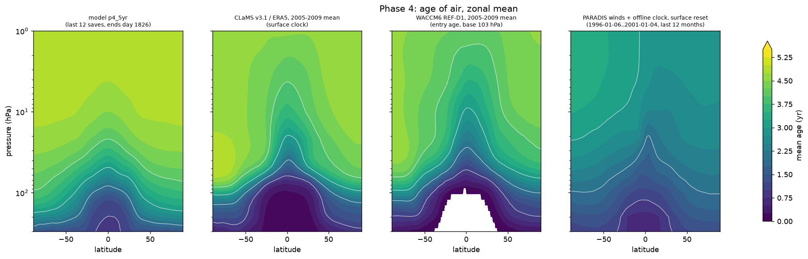
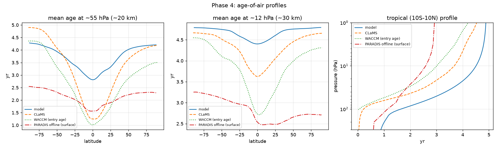
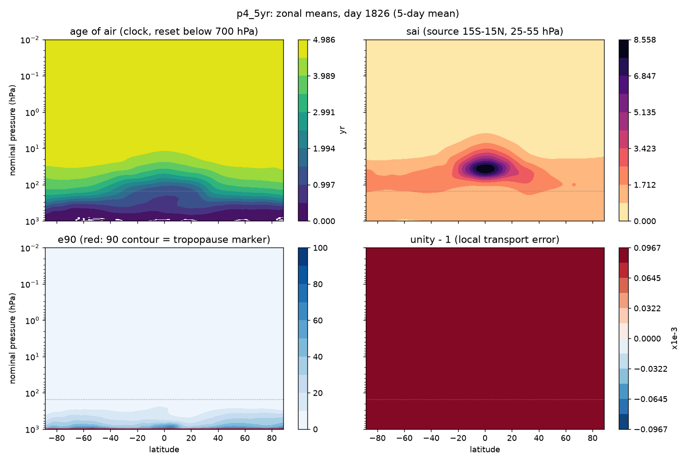
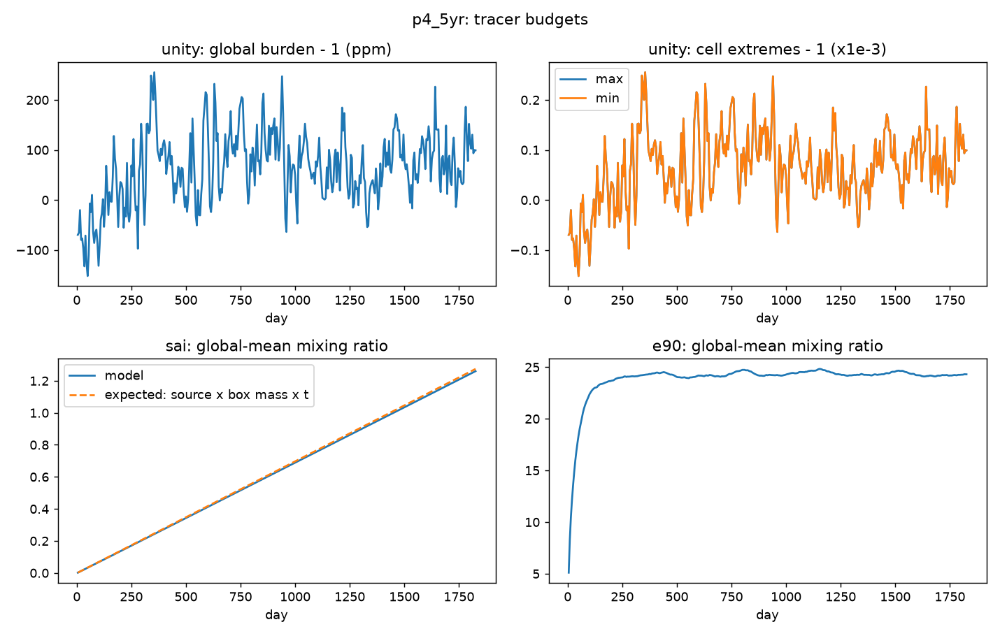
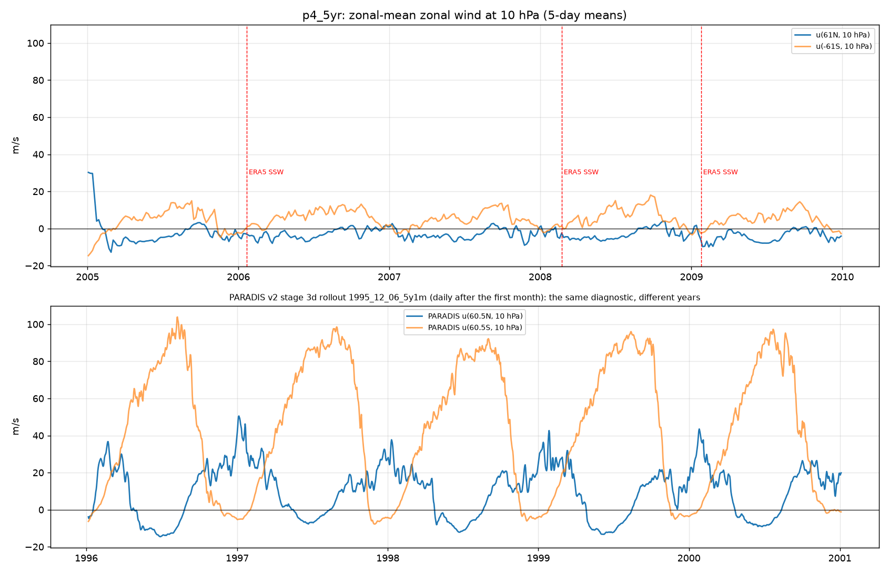
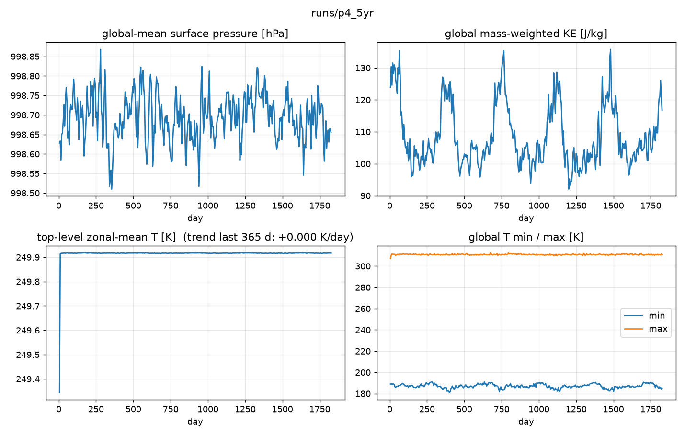
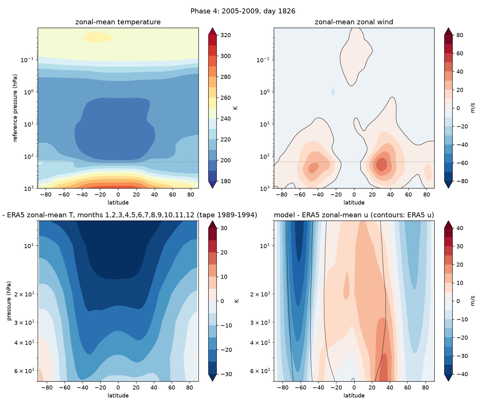
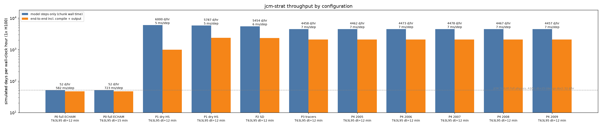
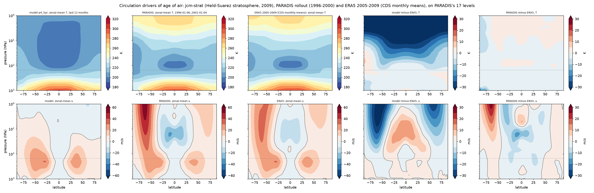
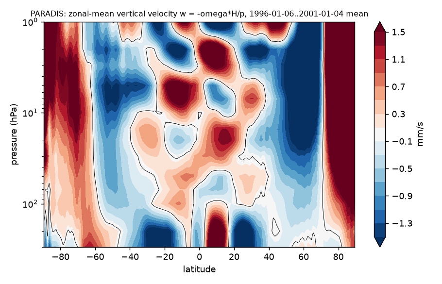

# Phase 4 — the 5-year run and the Phase-1 number

Status: **runs complete; transport checks pass, the two circulation checks do not** (see acceptance). Branch `phase4-5yr`.

## Configuration

`+experiment=p4_5yr`: the Phase-3 configuration unchanged — dry Held-Suarez physics, ERA5-nudged
winds and temperature below 150 hPa, free stratosphere, four passive tracers with the clock
excluded from the mass fixer — over 2005-01-01 … 2009-12-31 (1826 days), 30-day chunks, 5-day
means, restart checkpoint every chunk.

**Run as five chained one-year segments** (`scripts/chain_years.sh`). The first attempt as one
1826-day run (`p4_5yr_oom`) died in the first step with `RESOURCE_EXHAUSTED: Out of memory while
trying to allocate 47.75GiB`: JCM keeps the entire nudging target on the GPU, and five years of
6-hourly L95 u, v, T are 154 GB against an 80 GB card, where one year (31 GB) fits. Each
calendar year therefore runs on its own with `init=from_state init.file=<previous>/checkpoint.ckpt`,
which restores the full dycore + physics state including the tracers and restarts the calendar at
the segment's `run.start_date`. The segments' chunk files are linked into `runs/p4_5yr/` with
cumulative day numbers, so the analysis scripts see one 1826-day run.

ERA5: the whole window was prefetched once (`--start 2004-12-31 --end 2010-01-03`, 2 h, 154 GB
on disk) and the per-year windows cut from it with `scripts/slice_era5_years.py` (the cache key
hashes only the grid, so this is byte-equivalent to downloading them; verified against the
separately downloaded 2005 window).

## Runs

| run | days | purpose |
|---|---|---|
| `p4_5yr_oom` | 0 | single 1826-day run; GPU OOM loading the 154 GB target (kept as evidence) |
| `p4_2005` … `p4_2009` | 365/365/365/366/365 | the five chained segments |
| `p4_5yr` | 1826 | symlinked aggregate of the segments, what the analysis reads |

## Acceptance (from PLANS.md)

| check | threshold | result |
|---|---|---|
| 5 years complete | all chunks healthy | **pass** — 65/65 chunks 0 NaN; p_s 998.63 → 998.66 hPa (+0.03 hPa in 5 yr); top-level T trend 0.000 K/day; T range 181–313 K |
| segment chaining | tracers and state continuous across the four year boundaries | **pass** — clock continues within 0.01 yr and the sai global mean within one save's growth at every boundary (day 365/395, 730/760, 1095/1125, 1461/1491) |
| tracer drift (Phase-3 thresholds) | unity within 1 ± 1e-3; sai < 0.5 %/yr vs its source | **pass** — unity max \|q−1\| 2.55e-4 over 365 saves, burden drift +1.7e-4; sai burden −1.1 % vs source × box mass × t after 5 yr (same expectation caveat as Phase 3) |
| no negatives | cell min ≥ 0 | **pass** for unity, sai, e90 (0.0); aoa min −9e-7 d (reset-relaxation roundoff) |
| no polar pull-up | no polar-cap maximum of sai at the top level | **pass** — polar-cap top-level sai is 0.67 of the global-mean column; after 5 years of continuous source the tracer fills the whole upper domain roughly uniformly (~1.7 vs 8.6 in the source box) rather than piling up at the poles |
| age-of-air latitude gradient has the right sign | qualitative | **pass** — youngest air in the tropics at every level, oldest over both poles; the tropical pipe is there |
| tropical/extratropical age contrast within 50 % of CLaMS | at ~55 hPa | **fail** — model 2.88 yr (10°S–10°N) vs 4.09 yr (50–70°), contrast 1.21 yr; CLaMS 1.33 vs 4.12, contrast 2.79 yr. The model's contrast is 43 % of CLaMS's: **the tropics are 1.5 yr too old**, the extratropics are right (4.09 vs 4.12). At ~12 hPa: model 4.42/4.76 vs CLaMS 3.68/4.56 |
| ≥ 2 of the 3 ERA5 SSW winters show a weakened vortex | qualitative | **not testable** — there is no polar-night jet to weaken: DJF-mean u(61°N, 10 hPa) is −4 to −2 m/s in every winter (ERA5 climatology ~+30 m/s). The Held-Suarez stratosphere is isothermal and unforced above the nudged layer (issues #2, #5) |
| throughput | report | 4315 days/hr stepping over the 64 steady chunks (4460–4480 per segment), **1768 days/hr end-to-end** for 1826 days incl. five compiles and five 31 GB target loads (2080–2100 per segment) |

## Results

### p4_5yr (aggregate of p4_2005 … p4_2009)

```
throughput:     4315.0 simulated days / hour   (steady state, 1796 d over 64 chunks; per segment 4457-4478)
per step:       7 ms
end-to-end:     1826 d in 3718 s = 1768 days / hour   (per segment 2079-2099; segment load of the 31 GB target ~1 min each)

global-mean ps:         998.628 -> 998.655 hPa   drift +0.0267 hPa over 5 yr
global KE (J/kg):       123.9 -> 116.7
top-level zonal-mean T: mean(last 365 d) 249.9 K, trend +0.000 K/day
T range:                min 181.0 K  max 312.5 K
model - ERA5 over 7-70 hPa (last save vs 1989-1994 tape): RMS dT = 21.5 K, RMS du = 13.5 m/s

unity max |q-1| (any cell, any save): 2.55e-04      unity global burden drift: +1.69e-04
sai burden vs expected (source*box mass*t): -1.10%  (expected 1.274, got 1.260)
cell minimum: aoa -9.22e-07, unity 1.00e+00, sai 0.00e+00, e90 0.00e+00
pull-up check: sai at top level, |lat|>70: 0.842 vs global-mean column 1.260 (ratio 0.668)
age of air at ~20 hPa, last save: tropics 4.13 yr, 50-70deg 4.69 yr, max 4.99 yr (= elapsed)

age of air vs references (last 12 saves = 2009-11/12 mean; CLaMS and WACCM 2005-2009 means)
level            source                tropics 10S-10N  50-70 deg  contrast
~55 hPa (~20 km) model                            2.88       4.09      1.21
~55 hPa (~20 km) CLaMS v3.1 / ERA5 (surface clock) 1.33       4.12      2.79
~55 hPa (~20 km) WACCM6 REF-D1 (entry age)         1.11       3.40      2.29
~12 hPa (~30 km) model                            4.42       4.76      0.35
~12 hPa (~30 km) CLaMS                            3.68       4.56      0.88
~12 hPa (~30 km) WACCM (entry age)                2.82       4.18      1.36

polar vortex, u(61N, 10 hPa), 5-day means
winter     DJF mean [m/s]   5-day means with u<0 (Nov-Mar)
2005/2006      -4.3              30
2006/2007      -1.8              21
2007/2008      -2.5              26
2008/2009      -5.2              27
```










## PARADIS: the circulation drivers, since the rollout carries no tracer

Requested 2026-09-03: put the PARADIS long-range rollout `1995_12_06_5y1m` next to CLaMS and WACCM
in the age-of-air comparison. The rollout (`/data/paradis_logs/lightning_logs/cesm_run_2/forecasts/
longrange_v2_dec1995_ensemble/1995_12_06_5y1m/state.zarr`; PARADIS v2 stage 3d, 1°, 17 pressure
levels 1–1000 hPa, initialised 1995-12-06, 6-hourly for 30 days then daily to 2001-01-04) carries
**no tracer of any kind**, so it has no age of air to compare. Deriving one offline from its winds is
issue #29. What it does carry is the circulation that sets the age of air, so that is compared here:
the first month is discarded and the 1996-01-06 … 2001-01-04 mean is used (`scripts/paradis_zonal.py`
→ `runs/paradis_1995_12_06/zonal_means.nc`; `scripts/paradis_circulation.py --era5`; `vortex_series.py --paradis`).
ERA5 enters the climatology figure as the reference: CDS monthly-mean zonal means of u and T on 25 levels
(1–1000 hPa) for the model years 2005–2009 (`cache/era5_ref/era5_zm_monthly_<year>.nc`, produced by the
CDS fetch on the Phase 6 branch), so both models are shown against the same reanalysis — PARADIS for its
own years, the model for its own — on PARADIS's 17 levels.

```
PARADIS u(60.5N, 10 hPa)             DJF mean   days u<0 (Nov-Mar)      60.5S DJF
  1996/1997                            30.7          0                    0.5
  1997/1998                            23.4          0                    1.4
  1998/1999                            24.2          0                    1.1
  1999/2000                            21.4          0                    1.7
  2000/2001                            15.8          0                   -0.7
annual mean u(60N, 10 hPa): PARADIS +10.0 m/s, jcm-strat (Held-Suarez) -4.0 m/s, ERA5 2005-2009 +9.8 m/s

zonal-mean T bias vs ERA5 2005-2009 [K]   tropics 10S-10N   60-90N   60-90S
  10 hPa   model                              -34.3          -18.8    -15.2
  10 hPa   PARADIS                             +1.1           +0.5     -5.8
  30 hPa   model                              -19.5           -8.9     -2.5
  30 hPa   PARADIS                             -3.4           -1.6     -4.2
  50 hPa   model                              -12.3           -7.6     +0.3
  50 hPa   PARADIS                             -1.1           -0.8     -2.3
  70 hPa   model                               -6.5           -7.4     +1.1
  70 hPa   PARADIS                             +1.1           -0.6     -1.3

PARADIS tropical (10S-10N) zonal-mean upwelling w = -omega*H/p, 5-yr mean (ERA5-era w* ~0.2-0.4 mm/s at 70 hPa)
  100 hPa +0.10 mm/s | 70 hPa -0.17 | 50 hPa +0.32 | 30 hPa +0.52 | 20 hPa +0.24
```





Reading:

1. **PARADIS has the stratosphere the Held-Suarez model lacks, and it is close to ERA5.** Against the
   2005–2009 ERA5 zonal means PARADIS's temperature is within ±1–3 K in the tropics and Arctic at 10–70 hPa
   (−4 to −6 K over the Antarctic), and its annual-mean u(60°N, 10 hPa) is 10.0 m/s against ERA5's 9.8;
   both polar-night jets, the summer easterlies and an equatorial easterly band at 10–30 hPa are there.
   The model-minus-ERA5 panels are the Held-Suarez signature: −34 K in the tropics and −15 to −19 K over the
   poles at 10 hPa, −12 K in the tropics at 50 hPa, 20–30 m/s too weak at both jets, too westerly at the
   equator. PARADIS-minus-ERA5 is small by comparison except for a weak Antarctic cold bias and a too-weak
   Antarctic jet core. If PARADIS's circulation drove the tracers, the tropical pipe would be
   ventilated far more strongly than in Phase 4 — which is the case for an emulator-driven transport.
2. **But PARADIS's northern vortex never breaks and weakens over the rollout.** DJF-mean u(60°N, 10 hPa)
   falls from 31 to 16 m/s across the five winters and there is not a single reversal in five winters,
   where ERA5 shows roughly six major warmings per decade. A too-stable, slowly drifting vortex is a
   known long-rollout failure mode; it would bias an emulator-driven age of air old in the polar
   lower stratosphere.
3. **PARADIS's vertical velocity is not usable as a Brewer-Dobson proxy.** The daily-mean zonal-mean ω
   is noisy and partly unphysical: a checkerboard above 10 hPa with ±1.5 mm/s cells, strong ascent
   over both poles at all levels, and a sign change between 100 hPa (+0.10 mm/s), 70 hPa (−0.17) and
   50 hPa (+0.32) in the tropics where the residual circulation is smoothly upward at 0.2–0.4 mm/s.
   The resolved ω of an emulator is not the residual (Lagrangian-mean) circulation anyway; the honest
   way to get PARADIS's transport is a tracer carried by its winds (issue #29), or the transport head
   that Approach B proposes.
4. **What this means for Approach A vs B.** The physics baseline transports well but on the wrong
   circulation; the emulator has a far better mean circulation but no tracer, no reversals, and a
   vertical velocity that cannot be trusted directly. Neither is yet a validated age of air. The
   next step on the physics side is the stratospheric forcing (issues #2, #5); on the emulator side,
   issue #29.

### PARADIS offline clocks (issue #29): two age-of-air definitions carried by the rollout's winds

`scripts/paradis_offline_clock.py`: semi-Lagrangian backward trajectories (two-pass midpoint,
trilinear interpolation in longitude, latitude and ln p) on PARADIS's own 1°×17-level grid, driven by
its daily u, v (from the Cartesian components) and ω (d ln p/dt = ω/p), 6-hour sub-steps with the
daily winds interpolated in time, run over 1996-01-06 … 2001-01-04 on GPU 0 in 1.4 minutes. Two
clocks, both +1 day/day: **surface reset** (lowest level; the CLaMS and WACCM boundary condition)
and **reset below 150 hPa** (an entry age; KEY_DECISIONS #22, issue #25). Sanity: far from the
resets the clock advances exactly 1.00 day/day (30.0 d after 30 d; 5-year top-level maximum 3.45 yr
< 5 yr because the 1 hPa level is ventilated from below). Output `runs/paradis_1995_12_06/offline_clock.nc`. The figures show the surface-reset clock only (the entry clock is in the table below and available with `--paradis-entry-clock`).

```
last 12 months, zonal mean [yr]                tropics 10S-10N   50-70 deg   contrast
~55 hPa  model (jcm-strat, 700 hPa reset)             2.88          4.09       1.21
~55 hPa  CLaMS v3.1 / ERA5 (surface clock)            1.33          4.12       2.79
~55 hPa  WACCM6 REF-D1 (entry age)                    1.11          3.40       2.29
~55 hPa  PARADIS winds + offline clock (surface)       1.59          2.33       0.74
~55 hPa  PARADIS winds + offline clock (entry <150)    0.85          1.49       0.64
~12 hPa  model                                        4.42          4.76       0.35
~12 hPa  CLaMS                                        3.68          4.56       0.88
~12 hPa  WACCM (entry age)                            2.82          4.18       1.36
~12 hPa  PARADIS offline (surface)                    2.59          2.93       0.34
~12 hPa  PARADIS offline (entry <150)                 1.91          2.27       0.36

PARADIS offline, surface clock, tropical / global mean:  200 hPa 0.62 / 1.18 yr;  100 hPa 1.13 / 1.65;
  50 hPa 1.59 / 2.13;  10 hPa 2.59 / 2.83;  1 hPa 2.92 / 3.04.   Entry clock at 100 hPa: 0.40 / 0.71.
```

Reading:

1. **The PARADIS-driven stratosphere is too young everywhere, the opposite failure to the physics
   model.** At 55 hPa the extratropics read 2.3 yr (CLaMS 4.1) and at 12 hPa 2.9 yr (CLaMS 4.6); even the
   entry clock, which cannot be blamed on tropospheric transit, gives 1.5 yr at 50–70° where WACCM's
   entry age is 3.4. The tropical pipe is there (tropics younger than extratropics at every level, and
   the 55 hPa minimum sits at the equator) but the contrast is a quarter of CLaMS's.
2. **Slow troposphere, fast stratosphere.** The surface clock reads 0.6 yr at 200 hPa and 1.1 yr at
   100 hPa in the tropics (CLaMS 0.2 at 100 hPa): with five tropospheric levels and no parameterised
   mixing, resolved daily winds carry air up slowly — the same tropospheric-transit bias as in
   jcm-strat, larger. Above the tropopause the age then grows far too slowly with height.
3. **Why the stratosphere is too young.** Three causes, all foreseen and none attributable to
   PARADIS's transport as such: (a) PARADIS's ω is noisy and partly unphysical (checkerboard above
   10 hPa, polar ascent; the previous section), which the offline scheme turns into spurious vertical
   exchange; (b) 17 levels put 100, 70, 50, 30, 20, 10 hPa about 5 km apart, so trilinear
   interpolation in ln p is strongly diffusive in the vertical; (c) daily winds miss the sub-daily
   part of the transport. The result measures "PARADIS winds through a coarse offline scheme"; it
   bounds PARADIS's transport from below in age, as the physics model bounds it from above.
4. **What would make it meaningful.** A less diffusive vertical treatment (cubic or monotone
   interpolation, or a flux-form scheme), the 6-hourly output for the whole rollout, a smoothed or
   mass-consistent ω, and ideally the tracer inside the emulator — which is Approach B's transport
   head. Until then the two offline lines are shown as bounds with these caveats, not as PARADIS's
   age of air.

## The Phase-1 number

> The stripped stratospheric JCM on Dinosaur-SL — dry Held-Suarez physics, ERA5-nudged winds and
> temperature below 150 hPa, four semi-Lagrangian tracers — runs **4300–4500 simulated days per
> hour stepping and about 1800 end-to-end on one H100 at T63L95 with a 12-minute step: one
> simulated year in 10.4 minutes, 30 years in about 5.2 GPU-hours** (full ECHAM physics on the same
> grid: 47 days/hr, 7.8 h per year). Passive-tracer mass closes to 0.02 % over five years for a
> uniform tracer and to 1 % against an analytic source, with exact non-negativity and no polar
> pull-up. The age-of-air *pattern* is right (tropical pipe, poleward ageing) but the tropics are
> 1.5 yr too old at 20 km and the stratosphere has no polar-night jet: with Held-Suarez in place of
> radiation the Brewer-Dobson circulation is too weak. The speed question is answered; the fidelity
> question now depends on the stratospheric forcing (issues #2 RRTMGP, #5 Polvani-Kushner).

## Reading

1. **Speed.** Stripping the physics bought a factor ~40 end-to-end and ~90 in stepping over full
   ECHAM on the same grid. The remaining end-to-end cost is roughly half stepping, half output
   writing and per-segment setup (issue #19); the time-step sweep (issue #3) is the next lever.
2. **Transport is sound over five years.** Conservation, positivity and the pull-up check all hold
   at the Phase-3 levels with no degradation over time, and the year-boundary chaining is exact.
   The mass-fixer exemption for the clock (Phase 3) held: the clock reaches 4.99 yr where it must.
3. **The tropics are too old, the extratropics are right.** At 55 hPa the model matches CLaMS at
   50–70° (4.09 vs 4.12 yr) but is 1.5 yr too old at the equator; at 12 hPa the whole profile is
   0.2–0.7 yr too old. Two causes, both expected from the Phase-1 physics choice:
   (a) *weak tropical upwelling* — the Held-Suarez stratosphere is isothermal with no meridional
   temperature gradient and no polar-night jet, so there is little wave-driven Brewer-Dobson
   circulation above the nudged layer (the zonal-mean plot shows u ≈ 0 above 100 hPa);
   (b) *slow tropospheric transit* — the clock is reset below 700 hPa but, without convection or
   boundary-layer mixing, air between 700 and 150 hPa ages for months before it reaches the
   stratosphere (the tropical profile is already ~1 yr at 100 hPa, where CLaMS is 0.2). Part of the
   tropical excess is therefore tropospheric, not stratospheric. For Approach A's purpose the clock
   should be referenced to the tropopause — reset below ~150 hPa, or diagnosed as entry age as
   WACCM does — so that only stratospheric transport is scored (issue #25).
4. **Five years is still not equilibrium.** Everything above ~10 hPa reads 4.9–5.0 yr, i.e. the run
   age; the upper-stratospheric comparison with CLaMS is not meaningful yet (mean age needs ~10 yr).
5. **No vortex, no SSW test.** u(61°N, 10 hPa) hovers around −4 m/s in every winter. The nudged
   troposphere supplies the wave forcing but the stratosphere has nothing for it to act on. This is
   the same limitation as 3(a) and is what Phase 2 of the plan (Polvani-Kushner, issue #5) and
   RRTMGP (issue #2) address; a full-ECHAM specified-dynamics reference year is being run to
   quantify the gap.
6. **What the Phase-1 number means for the emulator question.** At ~5 GPU-hours per 30 years the
   physics baseline is already "hours, not weeks" on a single GPU. An emulator would need to beat a
   few GPU-hours per 30 years *and* match or exceed this transport fidelity to be worth building;
   the fidelity bar is currently set by the stratospheric forcing, not by the transport scheme.
