# Phase 6 — a stratosphere without radiation: seasonal Polvani-Kushner

Status: **complete** (2026-09-03): A/B, chosen configuration, 5-year chain, ECHAM reference. Branch `phase6-stratosphere` (worktree `jcm-strat-phase6`).

## Question this phase answers

Can an analytic relaxation give the stripped model a defensible stratosphere — polar-night jet,
seasonal cycle, roughly the right temperatures — without bringing radiation back? Judged against
ERA5, WACCM6 and JCM's own full-physics ECHAM configuration under the same specified dynamics.

## Configuration

`+experiment=p6_pk`: the Phase-3/4 configuration (ERA5-nudged u/v/T below 150 hPa, tau 6 h;
four passive tracers; clock exempt from the mass fixer; T63L95; dt 12 min; 2005) with
`physics=strat_pk`: `PolvaniKushnerColumns` replaces `HeldSuarezColumns`.

The term (`jcm_strat/polvani_kushner.py`): below 100 hPa the Held-Suarez equilibrium with the
200 K floor replaced by the US Standard Atmosphere and a winter-hemisphere asymmetry
(epsilon = 10 K); above 100 hPa `(1-W) T_US + W T_PV`, `T_PV = T_US(100 hPa) (p/100 hPa)^(R gamma/g)`,
`W` a tanh cap poleward of 50 deg (width 10 deg). The winter cap follows the calendar:
`s = cos(2 pi (tyear - 0.04))`, NH amplitude `max(0, s)`, SH amplitude `max(0, -s)`, so each
vortex is present for half the year with a smooth onset and breakdown. Stratospheric relaxation
time `tau_strat_days` is a separate knob (PK02 and Held-Suarez: 40 d).

## Reference data

| reference | source | what is used |
|---|---|---|
| ERA5 monthly | CDS `reanalysis-era5-pressure-levels-monthly-means`, 25 levels 1000-1 hPa, zonal-meaned (`scripts/fetch_era5_strat_ref.py`, `cache/era5_ref/era5_zm_monthly_<Y>.nc`) | zonal-mean T and u climatology 300-1 hPa, polar-cap T |
| ERA5 daily | CDS `reanalysis-era5-pressure-levels`, u at 10 hPa, 6-hourly to daily mean, 1 deg (`cache/era5_ref/era5_u10hPa_daily_<Y>.nc`) | u(60N/60S, 10 hPa) series, SSW central dates |
| WACCM6 | CESM2.1.5 WACCM6 histSST member `f.e21.FWHIST.f09_f09_mg17.atmos-scale_fixedSST_1996-2014.001`, monthly `h0` T/U and daily `h6` Uzm (`/data/cesm2.1.5_output/histSST/`) | same-period climatology; day-of-year envelope for the vortex (free-running dynamics, so not year-matched) |
| ECHAM reference | `+experiment=ref_echam_sd`: JCM full ECHAM physics, ERA5 init, same nudging below 150 hPa, 2005, target sampled 12-hourly (memory) | what JCM's own radiation buys; run on GPU 1 by agreement |

## Runs

| run | physics | gamma [K/km] | tau_strat [d] | days | purpose |
|---|---|---|---|---|---|
| `p6_pk_smoke` | strat_pk | 4 | 40 | 5 | plumbing (0 NaN, exit 0) |
| `p6_pk_g4_t40` | strat_pk | 4 | 40 | 365 | PK02 as published (half-year cosine season) |
| `p6_pk_g2_t40` | strat_pk | 2 | 40 | 365 | weaker vortex |
| `p6_pk_g4_t40_s05` | strat_pk | 4 | 40 | 365 | season_offset 0.5 (equinox-to-equinox cooling) |
| `p6_pk_g4_t15` | strat_pk | 4 | 15 | 365 | radiative-timescale relaxation (Duncan, sec. 4.3) |
| `p6_pk_g4_t25_s05` | strat_pk | 4 | 25 | 365 | intermediate relaxation, wide season |
| `p6_pk_g4_t15_s05` | strat_pk | 4 | 15 | 365 | tau 15 + wide season |
| `p6_pk_g4_t15_s05_top10` | strat_pk | 4 | 15 | 365 | + vortex cooling faded out above 10 hPa |
| `p6_pk_g4_t15_s05_top5` | strat_pk | 4 | 15 | 365 | + faded above 5 hPa |
| `p6_pk_g4_t15_s05_top3` | strat_pk | 4 | 15 | 365 | **+ faded above 3 hPa — chosen; now the `strat_pk` defaults** |
| `p6_2005` … `p6_2009` | strat_pk (chosen) | 4 | 15 | 5 x 365 | the 5-year chain with tracers (`chain_years.sh`, EXPERIMENT=p6_pk PREFIX=p6) |
| `ref_echam_sd_2005` | echam (full: RRTMGP, convection, clouds, TKE, surface, Hines + SSO) | - | - | 365 | reference, GPU 1, target 12-hourly; 140 sim days/hr (2.8 h) |
| `p3_tracers_1yr` | strat_passive (Held-Suarez) | - | 40 | 365 | the Phase-3 baseline, for contrast |

## Acceptance (proposed in PLANS.md, PR 7)

| check | threshold | result |
|---|---|---|
| zonal-mean T RMSE 100-1 hPa vs ERA5 | <= 5 K, and no worse than the ECHAM reference | **6.7 K annual** for the chosen run, 6.4 K over 2005-2009 (Held-Suarez: 35 K); DJF 9.8 K is inflated by the January spin-up. **Not met against the ECHAM reference on temperature**: full ECHAM gets 4.3 K. Met on wind: 6.8 vs ECHAM's 9.7 m/s |
| DJF u(60N, 10 hPa) vs ERA5 | within 10 m/s | **pass**: 38 vs 38 m/s |
| JJA u(60S, 10 hPa) vs ERA5 | (added) within 20 percent | 66 vs 78 m/s (-15 percent) |
| SSW winters 2005-2009 | >= 2 of 3 with a weakened vortex | **pass, 2 of 3**: ERA5 central dates 2006-01-21, 2007-02-24, 2008-02-22 (+03-14), 2009-01-24; the chain reverses on 2008-03-21 and 2009-02-05 (5-day means), misses 2006 and 2007. Held-Suarez chain: none |
| tracer checks over 5 years | unchanged from Phase 3 | **pass**: unity max deviation 2.6e-4, sai burden -0.8 percent vs analytic, minima >= 0 (aoa -8e-7 d roundoff), top-level polar sai 9 percent of the column mean (no pull-up) |
| age of air vs CLaMS (Phase 4 criterion) | latitude gradient right sign; tropical/extratropical contrast within 50 percent of CLaMS | **pass at 30 km, marginal at 20 km**: contrast 0.77 vs 0.88 yr at 12 hPa; 1.56 vs 2.79 yr at 55 hPa (56 percent). Held-Suarez chain: 0.35 and 1.21 |
| 5-year climatology vs ERA5 2005-2009 | (added) | T RMSE 6.4 K, u RMSE 5.6 m/s annual; DJF u(60N) 32 vs 28, JJA u(60S) 65 vs 72 (Held-Suarez chain: 35.7 K, 11.9 m/s) |

## Results

All runs are 2005, dt 12 min, 5-day means; metrics over 100-1 hPa, area-weighted, model interpolated
in log-pressure to ERA5's levels (`scripts/strat_compare.py`). Full table with the WACCM6 rows:
`strat_metrics.md`. `strat_climatology_panel.png` puts every model version on one page: full ECHAM
physics under the same nudging, Held-Suarez, the chosen Polvani-Kushner run, ERA5, WACCM6
(`scripts/strat_compare.py --panel`).

| run | ref | season | RMSE T 100-1 hPa [K] | RMSE u 100-1 hPa [m/s] | u(60N,10hPa) DJF [m/s] | u(60S,10hPa) JJA [m/s] |
|---|---|---|---|---|---|---|
| P3_HS | ERA5 | DJF | 34.6 | 18.1 | 4 (ref 38) | -5 (ref -9) |
| P3_HS | ERA5 | JJA | 36.3 | 25.4 | -4 (ref -9) | 10 (ref 78) |
| P3_HS | ERA5 | annual | 35.2 | 13.0 | -2 (ref 11) | 4 (ref 33) |
| PK_g4_t40 | ERA5 | DJF | 14.9 | 11.4 | 22 (ref 38) | -9 (ref -9) |
| PK_g4_t40 | ERA5 | JJA | 8.7 | 14.8 | -6 (ref -9) | 41 (ref 78) |
| PK_g4_t40 | ERA5 | annual | 8.9 | 10.2 | 2 (ref 11) | 11 (ref 33) |
| PK_g2_t40 | ERA5 | DJF | 13.8 | 13.0 | 14 (ref 38) | -6 (ref -9) |
| PK_g2_t40 | ERA5 | JJA | 8.8 | 18.2 | -7 (ref -9) | 28 (ref 78) |
| PK_g2_t40 | ERA5 | annual | 7.8 | 10.1 | -1 (ref 11) | 8 (ref 33) |
| PK_g4_t40_s05 | ERA5 | DJF | 15.4 | 11.2 | 24 (ref 38) | -7 (ref -9) |
| PK_g4_t40_s05 | ERA5 | JJA | 9.6 | 16.2 | -1 (ref -9) | 40 (ref 78) |
| PK_g4_t40_s05 | ERA5 | annual | 10.1 | 9.5 | 6 (ref 11) | 13 (ref 33) |
| PK_g4_t15 | ERA5 | DJF | 11.9 | 10.7 | 40 (ref 38) | -0 (ref -9) |
| PK_g4_t15 | ERA5 | JJA | 8.0 | 11.5 | -1 (ref -9) | 65 (ref 78) |
| PK_g4_t15 | ERA5 | annual | 7.4 | 7.7 | 13 (ref 11) | 27 (ref 33) |
| PK_g4_t25_s05 | ERA5 | DJF | 13.7 | 10.0 | 27 (ref 38) | -4 (ref -9) |
| PK_g4_t25_s05 | ERA5 | JJA | 8.8 | 13.3 | -3 (ref -9) | 58 (ref 78) |
| PK_g4_t25_s05 | ERA5 | annual | 9.2 | 7.5 | 8 (ref 11) | 23 (ref 33) |
| PK_g4_t15_s05 | ERA5 | DJF | 12.2 | 10.6 | 43 (ref 38) | -0 (ref -9) |
| PK_g4_t15_s05 | ERA5 | JJA | 8.2 | 11.8 | -0 (ref -9) | 68 (ref 78) |
| PK_g4_t15_s05 | ERA5 | annual | 8.5 | 8.4 | 18 (ref 11) | 32 (ref 33) |
| PK_g4_t15_s05_top10 | ERA5 | DJF | 9.3 | 14.7 | 25 (ref 38) | 0 (ref -9) |
| PK_g4_t15_s05_top10 | ERA5 | JJA | 9.8 | 15.5 | -0 (ref -9) | 54 (ref 78) |
| PK_g4_t15_s05_top10 | ERA5 | annual | 6.4 | 7.6 | 10 (ref 11) | 25 (ref 33) |
| PK_g4_t15_s05_top5 | ERA5 | DJF | 9.5 | 12.8 | 34 (ref 38) | 0 (ref -9) |
| PK_g4_t15_s05_top5 | ERA5 | JJA | 8.9 | 13.0 | -2 (ref -9) | 62 (ref 78) |
| PK_g4_t15_s05_top5 | ERA5 | annual | 6.5 | 6.9 | 14 (ref 11) | 28 (ref 33) |
| PK_g4_t15_s05_top3 | ERA5 | DJF | 9.8 | 11.9 | 38 (ref 38) | -0 (ref -9) |
| PK_g4_t15_s05_top3 | ERA5 | JJA | 8.1 | 11.6 | -1 (ref -9) | 66 (ref 78) |
| PK_g4_t15_s05_top3 | ERA5 | annual | 6.7 | 6.8 | 16 (ref 11) | 29 (ref 33) |

ERA5 SSW central dates (60N, 10 hPa reversal, Nov-Mar, not final warmings): none / no daily ERA5
P3_HS SSW-like reversals (5-day means, +-5 d): none
PK_g4_t40 SSW-like reversals (5-day means, +-5 d): 2005-12-02
PK_g2_t40 SSW-like reversals (5-day means, +-5 d): 2005-12-12
PK_g4_t40_s05 SSW-like reversals (5-day means, +-5 d): none
PK_g4_t15 SSW-like reversals (5-day means, +-5 d): none
PK_g4_t25_s05 SSW-like reversals (5-day means, +-5 d): none
PK_g4_t15_s05 SSW-like reversals (5-day means, +-5 d): none
PK_g4_t15_s05_top10 SSW-like reversals (5-day means, +-5 d): 2005-12-02
PK_g4_t15_s05_top5 SSW-like reversals (5-day means, +-5 d): none
PK_g4_t15_s05_top3 SSW-like reversals (5-day means, +-5 d): 2005-03-22

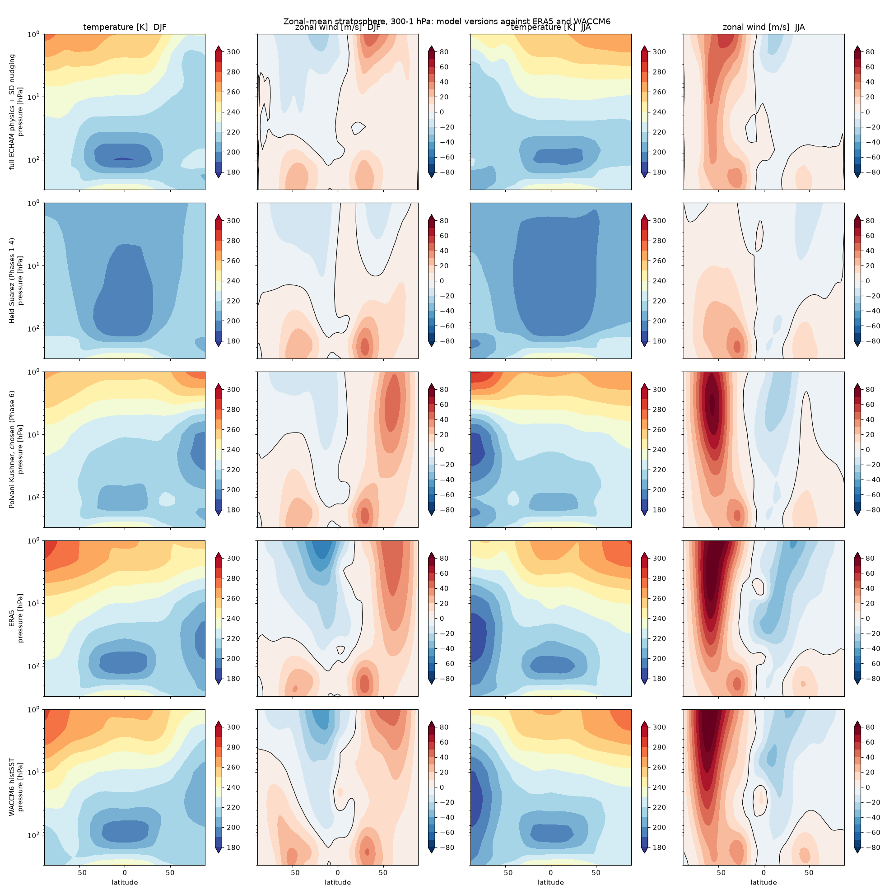
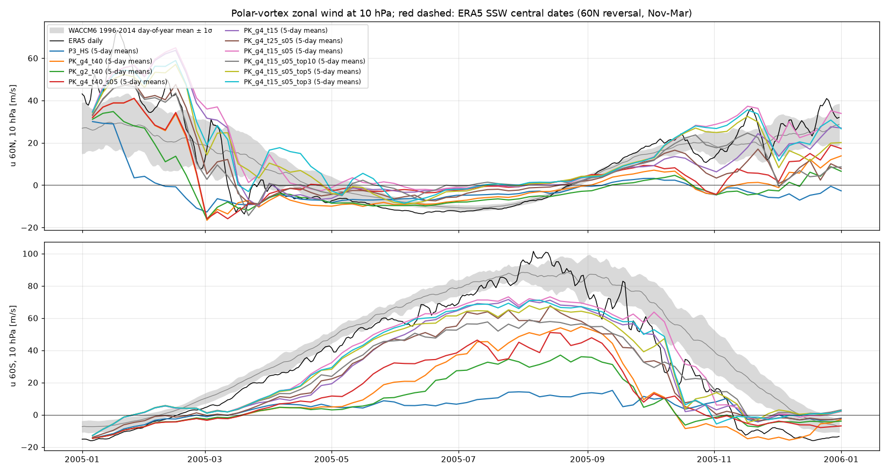
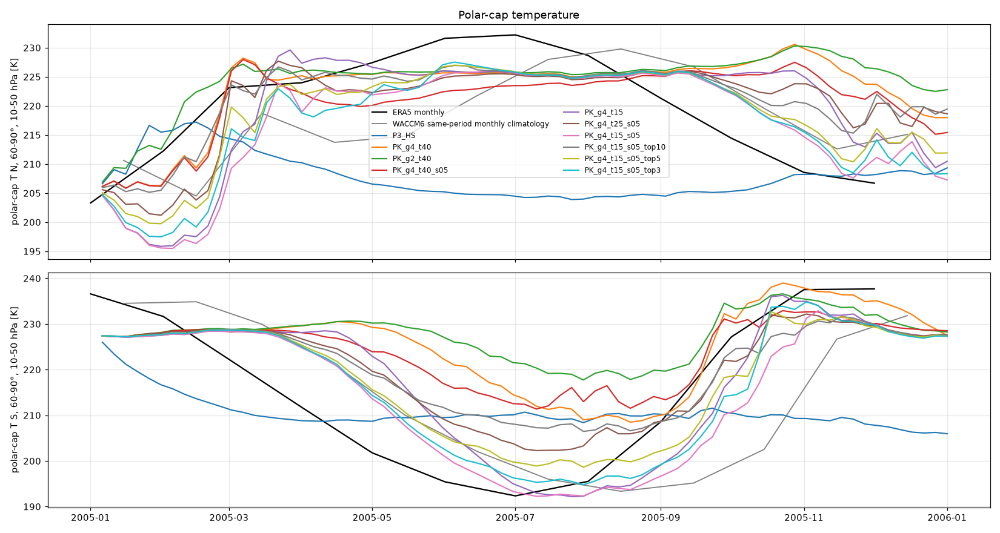
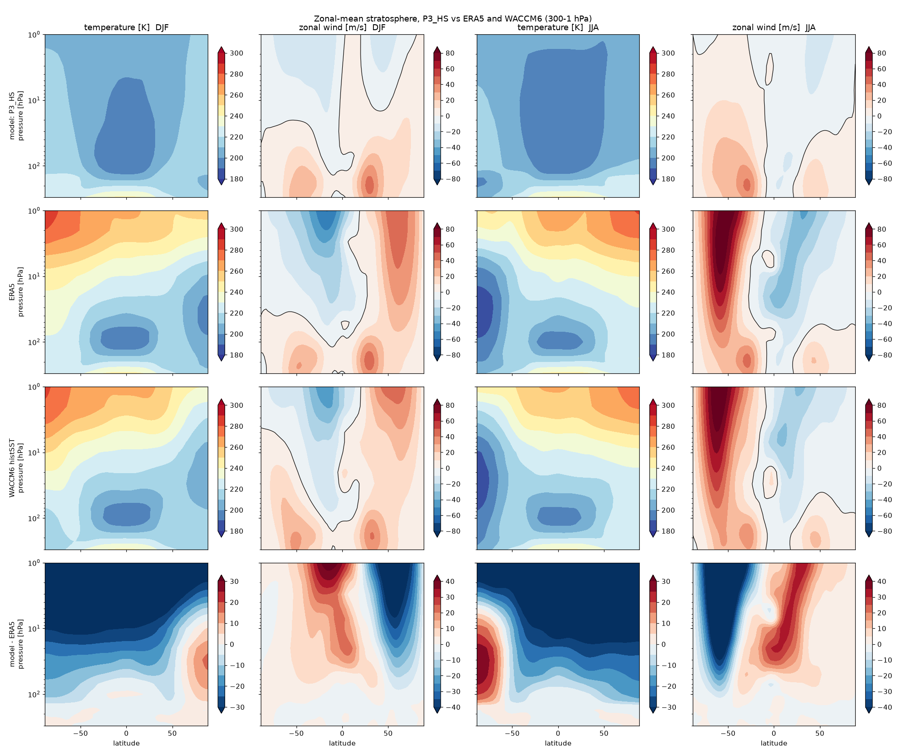
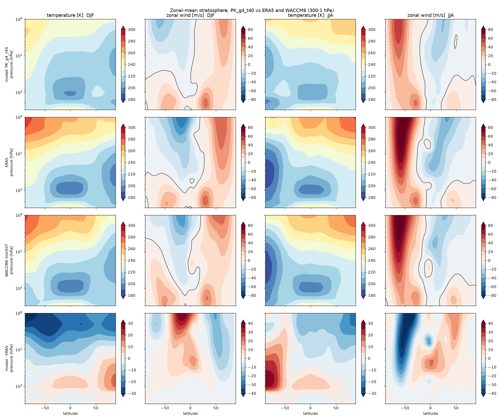
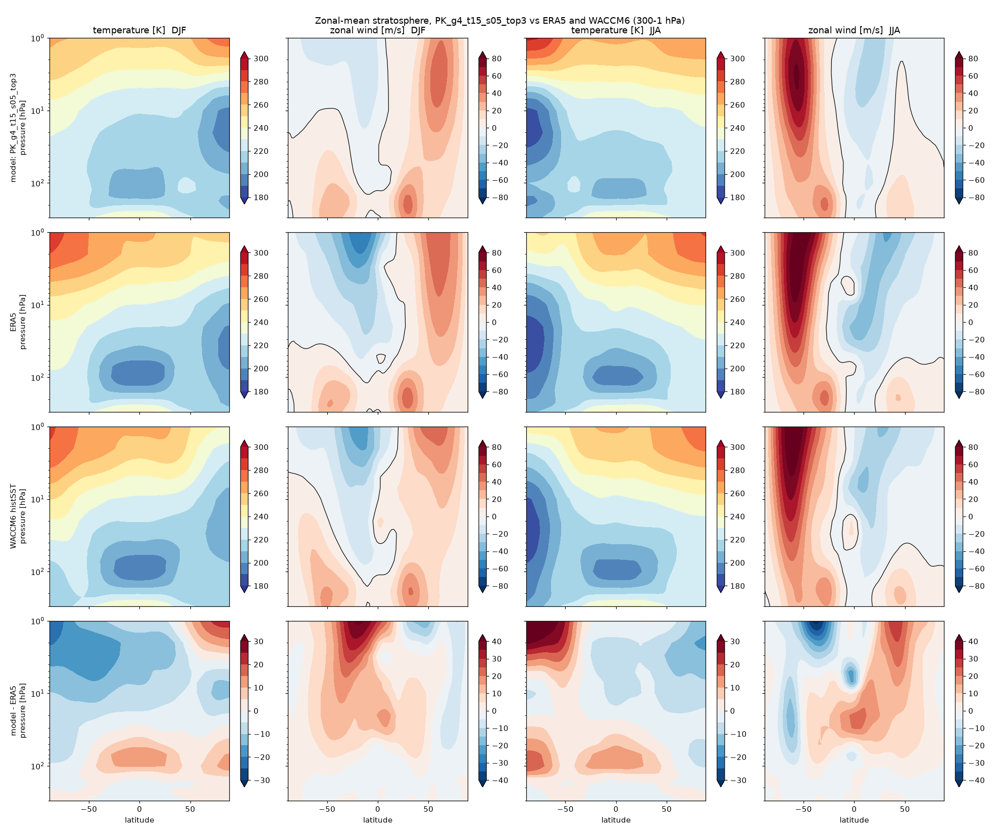
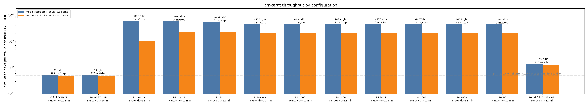

Throughput of the chosen configuration: 4445 simulated days/hour stepping, 2012 end-to-end
(`p6_pk_g4_t15_s05_top3`), indistinguishable from Phase 3 (4458 / 2082): the PK equilibrium costs
nothing measurable.

### The 5-year chain (`p6_2005` … `p6_2009`, aggregate `runs/p6_5yr`; figures in `5yr/`)

Same configuration, 2005-2009, four passive tracers, five chained one-year segments (65 min on
GPU 0). Compared with ERA5 2005-2009, WACCM6, CLaMS and the Held-Suarez Phase-4 chain (`p4_5yr`).

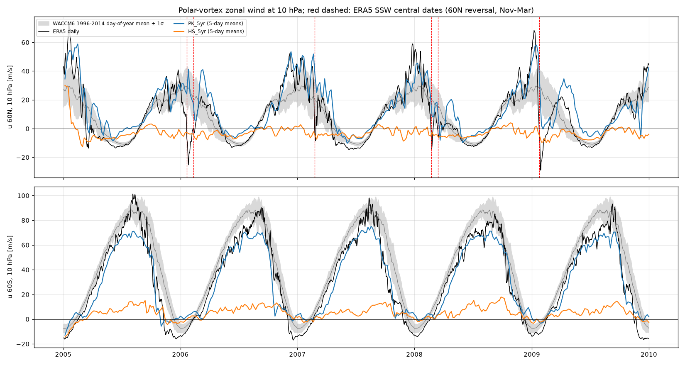
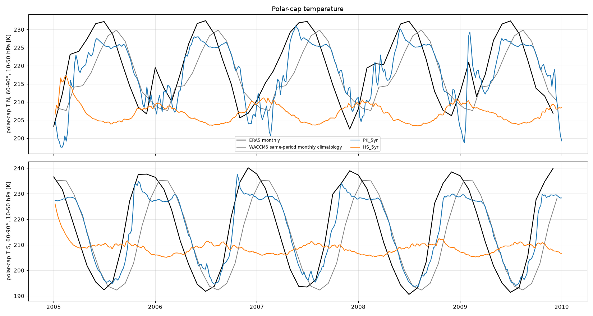
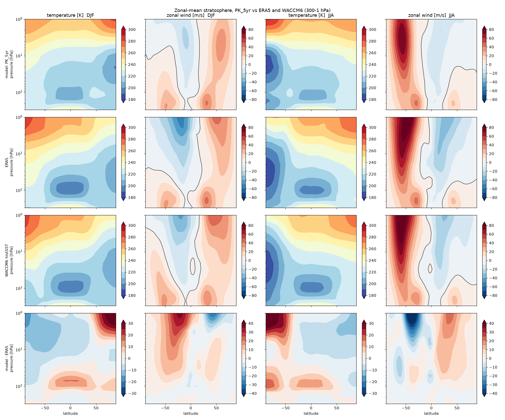
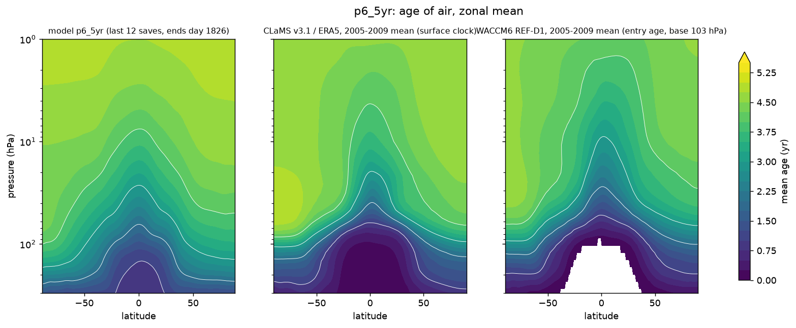
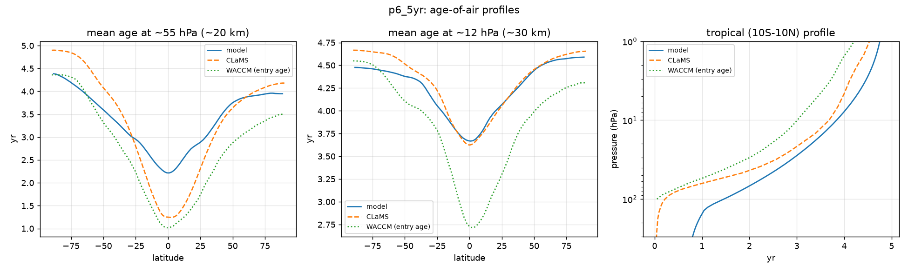
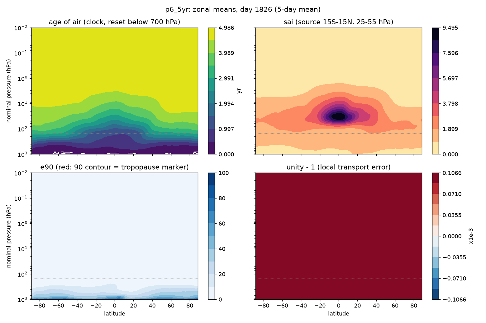
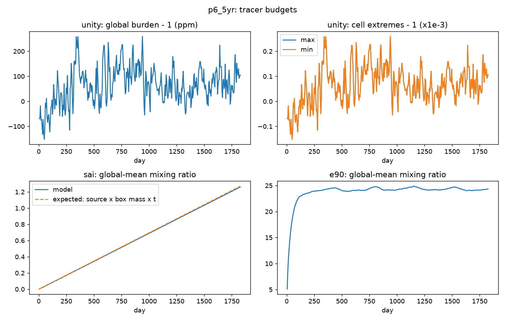

```
5-yr metrics vs ERA5 2005-2009 (100-1 hPa):  T RMSE 6.4 K (HS 35.7)   u RMSE 5.6 m/s (HS 11.9)
age of air, model / CLaMS / WACCM (entry age), 2005-2009 mean of the last year:
  ~55 hPa: tropics 2.29 / 1.33 / 1.11 yr   50-70 deg 3.85 / 4.12 / 3.40   contrast 1.56 / 2.79 / 2.29
  ~12 hPa: tropics 3.70 / 3.68 / 2.82 yr   50-70 deg 4.47 / 4.56 / 4.18   contrast 0.77 / 0.88 / 1.36
  Held-Suarez chain:  ~55 hPa contrast 1.21;  ~12 hPa contrast 0.35
tracers over 1826 d: unity max |q-1| 2.59e-4, burden drift +1.8e-4; sai -0.77 percent vs analytic;
  minima: aoa -8.5e-7 d, unity 1.0, sai 0, e90 0; top-level polar sai / column mean 0.089
```

## Reading

1. **A polar-night jet without radiation is achievable, and the relaxation time is the knob that
   matters.** PK02 as published (tau 40 d) gives jets at ~55 percent of ERA5's strength; at
   tau 15 d — the radiative damping time Duncan's handover asks for — both jets are within
   15 percent and the polar-cap temperature cycle follows ERA5 in both hemispheres. tau 25 sits
   in between on every metric. The price of a short tau is less internal variability: none of the
   tau 15 runs produces a mid-winter wind reversal in 2005 (correctly, that year), but the
   5-year chain must show whether the 2006, 2008 and 2009 SSWs survive the stronger relaxation.
2. **The seasonal envelope fixes timing, not strength.** The half-year cosine delayed the autumn
   cooling by about two months (Arctic cap 7 percent cooled in mid-October when ERA5 is 15 K
   down). Starting the cooling at the equinox (`season_offset` 0.5) moves the NH onset a month
   earlier and holds the SH vortex to November instead of mid-October, at almost no change in the
   RMSE.
3. **PK02's vortex profile must be capped aloft.** It cools without limit with height (143 K at
   3 hPa), which the tau-15 runs turned into a 30 K cold pole above 10 hPa. Fading the cooling
   out above 3 hPa removes that while keeping the 10 hPa jet; fading above 10 hPa fixes the
   temperature but takes 20 m/s off the jet.
4. **Two biases remain, both from the standard-atmosphere target.** (a) The 1-3 hPa layer is
   ~9 K too cold year-round (global mean 247 vs 256 K in ERA5) even at tau 15, i.e. dynamical
   cooling the relaxation does not overcome; January is 25 K cold because the ERA5 initial state
   has no information above 50 hPa and the upper stratosphere spins up over the first month,
   which inflates every DJF number in a 2005-only run. (b) The tropical lower stratosphere at
   70-150 hPa is ~10 K too warm: `T_US` is 217 K where the tropical tropopause is ~195 K. This
   matters for the tropical pipe and therefore age of air; a latitude-dependent tropopause
   temperature in the equilibrium is the obvious fix (issue to file).
5. **Held-Suarez is now clearly out.** 35 K RMSE, no vortex, no seasons, against 6.7 K with
   the same code path and the same cost.

6. **Over five years the picture holds and the variability is there.** RMSE 6.4 K / 5.6 m/s
   against ERA5 2005-2009; the polar-cap temperature follows ERA5 in both hemispheres with the
   Arctic winters showing the year-to-year variability that Held-Suarez had none of. Two of the
   three ERA5 SSW winters produce a wind reversal within one to four weeks of the observed date
   (2008, 2009); 2006 and 2007 do not, and the January-2006 event was a particularly wave-driven
   one, so tau 15 may be too stiff for it (DEFERRED). The 5-year climatology shows the remaining
   biases cleanly: the winter pole above 10 hPa is now 20-30 K too *warm* (the 3 hPa taper hands
   the cap back to the standard atmosphere, whose 250-270 K at 1-3 hPa is the summer value),
   the tropics at 1-3 hPa 10 K too cold, the tropical lower stratosphere 10 K too warm.
7. **Age of air: right pattern, tropical pipe too old in the lower stratosphere.** At 30 km the
   model matches CLaMS almost exactly (tropics 3.70 vs 3.68 yr, contrast 0.77 vs 0.88). At
   20 km the tropics are a year too old (2.29 vs 1.33 yr) so the tropical/extratropical contrast
   is 56 percent of CLaMS's: too slow tropical ascent or too much in-mixing between 100 and
   30 hPa. Both point at the 10 K warm tropical tropopause in the target (DEFERRED). Against the
   Held-Suarez chain the PK stratosphere improves the contrast from 1.21 to 1.56 yr at 20 km and
   from 0.35 to 0.77 yr at 30 km.
8. **A bug in the pull-up check.** `tracer_budget.py` summed the top level over longitude without
   dividing by the number of longitudes, so every pull-up ratio it printed before today was 192
   times too large (Phase 3: 0.001 was really 5e-6; the Phase-4 chain's 0.668 is really 0.003;
   this chain's 17.0 is 0.089). No verdict changes, but the Phase 4 record should be corrected.

9. **Against JCM's own full physics, the analytic stratosphere wins on winds and loses on
   temperature.** The full-ECHAM specified-dynamics year (`echam_ref/`) has the better temperature
   climatology (4.3 K RMSE, 100-1 hPa) but almost no Arctic vortex: u(60N, 10 hPa) drops to
   ~4 m/s in the first week of January 2005 and stays there through the following November and
   December, when it should rebuild to 25-30 m/s, and the Antarctic jet peaks at 40-50 m/s
   against ERA5's 80-100. Its wind RMSE is 9.7 m/s against the PK run's 6.8. Two caveats: its
   nudging target is 12-hourly (memory), and one year is one year; but the missing Arctic
   vortex in a run with radiation, Hines and orographic drag on suggests the full package's
   gravity-wave drag or its radiation-plus-nudging balance deserves a look before it is used as
   "the answer". It also runs at 140 simulated days/hour here (Phase 0 measured 52 with 5-day
   chunks and hourly diagnostics), i.e. 32 times slower than the PK model.

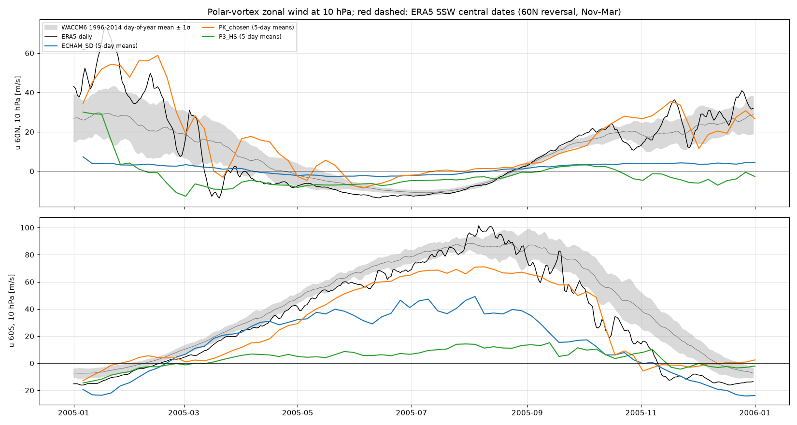
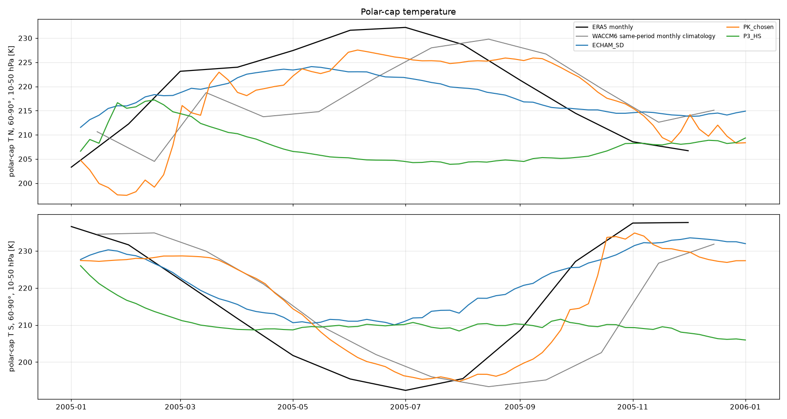
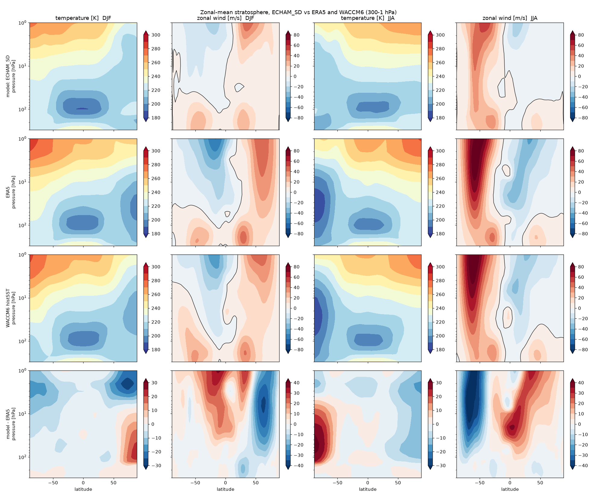

Decision: `strat_pk` defaults = gamma 4 K/km, tau 15 d, season_offset 0.5, vortex cooling faded
above 3 hPa (KEY_DECISIONS #23-#25). Phase 7 (time-step sweep) runs on this configuration.
