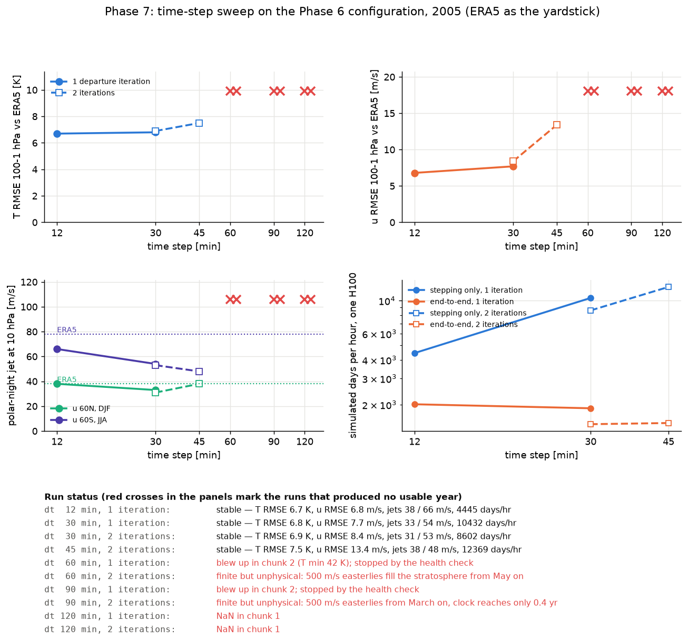
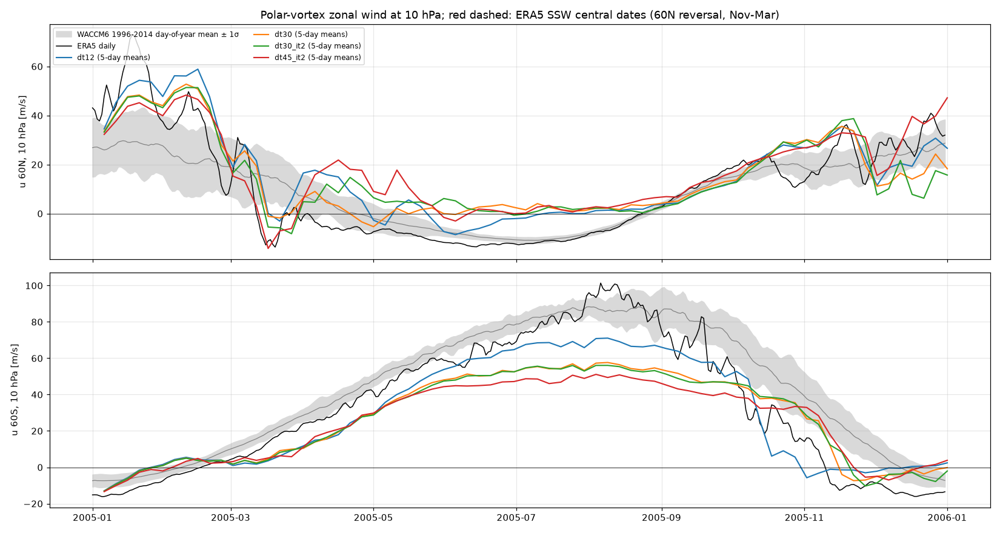
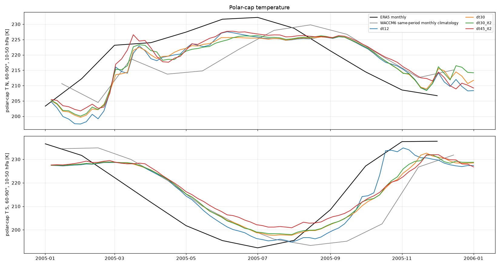
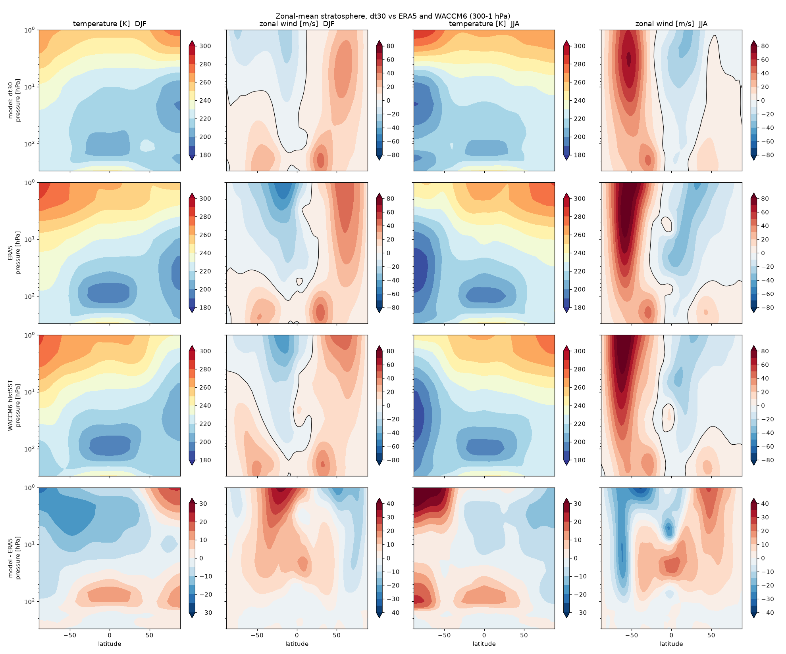
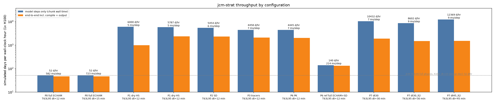

# Phase 7 — time-step sweep

Status: **complete** (2026-09-03). Branch `phase7-timestep` (off `phase6-stratosphere`).

## Question this phase answers

How long a time step does the semi-Lagrangian dycore tolerate on the Phase 6 configuration before
the stratosphere (climatology, polar-night jets) or the tracers degrade, and what does that do to
throughput? Duncan's handover (sec. 4.6): "double the dycore step until the polar vortex
climatology or the age of air degrades. That step is the answer."

## Configuration

`+experiment=p6_pk run.time_step=<min>` — the chosen Phase 6 stratosphere (gamma 4, tau 15 d,
equinox-to-equinox season, vortex cooling faded above 3 hPa), ERA5 nudging below 150 hPa, four
passive tracers, T63L95, 2005. Nothing else changes with dt: the 6-hourly nudging target is
interpolated to whatever step is used, the sponge and relaxation rates are per unit time.
`sl_departure_iterations=2` (via `jcm_strat.main`) doubles dinosaur's fixed-point iterations
for the departure points, whose accuracy condition is dt x |grad V| < 1.

## Runs

| run | dt [min] | departure iterations | fate |
|---|---|---|---|
| `p6_pk_g4_t15_s05_top3` (Phase 6) | 12 | 1 | stable, the reference |
| `p7_dt30` | 30 | 1 | stable |
| `p7_dt30_it2` | 30 | 2 | stable, indistinguishable from `p7_dt30` |
| `p7_dt45_it2` | 45 | 2 | stable, degraded winds |
| `p7_dt60` | 60 | 1 | blew up in chunk 2 (T min 42 K); JCM's between-chunk health check stopped the run (exit 0) |
| `p7_dt60_it2` | 60 | 2 | no NaN, but 500 m/s easterlies fill the stratosphere from May on |
| `p7_dt90` | 90 | 1 | blew up in chunk 2; stopped by the health check |
| `p7_dt90_it2` | 90 | 2 | no NaN, but 500 m/s easterlies from March on; the clock tracer reaches 0.4 yr in a year |
| `p7_dt120`, `p7_dt120_it2` | 120 | 1, 2 | NaN in the first chunk |

All 2005, GPUs 0-2 in parallel (three runs at a time), ~10 min each; queues `scripts/phase7_queue*.sh`.

## Acceptance

| check (vs the 12-min run) | threshold | 30 min | 45 min (2 it.) | >= 60 min |
|---|---|---|---|---|
| a full year, no NaN, physical state | required | **pass** | **pass** | **fail** (see fates) |
| T RMSE 100-1 hPa vs ERA5 | within 1 K | **pass**: 6.8 vs 6.7 K | **pass**: 7.5 K | - |
| u RMSE 100-1 hPa vs ERA5 | within 1 m/s | **pass**: 7.7 vs 6.8 m/s | fail: 13.4 m/s | - |
| polar-night jets, 10 hPa | within 5 m/s | **fail on the Antarctic jet**: 54 vs 66 m/s (ERA5 78); Arctic 33 vs 38 | Antarctic 48; Arctic 38 | - |
| tracers (unity, sai, minima, pull-up) | Phase 3 band | **pass**: 1.9e-4, -1.2 percent, >= 0, 0.002 | **pass**: 2.2e-4, -1.3 percent, >= 0, 0.003 | - |
| stepping throughput | reported | 10 432 days/hr (2.35x) | 12 369 days/hr (2.8x) | - |

The longest step inside the band on temperature, wind RMSE and tracers is **30 minutes**; it
misses the jet criterion on the Antarctic vortex, which is 12 m/s (18 percent) weaker than at
12 minutes. 45 minutes degrades the winds clearly. From 60 minutes on the dycore is unusable.

## Results

`dt_sweep.png` is the one-figure summary (metrics against the step, failures as red crosses,
a status line per run). `strat_metrics.md` has the stable runs, `strat_metrics_all_runs.md` all of
them including the unphysical ones; `vortex_series.png` and `polar_cap_T.png` overlay the stable
runs; climatology panels for 30 and 45 min.







```
                 T RMSE [K]  u RMSE [m/s]  u 60N DJF  u 60S JJA   stepping days/hr   ms/step
dt 12, 1 it.        6.7         6.8          38         66            4 445             7
dt 30, 1 it.        6.8         7.7          33         54           10 432             7
dt 30, 2 it.        6.9         8.4          31         53            8 602             9
dt 45, 2 it.        7.5        13.4          38         48           12 369             9
dt 60, 2 it.       24.6       178.3        -216       -185      (unphysical)
dt 90, 2 it.       35.7       285.5        -311       -323      (unphysical)
ERA5                 -           -           38         78
```

## Reading

1. **The semi-Lagrangian dycore's ceiling on this grid is between 45 and 60 minutes, not the
   2-3 hours the SL pull request's shear analysis suggested.** At 60 minutes with one departure
   iteration the model blows up within the second month; with two iterations it no longer
   produces NaN but drifts, four to five months in, into a state with 500 m/s easterlies filling
   the whole stratosphere (u RMSE 178 m/s) that the limiter and sponge keep finite. At 90 the same
   happens in March; at 120 the first chunk is NaN regardless. The extra departure iteration
   therefore buys robustness against NaN but not accuracy, and at 30 minutes it changes nothing
   (`dt30` and `dt30_it2` are indistinguishable), so the departure-point solve is not the limit;
   the semi-implicit coupling of the fast stratospheric jets with the 0.2 off-centering is the
   more likely one (KEY_DECISIONS on `sl_off_centering` still to be explored: issue to file).
2. **The cost is linear in the step.** 7 ms per step at 12 and 30 minutes (9 ms with two
   iterations), so 30 minutes gives 2.35x the stepping throughput. End-to-end it gives *less*
   (1 891 vs 2 012 days/hr) because a new step length means a fresh JIT compile (~3 min) and the
   output volume is unchanged; over a multi-year chain the compile is amortised and the output
   volume (issue #19) becomes the whole story.
3. **What degrades first is the Antarctic polar-night jet.** 66 -> 54 -> 48 m/s at 12 -> 30 ->
   45 minutes, while temperature and the Arctic jet hardly move. The strongest winds in the
   model, 70-90 m/s in the winter stratospheric jet, are where dt x |grad V| is largest, so the
   damping of that jet with the step is the accuracy signature Duncan's section 4.6 predicts.
   Tracer conservation is untouched at 30 and 45 minutes.
4. **Recommendation.** Keep 12 minutes as the scientific default. Offer 30 minutes as the fast
   mode for throughput and sensitivity work (2.35x, T and u RMSE within 1 K / 1 m/s, tracers
   unchanged), stated with its 18 percent weaker Antarctic jet. Do not use 45 or longer. Whether
   the 30-minute jet loss is acceptable for the age-of-air question is a decision for the group;
   the 5-year chain at 30 minutes (65 -> ~30 min on one GPU) would settle it empirically.

Decision proposed: `run.time_step` stays 12 in `p6_pk`; a `p7_fast` experiment with 30 minutes
is added for throughput work once the group agrees (KEY_DECISIONS #22 pending).
