# Phase 8 — QBO nudging: giving the stripped model the tropical wind oscillation it cannot grow

Status: **runs complete, 2005 and the 2005–2009 chain; all acceptance checks pass except throughput (−13 %).** Branch `phase8-qbo-nudging` (off `phase6-circulation`), committed, not pushed. **Addendum 2026-09-09 (section at the end): the window top raised from 4 to 1 hPa, same runs repeated; now the default.** PDF: `docs/outputs/jcm-strat_phase8_qbo.pdf` (`scripts/make_phase8_report.py`).

## Why

Phase 6 gave the model a defensible stratosphere (Polvani-Kushner target, polar-night jets, most
sudden warmings) but no QBO: the equatorial wind sits in steady easterlies of 12–14 m/s with a
deseasonalised variability of 4 m/s where ERA5 has 17 (Phase 6 addendum). The QBO is driven by
tropical waves launched by convection, which the dry model does not have, and needs ~500–700 m
vertical spacing in the tropical lower stratosphere; neither can be supplied cheaply. For aerosol
transport the QBO matters directly: it modulates tropical upwelling and the subtropical mixing
barrier, so an injected layer's residence time in the tropics and its leak to mid-latitudes differ
by tens of percent between phases (Pinatubo; every SAI study reports it). Under specified dynamics
the standard remedy is to nudge the tropical stratospheric wind to observations (issue #6); this
phase does that and measures what changes.

## What is nudged, towards what

`jcm_strat/qbo_nudging.py` (`QboNudging`, in `physics/strat_pk_qbo.yaml`, `+experiment=p8_qbo`):

| | choice | reason |
|---|---|---|
| **Target** | ERA5 monthly-mean zonal-mean zonal wind, CDS `reanalysis-era5-pressure-levels-monthly-means`, 25 levels 1–1000 hPa, 2005–2009 (`cache/era5_ref/era5_zm_monthly_<year>.nc`), interpolated to the model's latitudes and reference pressures in ln p, linearly in time between month centres | Your preference was ERA5 and the data is there (the CDS fetch made for Phase 6 reaches 1 hPa, unlike the WeatherBench2 store that stops at 50 hPa). ERA5 is also what the troposphere is already nudged to, so the whole column follows one reanalysis. Monthly means are enough: the QBO evolves over months and descends about 1 km per month. |
| **What is relaxed** | only the **zonal mean** of the model's zonal wind: at every longitude of a latitude row the same tendency, −(ū_model − ū_ERA5)/τ, is applied | The waves that do the transport are left untouched; only the mean flow they propagate through is corrected. Relaxing the full wind field would damp the eddies too. |
| **Where** | weight 1 for \|lat\| ≤ 15°, cos² taper to 0 at 25°; full weight 9–40 hPa, log-linear taper to 0 at 4 and 90 hPa | The QBO's domain. Stays clear of the tropospheric nudging cutoff at 150 hPa below and of the SAO region above 4 hPa. |
| **How fast** | τ = 10 days | WACCM's QBO-nudging choice: slow enough not to fight the resolved waves step by step, fast enough to hold the observed phase. |
| **Everything else** | Phase 6 as chosen (Polvani-Kushner γ = 4 K/km, τ_strat 15 d, seasonal winter cap faded above 3 hPa; ERA5 u/v/T nudging below 150 hPa; four passive tracers; T63L95; dt 12 min) | one change at a time |

Implementation notes: the term runs on the column path; the zonal mean is a segment mean over the
columns of each latitude row; the fraction of year comes from `forcing.solar.tyear` like the
seasonal Polvani-Kushner term and the calendar year is a config argument that the segment chain
passes per year (`EXTRA_PER_YEAR="physics.terms.held_suarez.qbo.year={year}"`). The QBO tendency is
computed inside the Polvani-Kushner term (`PolvaniKushnerQbo`); three CPU tests check the weights,
that the tendency equals −k w (ū − target) exactly, and that the combined term equals the two-term
sum. One hazard found: the first three attempts at the 2005 run died with `RESOURCE_EXHAUSTED`
allocating 29.45 GiB (`p8_qbo_2005_oom`, `_oom2`). JAX preallocates 75 % of the card (60 of 80 GB) by
default; the compiled step holds the 29 GB one-year nudging target and at times a second copy of it,
so the Phase 6 configuration sat just below that ceiling and any additional term tipped it over
(30-day tests were misleading because their target is 12 times smaller). `scripts/env.sh` now sets
`XLA_PYTHON_CLIENT_MEM_FRACTION=0.92`; nothing about the physics changed.

## Runs

| run | days | purpose | before |
|---|---|---|---|
| `p8_qbo_2005_oom`, `_oom2` | 0 | GPU out of memory under the default 75 % preallocation (see above) | — |
| `p8_qbo_2005` | 365 | first year with QBO nudging | `p6_pk_g4_t15_s05_top3` (Phase 6 chosen configuration, same year) |
| `p8_2005` … `p8_2009`, aggregate `p8_5yr` | 1826 | the 5-year chain with tracers (`chain_years.sh`, 82 min on GPU 0) | `p6_5yr` (Phase 6 chain) |

## Acceptance

| check | threshold | result (2005–2009 chain unless stated) |
|---|---|---|
| equatorial 5°S–5°N monthly u vs ERA5, 10–70 hPa | RMS < 5 m/s (Phase 6: 16 m/s) | **pass** — 3.9 m/s (2005 alone: 4.2; Phase 6 chain 16.3) |
| QBO amplitude: deseasonalised std at 20 and 30 hPa within 30 % of ERA5 | | **pass** — 14.1 / 12.4 m/s vs ERA5 17.5 / 15.2 (81 %, 82 %); at 10 hPa 13.6 vs 17.5 (78 %), at 50 hPa 7.8 vs 10.7 (73 %). Phase 6: 3.9 / 3.7 |
| the change is confined to the tropics | RMS change in time-mean ū, \|lat\| > 30°, 1–100 hPa, < 2 m/s; troposphere unchanged | **pass** — 0.5 m/s outside, 0.0 in the troposphere; 3.3 m/s inside the window |
| polar vortex, sudden warmings | unchanged within noise | **pass** — DJF u(60°N, 10 hPa) 32 m/s (Phase 6: 32, ERA5 28); reversals 2008-03-21, 2009-01-31, 2009-12-07 (Phase 6: 2005-03-22, 2008-03-21, 2009-02-05, 2009-12-07; ERA5 major warmings 2006-01-21, 2007-02-24, 2008-02-22, 2009-01-24): the January 2009 warming moves 5 days closer to ERA5 and the spurious March 2005 reversal disappears; 2006 and 2007 are still missed (issue #33) |
| stratospheric climatology vs ERA5 | not worse than Phase 6 | **pass** — annual T RMSE 100–1 hPa 6.3 K (Phase 6: 6.4), u RMSE 6.4 m/s (5.6); the extra u error is the tropical upper stratosphere, see reading 4 |
| tracer conservation | Phase 3 levels | **pass** — unity max \|q−1\| 2.6e-4, sai −0.8 % vs analytic, minima ≥ 0, polar top-level sai 8 % of the column |
| age of air | reported | tropics 2.16 yr at 55 hPa (Phase 6: 2.29; CLaMS 1.33), contrast to 50–70° 1.63 (1.56; 2.79); at 12 hPa 3.61 (3.70; 3.68) |
| throughput | within 5 % of Phase 6 | **fail, −13 %** — 3880 days/hr stepping (Phase 6: 4445), 8 vs 7 ms/step; end-to-end 2150 (Phase 6 chain 2090, better only because the chain scripts changed). The zonal-mean reduction per step costs ~1 ms; issue #44 |

## Results

### The QBO, before and after (`scripts/qbo_compare.py`, `docs/outputs/08_qbo/5yr/`)

```
                                 deseasonalised std [m/s]      mean u [m/s]     RMS vs ERA5 eq. monthly u
                                 10 / 20 / 30 / 50 hPa        20 / 30 hPa      10-70 hPa [m/s]
before: Phase 6 chain (p6_5yr)    4.0 / 3.9 / 3.7 / 2.8      -14.2 / -11.7         16.3
after:  QBO nudged (p8_5yr)      13.6 / 14.1 / 12.4 / 7.8     -11.9 /  -7.5          3.9
ERA5 2005-2009 (monthly, CDS)    17.5 / 17.5 / 15.2 / 10.7    -12.9 /  -8.0          -
RMS change in time-mean zonal-mean u, after - before: inside the window 3.3 m/s; |lat| > 30, 1-100 hPa 0.5 m/s; troposphere 0.0 m/s
```

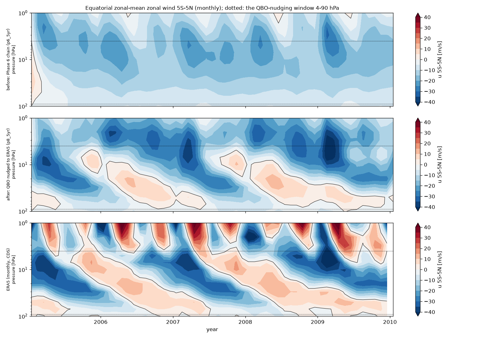
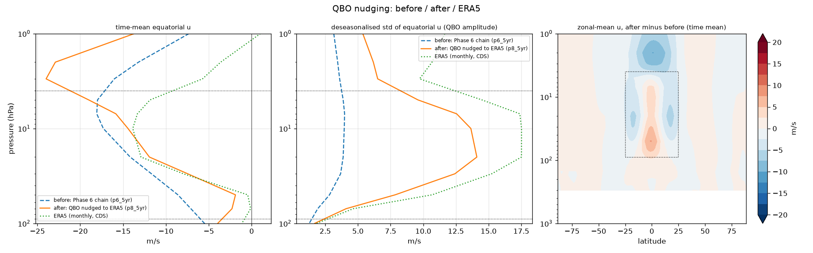

Single year 2005 (`1yr/`): RMS 16.8 → 4.2 m/s; after 30 days the wind at 10 / 20 / 30 hPa reads −29 / −21 / −6 m/s
(ERA5 −31 / −26 / −6; Phase 6 +2 / +5 / +6).

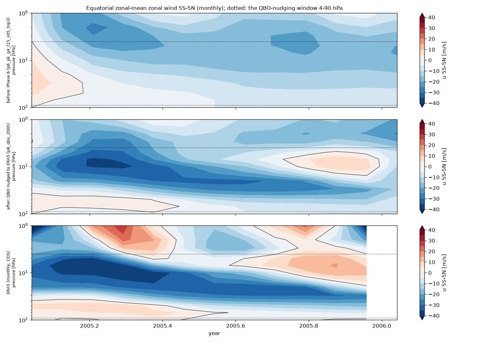

### Circulation and tracers (`strat_circulation.py`, `strat_compare.py`, `aoa_vs_clams.py`, `tracer_budget.py`)

```
Brewer-Dobson tropical upward mass flux [10^9 kg/s]   70 hPa DJF/JJA/annual   100 hPa annual   30 hPa annual
after (p8_5yr)                                          9.2 / 6.7 / 7.7            10.7            3.6
before (p6_5yr, Phase 6 record)                         8.8 / 6.5 / 7.2            10.2            3.4
WACCM6 histSST                                          8.6 / 5.4 / 6.1            10.8            3.1

Tropical ascent from age of air, 70 -> 10 hPa: transit 1.88 yr (before 1.87), 0.23 mm/s (CLaMS 2.94 yr, 0.15 mm/s)

Age of air, last 12 months [yr]        tropics 10S-10N   50-70 deg   contrast
~55 hPa  after (QBO)                        2.16            3.79       1.63
~55 hPa  before (Phase 6)                   2.29            3.85       1.56
~55 hPa  CLaMS v3.1 / ERA5                  1.33            4.12       2.79
~12 hPa  after                              3.61            4.42       0.81
~12 hPa  before                             3.70            4.47       0.77
~12 hPa  CLaMS                              3.68            4.56       0.88

Climatology vs ERA5 2005-2009, 100-1 hPa: T RMSE 6.3 K (before 6.4), u RMSE 6.4 m/s (before 5.6)
DJF u(60N, 10 hPa) 32 m/s (before 32, ERA5 28); JJA u(60S, 10 hPa) 65 (before 65, ERA5 72)
Tracers: unity max |q-1| 2.6e-4; sai burden -0.8 % vs analytic; minima >= 0; top-level polar sai 8 % of the column
Throughput: 3820-3960 days/hr stepping per segment (Phase 6: 4445), 2120-2190 end-to-end; 8 ms/step
```

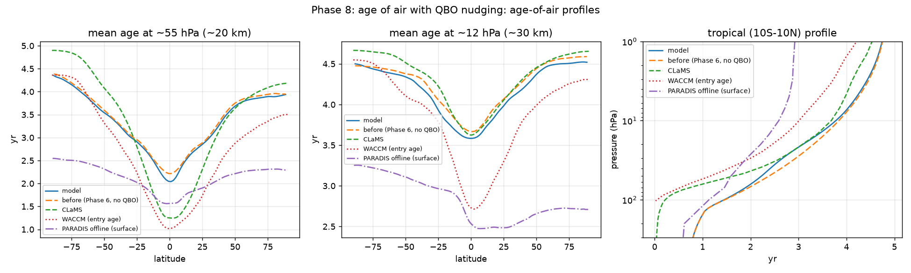
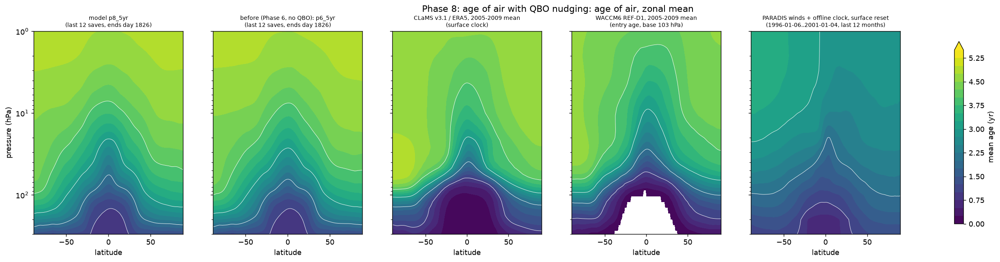
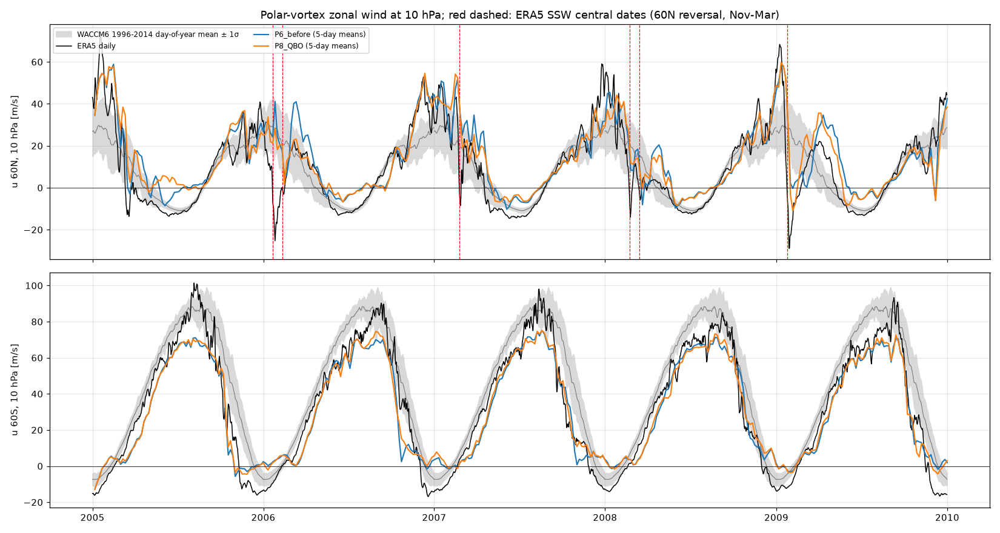
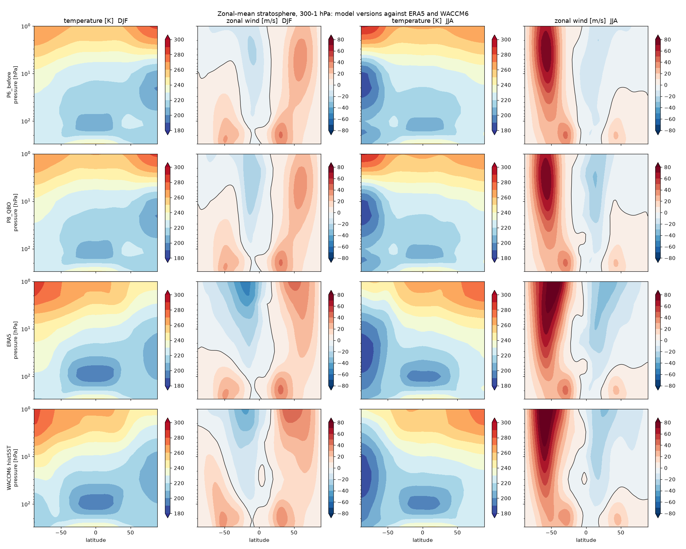
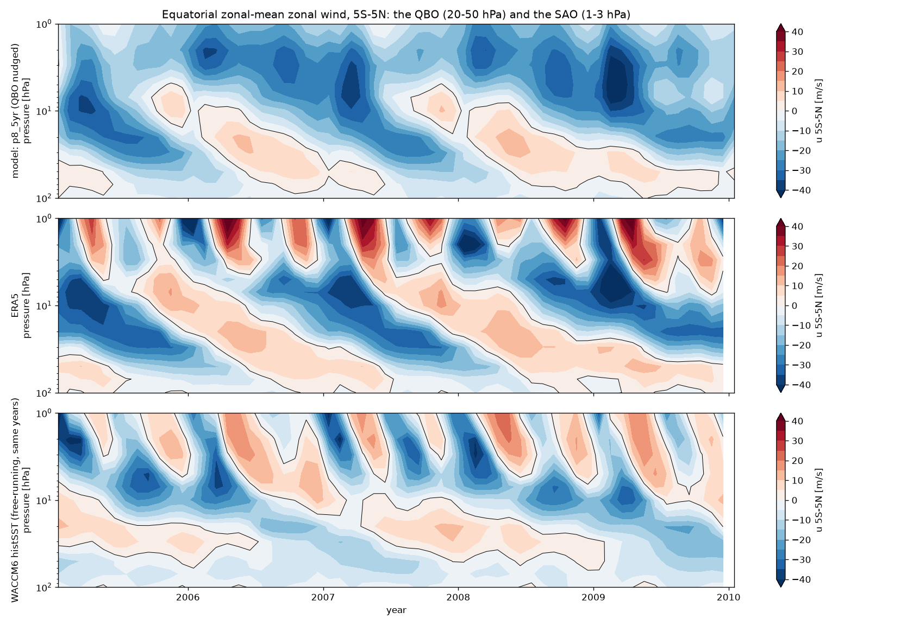
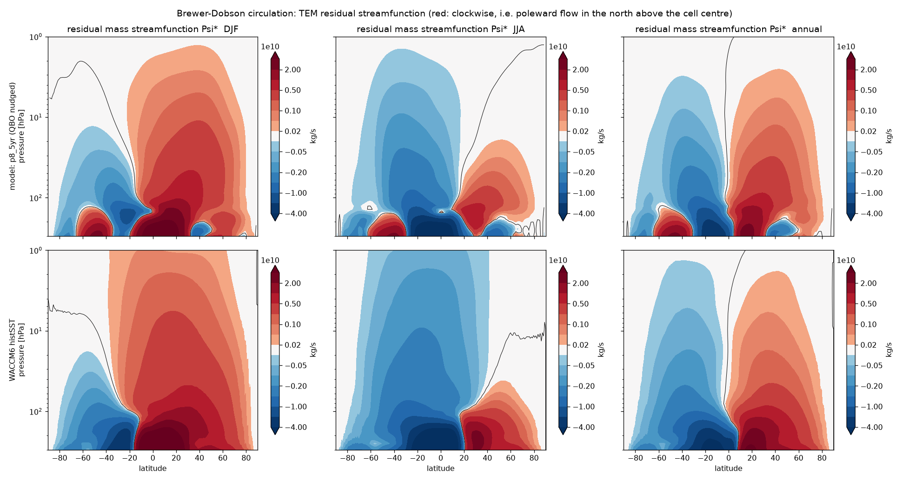
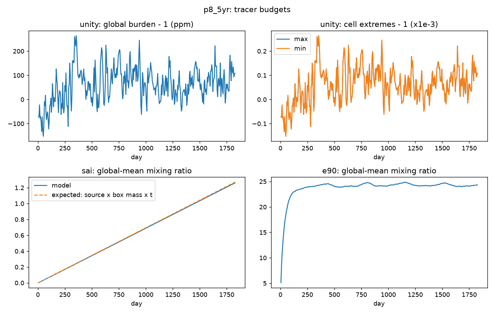
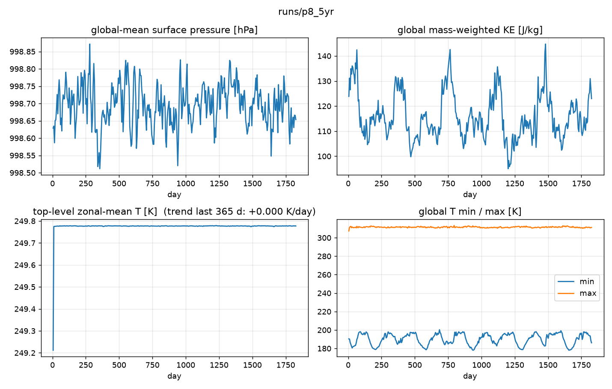

## Reading

1. **The model now has ERA5's QBO.** The descending easterly and westerly shear zones of 2005–2009 are
   reproduced in phase (time-height figure), the equatorial wind error against ERA5 falls from 16 to 4 m/s,
   and the QBO amplitude is 80 % of ERA5's at 10–30 hPa. It is not 100 % because monthly-mean targets
   and a 10-day relaxation smooth the extremes, and because the model's own dynamics pull back
   against the nudging; both are the intended behaviour of a nudge, not a bug.
2. **The rest of the stratosphere is untouched.** The time-mean wind changes by 0.5 m/s outside the
   window and not at all in the troposphere; the polar-night jets, the polar-cap temperatures and
   the sudden warmings are the Phase 6 ones (with the 2009 warming 5 days closer to ERA5 and a
   spurious 2005 reversal gone). The nudging does what it says: the tropical mean flow, nothing else.
3. **Age of air moves a little, in the right direction, and not enough.** Tropical age at 20 km drops
   from 2.29 to 2.16 yr and the tropics–extratropics contrast rises from 1.56 to 1.63 yr (CLaMS 2.79);
   the Brewer-Dobson upwelling at 70 hPa strengthens by 7 % (7.2 → 7.7 × 10⁹ kg/s; WACCM6 6.1). So
   the QBO's effect on the *five-year mean* transport is real but small, as expected: the QBO mainly
   redistributes transport between its phases, and a five-year mean averages over two cycles. The
   0.9 yr tropical excess that remains is the Phase 4 diagnosis unchanged: slow transit through the
   unmixed troposphere and lower stratosphere (issue #25), not the tropical wind. The QBO's value
   for aerosol is in phase-dependent statements (residence time in the easterly vs westerly phase,
   subtropical leakage), which this configuration can now make and the Phase 6 one could not.
4. **One new bias, above the window.** With the equatorial wind held easterly at 5–10 hPa, the
   mean flow at 1–3 hPa becomes 10–15 m/s more easterly than before (−24 m/s at 3 hPa against
   ERA5's −8), because momentum is carried upward from the nudged layer and nothing there
   (no SAO forcing) opposes it. This is why the global u RMSE is 0.8 m/s worse than Phase 6. It sits
   above the aerosol layer and does not touch the age of air at 20–30 km; extending the window to
   1 hPa or adding an SAO-region relaxation would remove it if it ever matters.
5. **Cost.** The zonal-mean reduction and the gather back to columns add about 1 ms to a 7 ms step
   (−13 % stepping throughput). The five-year chain took 82 min on GPU 0. A cheaper implementation
   (reduce once per latitude row on the dycore grid instead of via segment sums over 18 432
   columns) is issue #44; it is an optimisation, not a blocker.
6. **Why ERA5 and not something else.** ERA5's tropical stratospheric winds are observation-
   constrained (radiosondes at Singapore and the tropical network, GNSS radio occultation) and
   ERA5 has the QBO essentially right; the CDS monthly product goes to 1 hPa, unlike the
   WeatherBench2 store that stops at 50 hPa; and the troposphere is already nudged to ERA5, so one
   reanalysis constrains the whole column and the years line up with the CLaMS reference. A WACCM6
   target would have imposed a modelled QBO (weaker, 12.6 m/s std at 10 hPa in the free-running
   histSST run); a climatological or idealised QBO would have lost the real 2005–2009 phase
   sequence that the tracer comparison against CLaMS needs.

## Addendum, 2026-09-09: window top 1 hPa (`1hpa_top/`)

### Why

Two defects of the first version point at the top of the window. (1) Reading 4 above: with the
equatorial wind held easterly at 5–10 hPa and nothing constraining 1–4 hPa, the mean flow there
became 10–15 m/s more easterly than ERA5 (−24 m/s at 3 hPa against −8), and the model had no
semiannual oscillation. (2) The westerly QBO phase first appears at 5–10 hPa and descends from there;
with the taper ending at 4 hPa that onset layer had only weight 0.3 (5 hPa) to 0.7 (7 hPa). The ERA5
monthly target already reaches 1 hPa and the model lid is 0.01 hPa, so the change is one key,
`physics.terms.held_suarez.qbo.p_top_hpa=1.0`: full weight from 40 hPa up to 2.2 hPa, zero at 1 hPa.
Nothing else changed.

### The relaxations in the model, for reference

| field relaxed | where | target | tau | target cadence |
|---|---|---|---|---|
| u, v, T (full fields) | troposphere, p > 150 hPa, not the two lowest levels | ERA5 6-hourly (WeatherBench2) | 6 h | 6-hourly |
| T (full field) | stratosphere, p < 100 hPa | Polvani-Kushner seasonal equilibrium (analytic) | 15 d | analytic, follows the calendar |
| T (full field) | troposphere, under the ERA5 nudging | Held-Suarez equilibrium | 40 d free troposphere, 4 d boundary layer | analytic |
| u, v | boundary layer, sigma > 0.7 | zero (Rayleigh friction) | 1 d at the surface → 0 at sigma 0.7 | — |
| **zonal-mean u** | **tropics, \|lat\| < 25° (full to 15°), 90 hPa up to the window top (4 hPa before, 1 hPa now)** | **ERA5 monthly zonal means (CDS, 25 levels to 1 hPa)** | **10 d** | **monthly, interpolated between month centres** |
| u, v → 0; T → zonal mean and 250 K (sponge) | top 10 levels, 0.01–0.15 hPa | — | 1.5 h at the top, doubling per level | — |

### Runs

`p8b_2005` … `p8b_2009`, aggregate `p8b_5yr` (`chain_years.sh` with `EXTRA_PER_YEAR="... qbo.p_top_hpa=1.0"`,
5 × 14 min on GPU 0). Before = `p8_qbo_2005` / `p8_5yr` (window top 4 hPa). One segment (2007) died
once in JCM's provenance probe (`UnicodeDecodeError` while decoding `git diff HEAD`, because a
tracked PDF had been modified in the working tree by a parallel session); `.gitattributes` now
marks `*.pdf binary`, the segment was rerun, nothing else affected.

### Results (`scripts/qbo_compare.py --p-top 1`, `strat_compare.py`, `strat_circulation.py`, `aoa_vs_clams.py`, `tracer_budget.py`)

```
                                 deseasonalised std [m/s]    mean u [m/s]   RMS vs ERA5 eq. monthly u [m/s]   SAO amplitude [m/s]
                                 10 / 20 / 30 / 50 hPa       20 / 30 hPa    10-70 hPa      1-7 hPa            1 / 2 / 3 hPa
before: top 4 hPa (p8_5yr)       13.6 / 14.1 / 12.4 / 7.8    -11.9 / -7.5      3.9          22.7               4.7 /  5.6 /  5.5
after:  top 1 hPa (p8b_5yr)      13.7 / 14.1 / 12.4 / 7.8    -11.9 / -7.5      4.0          12.5               9.5 / 15.8 / 13.8
ERA5 2005-2009 (monthly, CDS)    17.5 / 17.5 / 15.2 / 10.7   -12.9 / -8.0       -             -               30.7 / 20.7 / 15.6
time-mean equatorial u at 3 hPa: before -24, after -9, ERA5 -6 m/s
RMS change in time-mean zonal-mean u, after - before: inside the window 5.0 m/s (one patch at 2-3 hPa); |lat| > 30, 1-100 hPa 0.5; troposphere 0.0
2005 alone: RMS 10-70 hPa 4.2 -> 4.2; 1-7 hPa 17.5 -> 10.6

climatology vs ERA5 2005-2009, 100-1 hPa: T RMSE 6.3 K (before 6.3; Phase 6 6.4); u RMSE 4.9 m/s (before 6.4; Phase 6 5.6)
DJF u(60N, 10 hPa) 31 m/s (before 32, ERA5 28); JJA u(60S, 10 hPa) 64 (65, 72); reversals 2008-03-26, 2009-01-31, 2009-12-07 (before 03-21, 01-31, 12-07)
Brewer-Dobson 70 hPa DJF/JJA/annual 9.4 / 6.6 / 7.7 (before 9.2 / 6.7 / 7.7); 100 hPa 10.7 (10.7)
age of air ~55 hPa tropics 2.16 yr (before 2.16), 50-70 deg 3.81 (3.79), contrast 1.64 (1.63); ~12 hPa tropics 3.68 (3.61; CLaMS 3.68)
tracers: unity max |q-1| 2.65e-4, sai -0.77 % vs analytic, minima >= 0, top-level polar sai 7.6 % of the column
throughput 3890-3930 days/hr stepping (before 3820-3960), 8 ms/step, 1870-1900 end-to-end
```

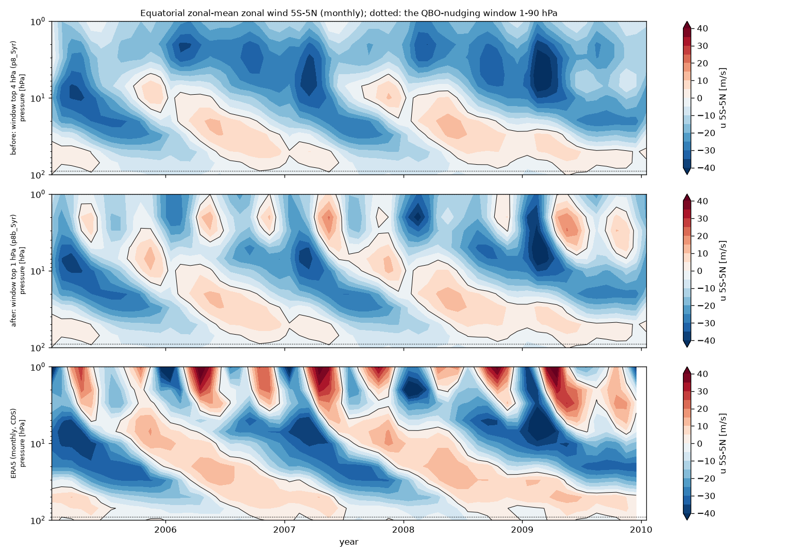
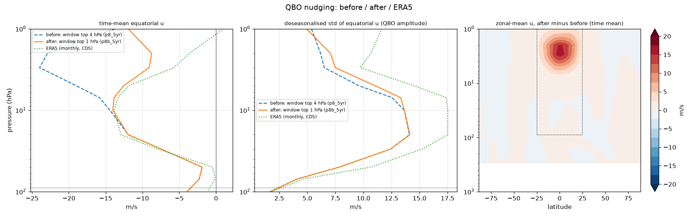
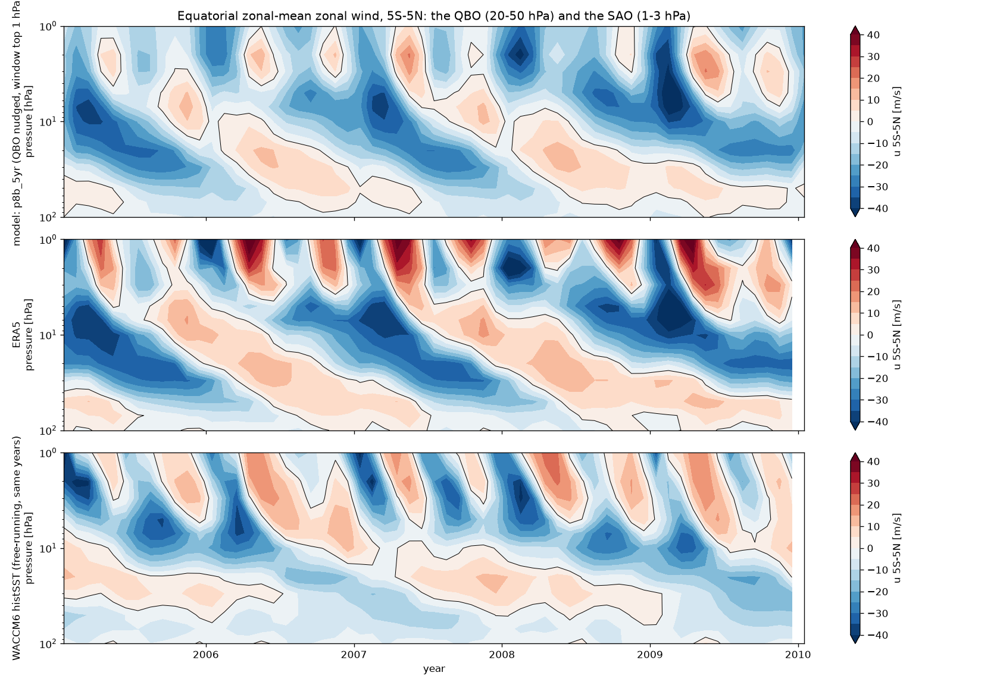
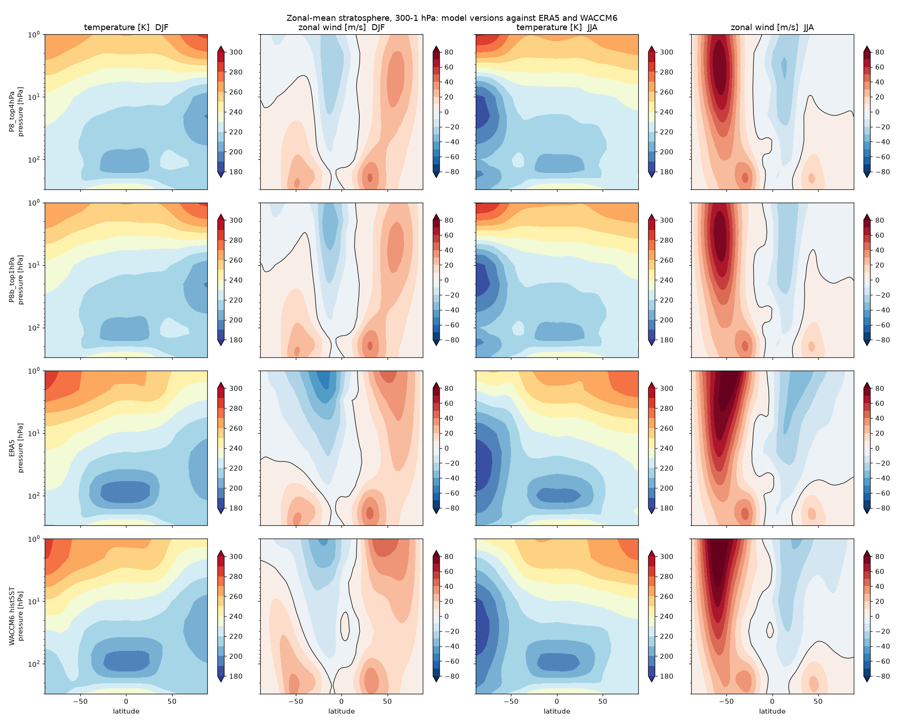
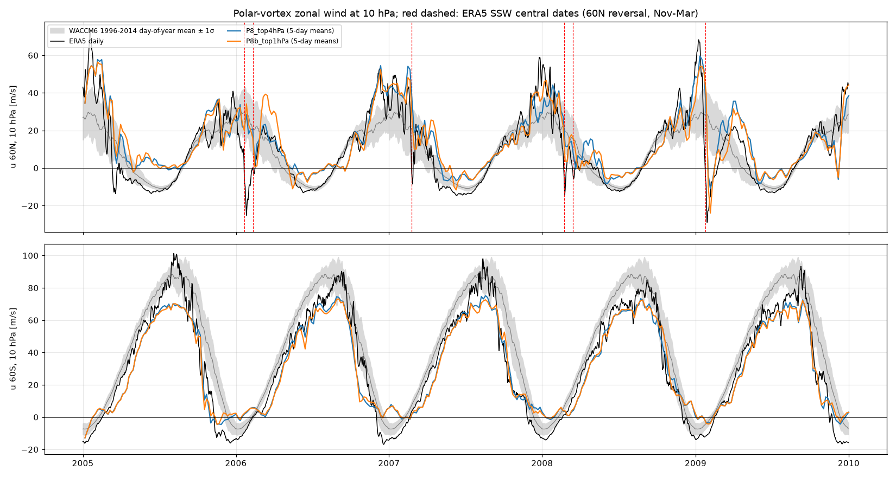
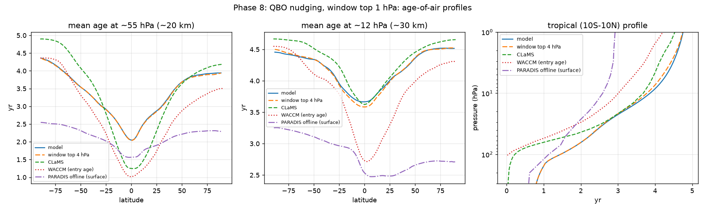
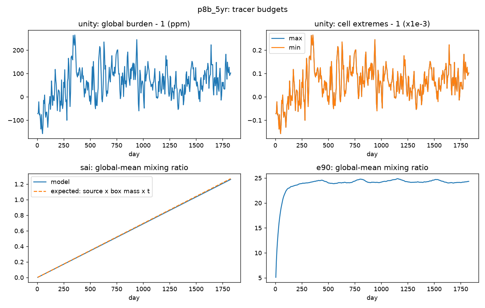
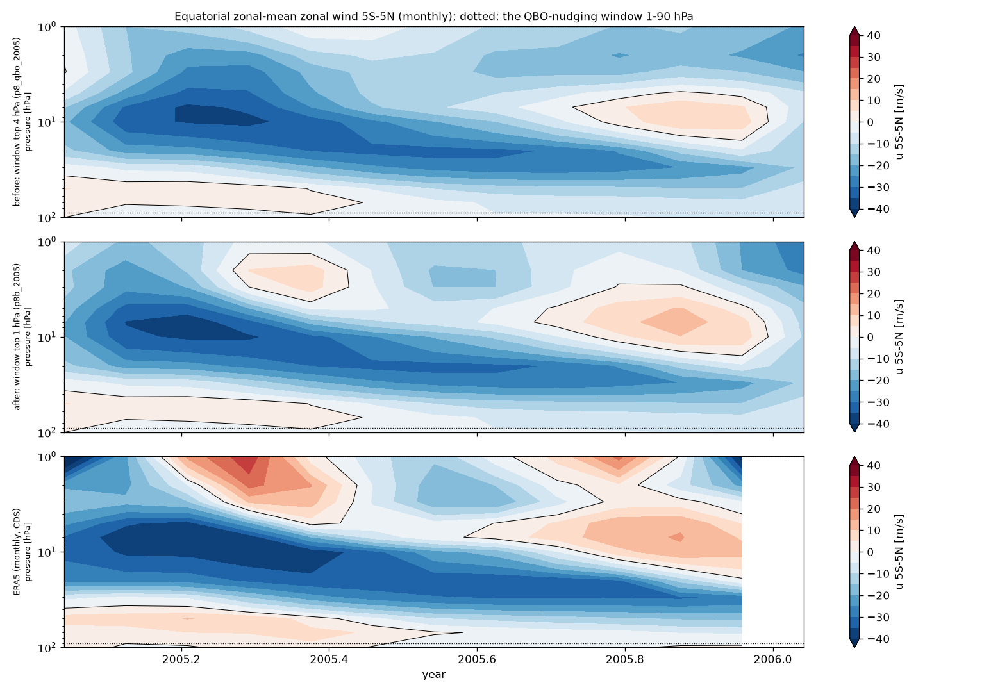

### Reading

1. **The bias above the window is gone and the model has a semiannual oscillation.** Equatorial
   error over 1–7 hPa 22.7 → 12.5 m/s; time-mean wind at 3 hPa −24 → −9 m/s (ERA5 −6); SAO amplitude
   at 2–3 hPa 5 → 14–16 m/s against ERA5's 16–21. The global stratospheric wind error falls from 6.4
   to 4.9 m/s, now better than Phase 6's 5.6: the QBO nudging no longer costs anything in the
   climatology. At 1 hPa itself the SAO is still 30 % of ERA5 because the weight is zero there by
   construction (the target's top level); a top below 1 hPa with the target clamped would hold it.
2. **Inside the QBO layer nothing changed.** Same amplitude (13.7 / 14.1 / 12.4 / 7.8), same
   RMS (4.0 vs 3.9), same time-mean profile below 5 hPa. So the westerly phases being 80 % of
   ERA5's was never the window: it is the 10-day relaxation against the model's own easterly pull
   (and the monthly target smoothing the extremes). The next knob is tau, not geometry (DEFERRED).
3. **Nothing else moved.** Vortex, warmings, polar-cap temperature, Brewer-Dobson flux, age of air
   (2.16 yr tropical at 20 km in both), tracer conservation and throughput are the 4 hPa numbers
   within noise. The change in the time-mean wind is one patch at 2–3 hPa over the equator.
4. **Decision: 1 hPa is the default** (`strat_pk_qbo.yaml`, KEY_DECISIONS #26). The 4 hPa chain
   `p8_5yr` stays on disk as the before-state.
