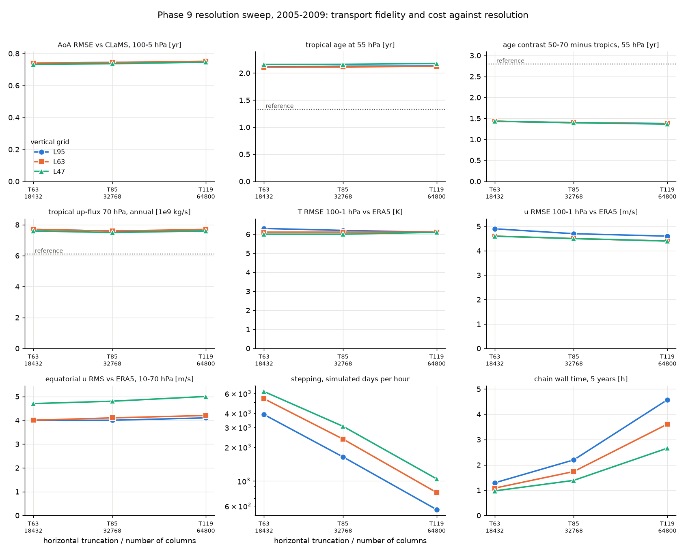
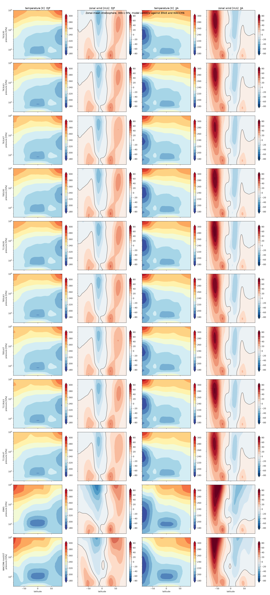
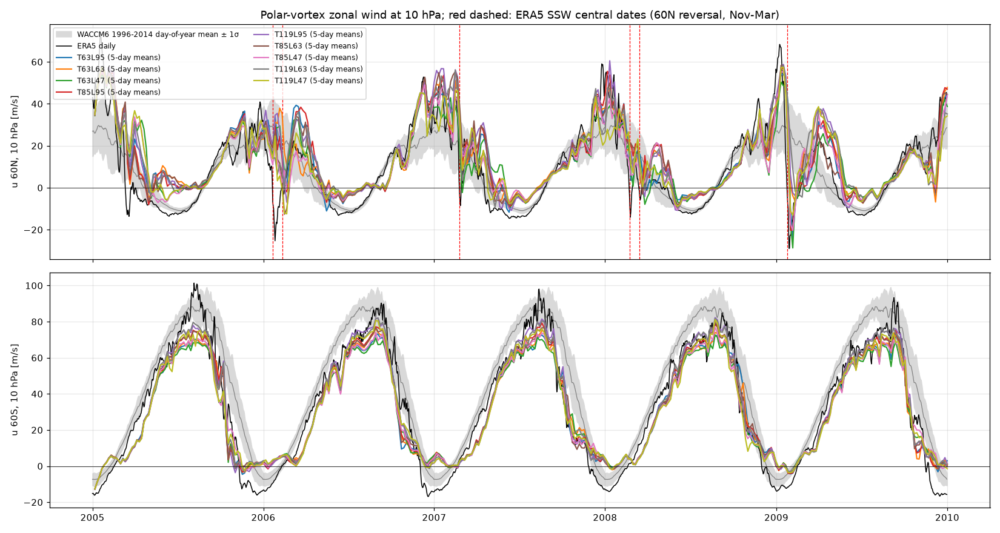
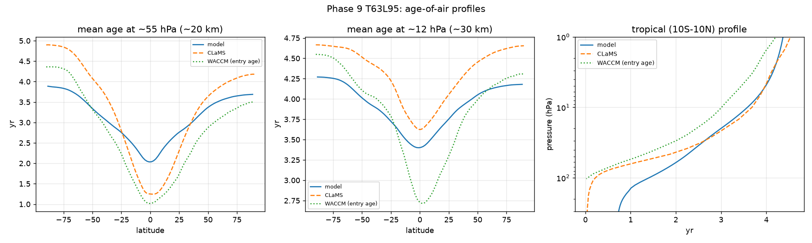
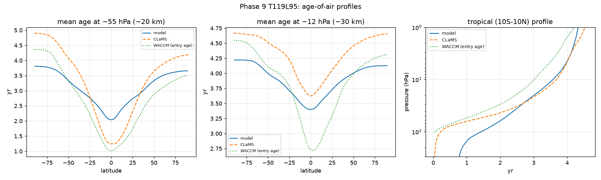
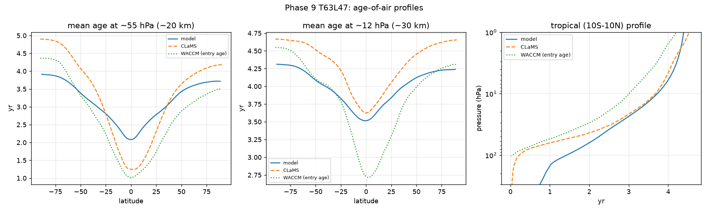
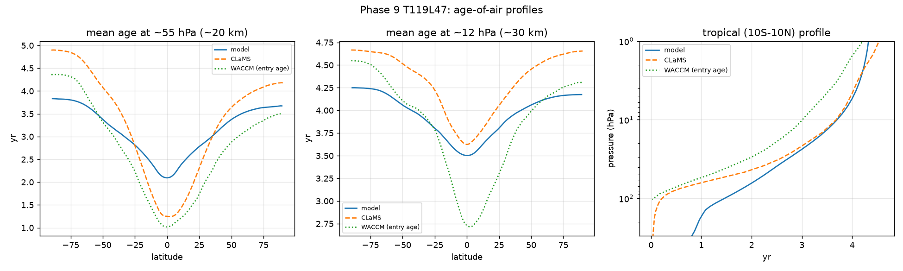

# Phase 9 — resolution sensitivity: what horizontal and vertical resolution do to stratospheric transport

Status: **runs complete and analysed (nine configurations, 2005–2009 each); all acceptance checks
pass except the analytic sai target, which is a diagnostic artefact (see Acceptance).** Branch
`phase9-resolution` (off `phase8-qbo-nudging`), worktree `/data/JCM_stripped/jcm-strat-phase9`.
Runs 2026-09-09 20:40 to 2026-09-10 06:34 UTC on GPUs 0–2 (released for the day); 18.3 GPU-hours,
2.2 TB of ERA5 windows in `cache/era5`.

## Why

Both resolutions set the implicit diffusion of the semi-Lagrangian transport: the horizontal
truncation through the interpolation at the departure points and the hyperdiffusion that goes
with it, the vertical spacing through the interpolation across levels in a stratosphere whose
transport is a slow ascent against a strong stratification. Phase 8 left the model at T63L95
with a tropical age of air 0.8 yr too old at 55 hPa against CLaMS/ERA5 and a tropics–extratropics
contrast of 1.4 yr against 2.8. Before a grid is fixed for the aerosol work this phase asks how
much of that gap is resolution, in which direction each axis moves it, and what each step costs.

## Question this phase answers

For the Phase 8b configuration (Polvani-Kushner stratosphere, ERA5-nudged troposphere below
150 hPa, QBO nudged to ERA5 up to 1 hPa, four passive tracers), how do age of air, the
Brewer-Dobson upwelling, the ERA5 climatology error and the cost change across T63 → T85 → T119
and across L95 → L63 → L47 (stratosphere kept), and where does each metric stop changing?

## Configuration

Everything is Phase 8b (`+experiment=p8_qbo` at commit 77fc70d, KEY_DECISIONS #26) except the
grid, the time step, the segment length of the 2005–2009 chain and, for the reduced vertical
grids, the sponge depth. One change per run.

| run | grid | columns | levels | dt | segments | ERA5 target per segment | hyperdiffusion profile |
|---|---|---|---|---|---|---|---|
| T63L95 (baseline, `p8b_5yr`) | `echam_t63_l95_hybrid` | 192×96 = 18 432 | 95 | 12 min | 5 × year | 31 GB | ECHAM (63, 95) |
| T63L63 | `strat_t63_l63_hybrid` | 18 432 | 63 | 12 | 5 × year | 21 GB | mapped from (63, 95) |
| T63L47 | `strat_t63_l47_hybrid` | 18 432 | 47 | 12 | 5 × year | 15 GB | mapped from (63, 95) |
| T85L95 | `echam_t85_l95_hybrid` | 256×128 = 32 768 | 95 | 9 | 10 × half-year | 28 GB | ECHAM (63, 95) (nearest) |
| T119L95 | `echam_t119_l95_hybrid` | 360×180 = 64 800 | 95 | 6 | 20 × quarter | 28 GB | ECHAM (127, 95) (nearest) |
| T85L63, T85L47 | as above, `grid.spectral_truncation=85` | 32 768 | 63 / 47 | 9 | 10 × half / 5 × year | 18 / 28 GB | mapped from (63, 95) |
| T119L63, T119L47 | as above, `grid.spectral_truncation=119` | 64 800 | 63 / 47 | 6 | 20 × quarter / 10 × half | 18 / 27 GB | mapped from (127, 95) |

**Horizontal.** T127 is not constructible in JCM (valid truncations are 21, 31, 42, 63, 85, 106,
119, 170, …); T119 on 360 × 180 Gaussian points is the 1° grid. The time step scales with
truncation (12 → 9 → 6 min) and must divide the 5-day save interval (KEY_DECISIONS #29). The
ECHAM hyperdiffusion base timescale is interpolated in truncation by JCM (7 h at T63 → 1.5 h at
T127); the order profile borrows the nearest tabulated truncation (T85 → T63's, T119 → T127's).

**Vertical** (`jcm_strat/levels.py`, KEY_DECISIONS #28). Both reduced tables are subsets of the
L95 interfaces, so every kept level is an L95 level:

- **strat63 = 8 + 47 + 8**: the 47 L95 levels between 1.08 and 159 hPa are kept exactly; the 21
  mesospheric levels above 1 hPa become 8 (interfaces 0.035, 0.073, 0.111, 0.198, 0.333, 0.458,
  0.714, 1.08 hPa), the 27 tropospheric levels below 159 hPa become 8 (210, 306, 402, 522, 656,
  795, 957, 1013 hPa).
- **strat47 = 7 + 15 + 17 + 8**: 30–159 hPa kept exactly (17 levels, ~1 km); 1.08–30 hPa every
  other L95 interface (15 levels, ~2 km); mesosphere 7 levels; troposphere the same 8 as strat63.
  This is not ECHAM's own L47, whose stratosphere is ~2 km throughout.

The hyperdiffusion order at each reduced level is the L95 order at the L95 index of its centre
(strat63 at T63: del² × 4, del⁴ × 3, del⁶ × 4, del⁸ × 52; strat47: 3 / 3 / 2 / 39). The upper
sponge keeps L95's tau(p): 4 levels with a factor 6.73 per level on strat63, 3 levels with a
factor 8 on strat47, both reaching ~0.2 hPa like L95's 10 levels with factor 2. The QBO window
(90 → 1 hPa) and the nudging cutoff (150 hPa) contain the same levels as on L95.

**Held fixed, and recorded as limitations.** The T63 terrain file is interpolated to every grid
(only T63 and T106 have native files; the dry model has no sub-grid orography), so the orography
spectrum is the same at all truncations. The ERA5 nudging target is 6-hourly everywhere; its
WeatherBench2 source store is 240×121 for T63 and 360×181 for T85 and T119. The clock tracer is
the surface clock (reset below 700 hPa) only, so the vertical axis includes tropospheric transit
(issue #25). All chains start from ERA5 on 2005-01-01 and carry the Phase 4 spin-up deficit of
the 5-yr clock (issue #44), which is the same kind of bias in every run.

## Reference data

| quantity | reference | source |
|---|---|---|
| age of air (surface clock) | CLaMS v3.1 driven by ERA5, 2005–2009 annual mean, 1° × 39 levels | `/data/CLaMS/CLaMS_v3/clams_v3.1_era5_zm_lat.zip` |
| age of air (entry age, pattern only) | WACCM6 REF-D1 | `/data/CESM2_REFD1_AOA/` |
| zonal-mean u, T 1–1000 hPa; equatorial u | ERA5 monthly (CDS), 2005–2009 | `cache/era5_ref/era5_zm_monthly_*.nc` |
| u(60N/60S, 10 hPa) daily | ERA5 (CDS) | `cache/era5_ref/era5_u10hPa_daily_*.nc` |
| tropical upward mass flux (TEM) | WACCM6 histSST 2005–2009, same method; ERA5-era literature 6–8 × 10⁹ kg/s at 70 hPa | `/data/cesm2.1.5_output/histSST/...` |

Age of air is the ranking metric (RMSE against CLaMS over latitude × ln p, 100–5 hPa, cos-lat
weighted, model from the last 12 months = 73 five-day means); ERA5 climatology, QBO, up-flux and
cost stand beside it, unweighted (`scripts/resolution_metrics.py`).

## Runs

| run | days | segments | GPU | wall | status |
|---|---|---|---|---|---|
| `p9smoke_*` (8) | 5 | 1 | 0 | 3–4 min each | all exit 0: no OOM, ERA5 from cache, lmidatm diffusion profile in use, health OK |
| `p8b_5yr` (Phase 8b, the T63L95 point) | 1826 | 5 | 0 | 1 h 17 min | done 2026-09-09 (Phase 8b record) |
| `p9_t63l63_*` → `p9_t63l63_5yr` | 1825 | 5 | 0 | 1 h 05 min | done, all segments exit 0 |
| `p9_t63l47_*` → `p9_t63l47_5yr` | 1825 | 5 | 0 | 58 min | done |
| `p9_t85l95_*` → `p9_t85l95_5yr` | 1825 | 10 | 0 | 2 h 12 min | done |
| `p9_t85l63_*` → `p9_t85l63_5yr` | 1825 | 10 | 2 | 1 h 44 min | done |
| `p9_t85l47_*` → `p9_t85l47_5yr` | 1825 | 5 | 1 | 1 h 23 min | done |
| `p9_t119l95_*` → `p9_t119l95_5yr` | 1825 | 20 | 0 | 4 h 34 min | done |
| `p9_t119l63_*` → `p9_t119l63_5yr` | 1825 | 20 | 1 | 3 h 37 min | done |
| `p9_t119l47_*` → `p9_t119l47_5yr` | 1825 | 10 | 2 | 2 h 40 min | done |

Susanne released GPUs 0–2 to this phase for 2026-09-09/10, so from 22:08 UTC the chains ran three
at a time (one queue per GPU, `scripts/phase9_queue.sh` with claim files). Wall times include
~10 min per segment of target loading, compile and output; the T119 chains are dominated by the
20 segment restarts and by the ERA5 prefetch that had to precede them (the prefetch, not the GPU,
was the critical path: ~10 h in three to four parallel CPU streams for 2.2 TB).

## Acceptance

| check | threshold | result |
|---|---|---|
| every chain complete | all segments exit 0, 1825 days linked, no OOM, ERA5 from cache | **pass** — 8 chains, 75 segments, every segment exit 0 and `era5: cache hit`; no RESOURCE_EXHAUSTED at any resolution (the 28–31 GB targets fit at 0.92 memory fraction, T119 included) |
| tracers at every resolution: unity | max \|q−1\| < 1e-3 | **pass** — 2.4e-4 to 3.1e-4 across the nine runs |
| tracers: minima | ≥ 0 | **pass** — sai and e90 minima 0; aoa −1e-6 day (roundoff) |
| tracers: sai burden vs analytic | within ±2 % | **formally fails on 6 of 9** (−4.0 % to +3.6 %), **but the model burdens agree across grids to within the box discretisation** (1.254–1.260 at T63 and T119, 1.295 at T85): the spread is the grid's rendering of the 15° × 25–55 hPa source box, which the budget script's analytic target renders differently again (DEFERRED). Conservation is the unity check, which passes everywhere. |
| stability at the chosen dt | u RMSE 100–1 hPa vs ERA5 < 30 m/s, no NaN | **pass** — 4.4–4.9 m/s; no NaN; p_s drift ≤ 0.03 hPa; top level 249.8 K in every run |
| ranking delivered | `resolution_metrics.md` with per-metric ranks; convergence statement per axis; cost per unit of AoA improvement | **pass** — table and figure below; see Reading 1–3 |

## Results

Full table with ranks: [`resolution_metrics.md`](resolution_metrics.md). Age of air from the last
12 months of each chain (2009), CLaMS 2005–2009 annual mean.

```
                 columns  dt   AoA RMSE  bias   age 55 hPa              age 12 hPa            transit  up-flux  T RMSE  u RMSE  u60N DJF  QBO RMS  stepping  ms/    chain
                          min  vs CLaMS         trop / 50-70 / contrast trop / 50-70 / contr  70->10   70 hPa   ERA5    ERA5    u60S JJA  vs ERA5  d/hr      step   wall h
T63L95 (8b)      18432    12   0.74      0.12   2.11 / 3.55 / 1.43      3.43 / 4.12 / 0.69    1.96     7.7      6.3     4.9     31 / 64   4.0      3890      8      1.3
T63L63           18432    12   0.74      0.11   2.11 / 3.54 / 1.44      3.41 / 4.11 / 0.69    1.95     7.7      6.1     4.6     31 / 64   4.0      5374      6      1.1
T63L47           18432    12   0.73      0.18   2.16 / 3.59 / 1.43      3.54 / 4.18 / 0.64    2.08     7.6      6.0     4.6     28 / 62   4.7      6228      5      1.0
T85L95           32768     9   0.75      0.11   2.13 / 3.53 / 1.40      3.43 / 4.10 / 0.67    1.93     7.6      6.2     4.7     32 / 67   4.0      1636     14      2.2
T85L63           32768     9   0.74      0.09   2.11 / 3.51 / 1.39      3.41 / 4.08 / 0.67    1.93     7.6      6.1     4.5     31 / 66   4.1      2356     10      1.7
T85L47           32768     9   0.74      0.16   2.16 / 3.56 / 1.40      3.53 / 4.15 / 0.62    2.05     7.5      6.0     4.5     28 / 64   4.8      3059      7      1.4
T119L95          64800     6   0.75      0.10   2.13 / 3.51 / 1.38      3.43 / 4.09 / 0.66    1.92     7.6      6.1     4.6     34 / 70   4.1       557     27      4.6
T119L63          64800     6   0.75      0.10   2.13 / 3.50 / 1.38      3.43 / 4.07 / 0.64    1.92     7.7      6.1     4.4     32 / 69   4.2       790     19      3.6
T119L47          64800     6   0.75      0.16   2.18 / 3.54 / 1.36      3.53 / 4.13 / 0.60    2.02     7.6      6.1     4.4     27 / 66   5.0      1045     14      2.7
CLaMS / ERA5     -         -   0         0      1.33 / 4.12 / 2.79      3.68 / 4.56 / 0.88    2.94     6.1*     0       0       28 / 72   0
   * WACCM6 histSST, same method; ERA5-era literature 6-8
```

QBO amplitude (deseasonalised std at 10 / 20 / 30 / 50 hPa, m/s; ERA5 17.5 / 17.5 / 15.2 / 10.7):
L95 and L63 runs 13.6–13.7 / 14.0–14.1 / 12.3–12.4 / 7.8 at every truncation; L47 runs
12.4–12.6 / 12.8–13.0 / 11.5–11.7 / 7.7–7.8. Equatorial u RMS vs ERA5 over 1–7 hPa: 11.0–12.5 m/s
in every run (Phase 8b: 12.5).

Sudden-warming-like reversals of u(60N, 10 hPa) (ERA5 majors: 2006-01-21, 2007-02-24, 2008-02-22,
2009-01-24): every run has the January 2009 warming; the February 2006 event appears in all six
T85 and T119 runs (2006-02-10 to 02-20) and in no T63 run; 2008 in five of nine; 2007 only in
T63L47 (2007-03-02, late). Two to four events per run; five years is too short to rank on this.









Per run under `<LABEL>/`: `*_aoa_triptych.png`, `*_aoa_profiles.png`, `*_tracer_budget.png`,
`*_tracer_zonal.png`, `*_summary.png`, `qbo_*.png` + `qbo_metrics.md`, `circulation/`
(`qbo_time_height.png`, `tem_streamfunction.png`, `circulation_metrics.md`); `strat/` holds the
nine climatology figures, the panel, the vortex series, the polar-cap temperatures and
`strat_metrics.md`.

## Reading

1. **Horizontal resolution does not move the transport.** From T63 to T119 (3.5 × the columns,
   half the time step, 3.5 × the cost per simulated year) the age-of-air RMSE against CLaMS goes
   0.74 → 0.75 → 0.75 yr, the tropical age at 55 hPa 2.11 → 2.13 → 2.13 yr, the 70 → 10 hPa
   transit 1.96 → 1.93 → 1.92 yr and the 70 hPa upward mass flux 7.7 → 7.6 → 7.6 × 10⁹ kg/s. The
   tropics–extratropics contrast even shrinks slightly (1.43 → 1.40 → 1.38 yr; CLaMS 2.79). The
   T63 → T85 step changes every transport number by less than the T85 → T119 step changes it,
   and both are below 0.03 yr: the transport is converged in the horizontal at T63 for this
   scheme. What T119 does buy is the climatology: u RMSE 4.9 → 4.6 m/s, the polar-night jets
   3–6 m/s stronger (u(60S, 10 hPa) JJA 64 → 70 against ERA5 72; u(60N) DJF 31 → 34 against 28,
   so overshooting), and the February 2006 warming that no T63 run has. None of that reaches the
   age of air.
2. **Thinning the mesosphere and the troposphere (L95 → strat63) changes nothing and buys 38 %.**
   Every metric agrees within 0.02 yr, 0.1 K, 0.3 m/s at all three truncations; the tracer and
   stability checks are identical. Halving the 1–30 hPa spacing on top of that (strat47) is
   visible but small: the clock reads 0.1 yr older above 30 hPa (12 hPa tropics 3.43 → 3.54;
   transit 70 → 10 hPa 1.95 → 2.08, coincidentally toward CLaMS' 2.94), the QBO amplitude at
   20 hPa drops from 14.1 to 13.0 m/s and its RMS against ERA5 rises from 4.0 to 4.7–5.0 m/s
   (fewer levels inside the nudging window and a 2 km grid where the shear zones are ~1 km), and
   the polar-night jets are 2–4 m/s weaker. strat47 is 60 % faster than L95 at every truncation.
3. **The age bias is not a resolution problem.** The 0.8 yr tropical excess at 55 hPa and the
   halved tropics–extratropics contrast are the same in all nine runs to within 0.07 yr, across
   a factor 3.5 in columns, a factor 2 in stratospheric level spacing and a factor 11 in cost.
   Implicit diffusion of the semi-Lagrangian transport at these resolutions is therefore not the
   cause; the Phase 6 diagnosis stands (too much aged air mixed into the tropical lower
   stratosphere and slow transit through the unmixed troposphere, issues #25 and #31), and the
   entry clock (KEY_DECISIONS #22) is the tool to separate the two. Cost per unit of age-of-air
   improvement from resolution is undefined: there is no improvement to buy.
4. **Recommendation.** Keep T63; adopt strat63 as the working vertical grid (identical physics
   and transport to L95 at 1.4 × the speed; a 5-yr chain in 65 min). strat47 is the option when
   throughput matters more than the QBO amplitude and the upper-stratospheric wind (another 16 %).
   Higher horizontal resolution is worth revisiting only once the model has a reason to resolve
   more, e.g. interactive aerosol heating or a wave-driven QBO; for passive transport under
   nudging it costs 3.5 × for nothing.
5. **Caveats.** The 5-yr clock is 0.6 yr young in the extratropics (issue #44) in every run
   alike; the surface clock includes tropospheric transit (issue #25); the T63 terrain was
   interpolated to T85 and T119, so the resolved orography did not sharpen with the grid; T85 and
   T119 take their nudging target from the finer WeatherBench2 store. None of these can create the
   flatness seen here, but the jet and warming differences at T119 are the kind of result that
   native orography could alter.
