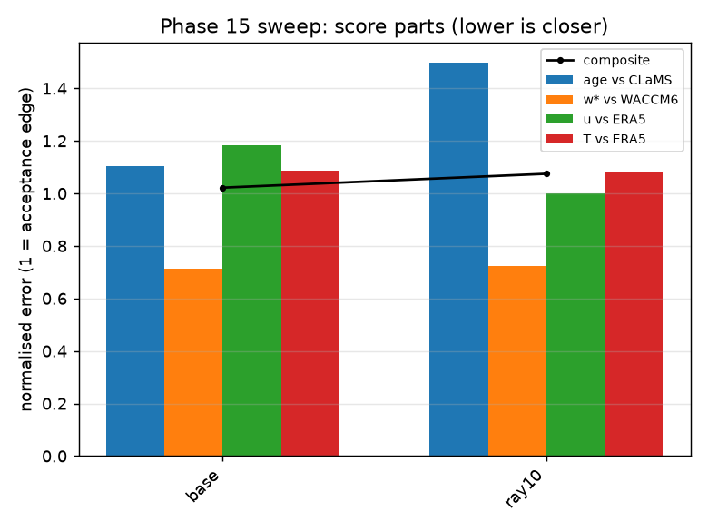
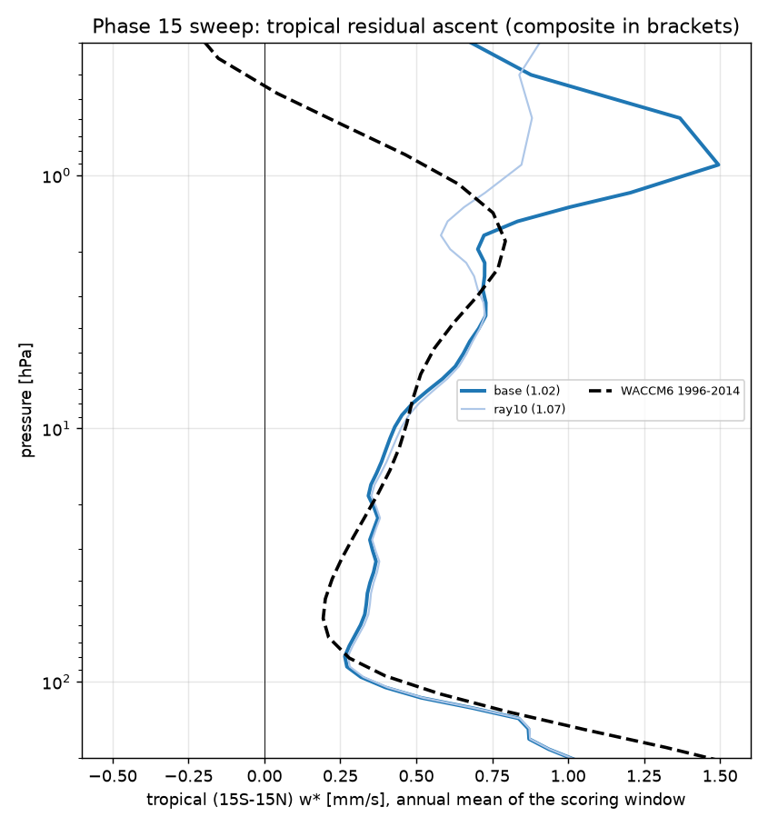
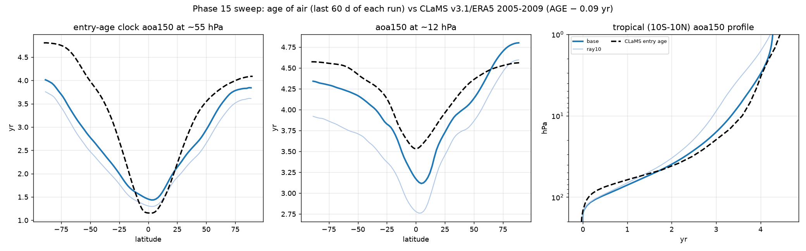

# Phase 15 — hyperparameter sweep of the dry stratosphere toward CLaMS / ERA5 (strat81, 1990–1992 per run, GPU 0)

Status: **running unattended** (tmux `strat_p15_sweep`, log `runs/p15_sweep.log`, branch `phase15-sweep`, worktree
`/data/JCM_stripped/jcm-strat-phase15`). Susanne, 2026-09-24 11:00 PDT: "I want to get stratospheric dynamics in the dry dycore of
JCM (dinosaur) that look like the ones we see in CLaMS (ERA5 reanalysis) … Make a hyperparameter sweep of the configurations to see
what gives me the best (most similar) result to CLaMS. Continuously document what you are trying and only use GPU 0 … Do not run
anything that takes longer than 48h." The leaderboard, the figures and the run log below are rewritten by the pipeline after every
run; the commit history of this directory is the time line.

## What was already tried (Phases 1–14, the state this sweep starts from)

| Phase | change | what it did to the stratosphere | record |
|---|---|---|---|
| 1–4 | dry Held-Suarez on T63L95, ERA5 nudging of u, v, T below 150 hPa (tau 6 h), passive clocks | isothermal stratosphere, no polar-night jet, tropical age 1.5 yr too old vs CLaMS | `01_dry` … `04_5yr` |
| 6 | Polvani–Kushner seasonal stratosphere (gamma 4 K/km, tau 15 d, vortex cooling faded above 3 hPa) | polar-night jets, 2 of 3 SSW winters, 6.4 K / 5.6 m/s vs ERA5; age pattern right, tropics old | `06_stratosphere` |
| 7 | time step | 12 min kept (30 min degrades the Antarctic jet) | `07_timestep` |
| 8 | QBO nudging of the tropical zonal-mean u to ERA5 (window to 1 hPa, tau 1 d, mean-preserving target) | equatorial u RMS 16 → 4 m/s, QBO 93 % of ERA5, SAO appears; age 0.1 yr younger in the tropics only | `08_qbo` |
| 9 | resolution T63/T85/T119 × L95/strat63/strat47 | age of air is not a resolution problem; strat63 chosen | `09_resolution` |
| 10–11 | production tracers, 1 hPa tracer lid relaxing the clocks to WACCM | bounds the clocks, but 20–1 hPa fills from the lid: the mesosphere is not ventilated | `10_production`, `11_lid_tracers` |
| 12 | QBO off; strat81 (all 26 L95 tropospheric layers); full ECHAM physics under the same nudging | neither dry change moves the age; full physics puts the tropical age on CLaMS but is too strong (100 hPa w* 3.6× WACCM6, no vortex, extratropics too young). Entry-age clock `aoa150` vs WACCM6 becomes the stratospheric criterion; dry runs' mesosphere is DOWNWARD above 1.5 hPa | `12_circulation` |
| 13 | Hines + Lott-Miller drag on the dry PK model (strat63 and native L95); strat81 nudged only below 400 hPa | drag closes the tropical age via a 2.6× shallow branch, extratropics 1.4 yr too young, 10 hPa ascent collapses, mesosphere still downward; L95 no change; 400 hPa cutoff ages everything 0.3–0.6 yr | `13_gwd` |
| 13b | Jucker, Fueglistaler & Vallis (2013) radiative T_e/tau in place of PK above 100 hPa (strat81), with/without drag | **best dry configuration so far**: mesosphere ventilated without drag, 10 hPa w* 0.41 (WACCM6 0.47), extratropical age right; 30 hPa stall remains (0.03 vs 0.26), tropical 55 hPa entry age 1.56 vs 1.19; drag on top repeats the Phase 13 damage | `13b_jucker` |
| 13c | Jucker + drag + 400 hPa cutoff, 10 yr, Hines with/without Lott-Miller | running on GPUs 1/2 in parallel with this sweep (started 2026-09-24 10:44 PDT) | `13c_jucker_n400` |
| 14 | full ECHAM physics free-running (no nudging), 10 yr | equatorial lower-stratospheric DESCENT, deep branch 2.8× WACCM6, no QBO: the package alone has no tropical pipe; Phase 12's "age on CLaMS" was the nudging's shallow branch | `14_free_physics` |

So the starting point is `p13_jucker` (strat81, JFV relaxation, QBO nudging to 1 hPa, ERA5 nudging < 150 hPa, no drag), and its
defects against CLaMS/WACCM6 are: (1) the 50–20 hPa stall of the tropical ascent (30 hPa w* 0.03 vs 0.26 mm/s) and with it the
old tropical 12 hPa entry age (3.67 vs 2.90); (2) a slightly weak lower branch (100/70 hPa w* 0.29/0.17 vs 0.40/0.21, tropical
55 hPa entry age 1.56 vs 1.19); (3) a mesospheric cell of only half the full-physics strength. The drag schemes at JCM defaults
over-drive the lower stratosphere instead.

## The sweep

**Base** `p15_base` = `p13_jucker` with only the analysed variables written (u, v, T, omega, p_s, `aoa150`, `aoa_sfc`, `aoa500`; still
6-hourly, see the finding below); the dynamics are identical. The base itself is not re-run: the Phase 13b segments 1990–1992 are
linked (`scripts/link_segments.py`) and scored like every other run.

**Stage 1 — one knob at a time, three years 1990–1992 each** (`scripts/phase15_matrix.txt`, in this order):

| run | family | change against the base | why |
|---|---|---|---|
| `ray10` | drag | Rayleigh drag on u, v ramping in log p from 0 at 30 hPa to 1/(10 d) at 1 hPa (`jcm_strat/rayleigh.py`) | the idealised stand-in for the missing wave drag above 30 hPa (Phase 13 plan's fallback); by downward control it should lift the 30 hPa ascent |
| `hines05` | drag | Hines only, launch 634 hPa, rms launch wind 0.5 m/s | Phase 13b open question (a): is the lower-stratospheric deposition the amplitude's? |
| `tau05` | relaxation | JFV tau × 0.5 above 100 hPa (`tau_scale`) | a faster radiative relaxation strengthens the temperature-gradient-driven cell (Phase 13b's mechanism) |
| `lm` | drag | Lott-Miller orographic drag only | the other half of the Phase 13c pair: is the shallow-branch over-drive the orographic scheme's? |
| `tau15cap` | relaxation | JFV tau capped at 15 d (`tau_max_days`) | Phase 13b: the tropical 55 hPa age got 0.25 yr older because JFV's lower-stratospheric tau is 12–39 d vs PK's 15 d |
| `hines1_l100` | drag | Hines only, default amplitude, launched at 100 hPa | no deposition between the launch and the tropopause; tests whether the Phase 13 damage was low-level deposition |
| `ray30` | drag | Rayleigh 30 → 1 hPa, 1/(30 d) at 1 hPa | a third of ray10 |
| `spongeT` | other | sponge damps winds only (no temperature damping toward 250 K in the top 4 levels) | the sponge fights the JFV T_e (150–330 K) in the top levels (Phase 13b open question) |
| `n100` | other | ERA5 nudging cutoff 150 → 100 hPa | a bracket: how much of the remaining gap is the tropopause layer (not a free-stratosphere fix) |
| `hines03` | drag | Hines only, rms launch wind 0.3 m/s | the low end of the amplitude |
| `rayzm10` | drag | ray10 on the zonal-mean wind only | eddies untouched: does it matter whether the drag acts on the waves too? |

**Stage 2** — `scripts/sweep_plan.py` combines the family winners (a member wins its family if it beats the base composite by
more than 0.02): drag winner + relaxation winner, + the "other" winner, and the neighbouring Rayleigh strength; three years each.
**Stage 3** — the best run of all stages continues its chain to 1990–1994 (the 1990–1992 segments are reused) and gets the standard
Phase 12/13 diagnostics against `p13jucker_5yr` and `p12echam_5yr` (`final/`). Before every run the remaining budget (46 h from the
start) is checked against the measured minutes per year; runs that would not fit are skipped and logged.

## A finding before the sweep: the TEM w* of Phases 12–13 depends on which hour of the day was sampled

Setting the sweep up, the scorer's w* (from the 00 UTC frames) disagreed with the Phase 13b record (from every 4th 6-hourly frame,
i.e. the 06 UTC frames). Recomputed on the 1991 segment of `p13jucker` for each daily phase separately and for all frames:

| tropical (15S–15N) w*, 1991 annual mean [mm/s] | 100 hPa | 70 hPa | 50 hPa | 30 hPa | 10 hPa |
|---|---|---|---|---|---|
| 00 UTC frames only | 0.49 | 0.48 | 0.59 | 0.50 | 0.06 |
| 06 UTC frames only (= the Phase 12/13 `--stride 4` sampling) | 0.28 | 0.17 | 0.15 | 0.11 | 0.41 |
| 12 UTC frames only | 0.29 | 0.27 | 0.35 | 0.52 | 0.97 |
| 18 UTC frames only | 0.17 | 0.17 | 0.35 | 0.54 | 0.33 |
| **all four phases (1460 frames)** | **0.31** | **0.27** | **0.36** | **0.42** | **0.44** |
| WACCM6 histSST 1996–2014 (daily-mean TEM tapes) | 0.40 | 0.21 | 0.20 | 0.26 | 0.47 |

The zonal eddy covariance v'θ' and the zonal-mean v of a single daily phase carry the model's (nudging-imprinted, aliased) tides;
the four phases differ by 0.4 mm/s at 30 hPa, more than the signal. WACCM6's tapes are daily means of the covariance, so the
all-frame mean is the like-for-like number. **Consequence for the earlier records:** the "50–20 hPa stall" of every dry
configuration (30 hPa w* 0.02–0.09 in Phases 12–13b) was measured on the 06 UTC phase, which happens to be the lowest of the four
here; with all frames the 1991 Jucker segment has 0.42 mm/s at 30 hPa (WACCM6 0.26) — no stall, if anything too strong at
50–30 hPa — while 10 hPa (0.44) and the lower branch (100 hPa 0.31 vs 0.40) barely move. The Phase 13b tropical entry age at
12 hPa (3.67 vs 2.90) therefore is not explained by a missing 30 hPa ascent. The 5-year all-frame numbers of the base come out of
this phase's final `phase12_compare --stride 1` (`final_*/vs_jucker_metrics.md`, "before" column). Everything in this sweep is
scored on all frames; the sweep therefore keeps 6-hourly output.

## Scoring (`scripts/sweep_score.py`, window = the last two years of each run, all 6-hourly frames; age = the last 60 days)

| part | model quantity | reference | normalisation |
|---|---|---|---|
| age | entry-age clock `aoa150` (reset below 150 hPa), zonal mean, cos-weighted RMSE over 100–5 hPa, \|lat\| ≤ 80° | CLaMS v3.1 / ERA5 mean age 2005–2009 minus CLaMS' own tropical age at 150 hPa (0.09 yr) | 0.5 yr |
| w* | TEM tropical (15S–15N) w* at 100 / 70 / 50 / 30 / 10 hPa, annual, eddy covariance from every 6-hourly frame; mean \|ln(model/ref)\|, floor 0.02 mm/s, cap ln 10 | WACCM6 histSST 1996–2014 daily-mean TEM tapes (CLaMS has no w*) | ln 1.5 |
| u | zonal-mean u, DJF and JJA, cos-weighted RMSE 100–1 hPa | ERA5 monthly zonal means of the same months | 5 m/s |
| T | the same for temperature | ERA5 | 5 K |

composite = mean of the four normalised parts; lower is closer; 1.0 is "every part at the edge of what Phases 12–13 called
acceptable". The surface clock `aoa_sfc` against CLaMS' AGE is reported but not scored: the dry troposphere's 500 → 100 hPa
transit puts 1.5–2 yr on it that no stratospheric knob can remove (Phase 12 addendum). Mesospheric w* (5–0.5 hPa) is reported
for the record. Three-year runs under-state the age response (the clocks start from WACCM's climatology and drift toward the
run's own circulation over ~5 yr), so the ranking leans on w*, u and T; the stage-3 five-year run gives the age its time.

## Leaderboard (rewritten by `scripts/sweep_leaderboard.py` after every run)

<!-- leaderboard:start -->
2 scored run(s) as of 2026-09-24 13:59 PDT. Composite = mean(age RMSE/0.5 yr, w* log-error/ln 1.5, u RMSE/5 m/s, T RMSE/5 K); lower is closer; the age term is the entry-age clock against CLaMS (AGE minus CLaMS' own 0.09 yr at 150 hPa), w* against WACCM6, u and T against ERA5 (same months).

**The base is still the best** (composite 1.022); no change has improved on it yet.

| rank | run | stage | composite | age RMSE `aoa150` vs CLaMS-entry [yr] | age bias | w* log-err | u RMSE [m/s] | T RMSE [K] | w* 100/70/50/30/10 hPa [mm/s] | `aoa150` 55 hPa trop / 50-70 | `aoa150` 12 hPa trop / 50-70 | `aoa_sfc` RMSE vs CLaMS | w* 1 hPa trop / NH / SH | min/yr | what |
|---|---|---|---|---|---|---|---|---|---|---|---|---|---|---|---|
| 1 | **base** | 1 | 1.022 | 0.55 | -0.25 | 0.29 | 5.9 | 5.4 | 0.32/0.28/0.34/0.36/0.43 | 1.48 / 3.22 | 3.21 / 4.29 | 0.96 | 1.50 / -2.43 / -2.63 | 32 | p13_jucker segments 1990-1992 (Phase 13b): strat81, JFV relaxation, no drag - THE BASE |
| 2 | ray10 | 1 | 1.075 | 0.75 | -0.50 | 0.29 | 5.0 | 5.4 | 0.33/0.29/0.35/0.37/0.45 | 1.33 / 2.92 | 2.82 / 3.93 | 0.87 | 0.85 / -2.32 / -2.60 | 29 | Rayleigh drag 30 -> 1 hPa, tau 10 d at 1 hPa (idealised stand-in for the missing upper-stratospheric wave drag) |
| | *references* | | | CLaMS entry age (AGE − 0.09) | | WACCM6 | ERA5 | ERA5 | 0.40/0.21/0.20/0.26/0.47 | CLaMS 1.24 / 4.03 (WACCM entry 1.11 / 3.40) | CLaMS 3.59 / 4.47 (WACCM 2.82 / 4.18) | | full ECHAM 1994: +0.96 / −1.29 / −3.19 | | |

<!-- leaderboard:end -->

## Reading the result

- The composite is a ranking device; the parts are what to look at. A run that improves w* at 30 hPa but breaks the
  extratropical age (the Phase 13 drag signature: 50–70° 55 hPa entry age falling toward 2 yr) shows up as a better w* part and a
  worse age part.
- Runs on GPUs 1/2 (Phase 13c, ten years, Jucker + drag + 400 hPa cutoff) are the other half of the picture and are not in this table;
  their record is `docs/outputs/13c_jucker_n400/`.
- Every run directory is `runs/p15_<name>_3yr` (segments `runs/p15_<name>_YYYYMMDD`), its score `scores/<name>.json`, its chain log
  `runs/p15_<name>_chain.log`; the stage-3 run adds `runs/p15_<name>_5yr` and the diagnostics in `final/`.

## Run log (appended by the pipeline)

- 2026-09-24 12:07 PDT — pipeline started (commit 4e289aa, GPU 0, budget 46 h)
- 2026-09-24 12:23 PDT — pytest and the four 5-day smokes (base, ray10, hines05, lm) passed; the sweep starts
- 2026-09-24 13:58 PDT — stage 1 **ray10** (Rayleigh drag 30 -> 1 hPa, tau 10 d at 1 hPa (idealised stand-in for the missing upper-stratospheric wave drag)): 87 min for 3 yr; [score ray10] composite 1.075 = mean(age 1.50, w* 0.72, u 1.00, T 1.08); age150 RMSE vs CLaMS-entry 0.75 yr (bias -0.50); tropical w* 100/70/50/30/10: 0.33/0.29/0.35/0.37/0.45 (WACCM 0.40/0.21/0.20/0.26/0.47); u RMSE 5.0 m/s, T RMSE 5.4 K; 29 min/yr -> /data/JCM_stripped/jcm-strat-phase15/docs/outputs/15_sweep/scores/ray10.json
