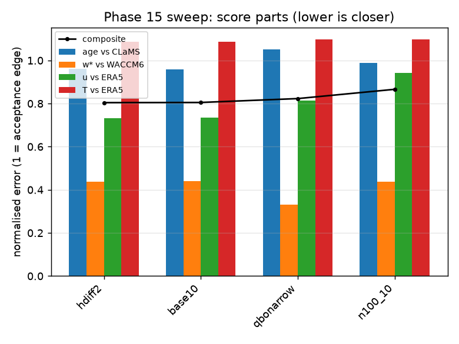
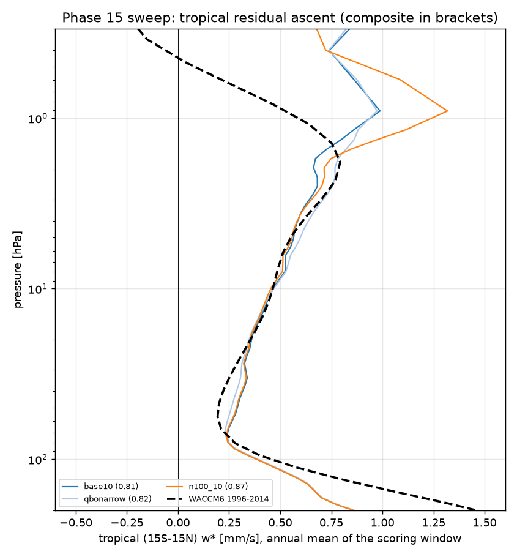
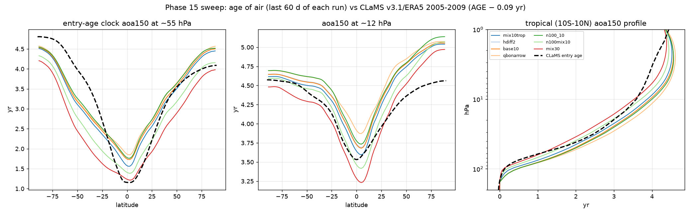

# Phase 16 — tropospheric tracer mixing and the in-mixing knobs on the Phase 15 winner (strat81, 1990–1999, GPUs 0/1/2)

Status: **running unattended** (three queues, tmux `strat_p16_A` / `_B` / `_C`, logs `runs/p16_A.log` etc., branch `phase16-mixing`,
worktree `/data/JCM_stripped/jcm-strat-phase16`). Susanne, 2026-09-28 21:30 PDT: "try all that on GPU0,1 and 2. Make your own
judgements … don't push anything online … don't run anything longer than 24h." The leaderboard, figures and run log below are
rewritten by the queues after every run; the commit history of this directory is the time line.

## Why

Phase 15 (`docs/outputs/15_sweep/`) ended with the circulation of the dry model on WACCM6 and its winds within 3.6 m/s of ERA5, but
the age of air unchanged by any circulation knob: with all 6-hourly frames the residual ascent is already on or above WACCM6 through the
whole stratosphere, so the remaining age error is not a w* problem. Two pieces remain, neither touched by Phase 15:

1. **The surface clock (CLaMS' own clock) is 2 yr too old in the tropics** (55 hPa 3.3 vs 1.3 yr) while the entry-age clock is within
   0.2 yr: the dry troposphere has no convection and no boundary-layer mixing, and air takes ~1.7 yr from 500 to 100 hPa (ECHAM 0.16;
   Phase 12 addendum). A dry *convective adjustment* would not help: under the ERA5 nudging the tropospheric temperature is already
   ERA5's, so it would have nothing to adjust and would move no tracer. What is missing is the tracer transport itself, so this phase
   adds a **tropospheric vertical tracer mixing** term (`jcm_strat/tracer_mixing.py`): Fickian vertical diffusion of every tracer,
   K m²/s below 100 hPa (full below 200 hPa), zero flux at the ends, mass-conserving, winds and temperature untouched.
2. **The entry age is 0.2 yr too old at 55 hPa in the tropics and slightly old in the extratropics with w* already too strong**, which
   points to too much in-mixing of old extratropical air into the tropical pipe, i.e. transport and numerics rather than forcing.
   Three knobs that act on that without changing the forcing: the width of the QBO nudging window (the subtropical barrier), the
   hyperdiffusion timescale, and the semi-Lagrangian departure-point iterations.

Phase 13d showed the clocks are not converged at five years, so every run here is ten years (1990–1999), scored on 1998–1999.

## Runs (`scripts/phase16_queues.txt`)

| queue / GPU | run | change against the base | what it answers |
|---|---|---|---|
| A / 0 | `base10` | Phase 15 winner (`ray30+n100`: Jucker relaxation, Rayleigh drag tau 30 d above 30 hPa, ERA5 nudging < 100 hPa) continued from its 1994 checkpoint to 1999 | the ten-year reference; how much the 5-yr ages still move |
| A / 0 | `mix10` | + tracer mixing K 10 m²/s | does tropospheric mixing bring the surface clock to CLaMS? (500–100 hPa exchange ~0.7 yr) |
| A / 0 | `mix30` | + tracer mixing K 30 m²/s | the ECHAM-like transit (~0.2 yr) |
| B / 1 | `qbonarrow` | QBO nudging window full to 10°, zero at 15° (was 15 / 25) | a freer subtropical barrier: does the tropical entry age get younger? |
| B / 1 | `hdiff2` | hyperdiffusion timescales × 2 (weaker) | numerical horizontal mixing of the dynamics |
| B / 1 | `slit2` | two semi-Lagrangian departure iterations | transport accuracy |
| C / first idle of 2, 0, 1 | `n100_10` | Phase 15's `n100` (no Rayleigh drag) to 1999 | the base without the idealised drag |
| C | `n100mix10` | `n100` + tracer mixing K 10 | does the mixing result hold without the Rayleigh drag? |
| C | `mix10trop` | tracer mixing K 10 confined to \|lat\| < 30° | deep convection is tropical; does confining it matter? |

GPU 2 carried a colleague's training job at launch; queue C takes the first idle GPU of 2, 0, 1 and skips a run that could not
finish within the 24 h budget.

## Scoring

As Phase 15 (`scripts/sweep_score.py`: entry-age clock vs CLaMS entry age over 100–5 hPa, tropical w* vs WACCM6 from all frames,
u and T vs ERA5 100–1 hPa, composite = mean of the normalised parts), plus two columns that this phase is about: the **surface
clock at 55 hPa in the tropics** (CLaMS 1.33 yr) and the **age of the 500 hPa clock at 100 hPa in the tropics** (the 500 → 100 hPa
transit; ECHAM 0.16 yr, dry base ~1.7 yr). The composite does not score the surface clock, so a mixing run is judged by those two
columns and by leaving the stratospheric parts unchanged.

## Leaderboard (rewritten by `scripts/sweep_leaderboard.py` after every run)

<!-- leaderboard:start -->
2 scored run(s) as of 2026-09-29 14:40 PDT. Composite = mean(age RMSE/0.5 yr, w* log-error/ln 1.5, u RMSE/5 m/s, T RMSE/5 K); lower is closer; the age term is the entry-age clock against CLaMS (AGE minus CLaMS' own 0.09 yr at 150 hPa), w* against WACCM6, u and T against ERA5 (same months).

| rank | run | stage | composite | age RMSE `aoa150` vs CLaMS-entry [yr] | age bias | w* log-err | u RMSE [m/s] | T RMSE [K] | w* 100/70/50/30/10 hPa [mm/s] | `aoa150` 55 hPa trop / 50-70 | `aoa150` 12 hPa trop / 50-70 | `aoa_sfc` RMSE vs CLaMS | `aoa_sfc` 55 hPa trop (CLaMS 1.33) | `aoa500` 100 hPa trop [yr] (500->100 transit) | w* 1 hPa trop / NH / SH | min/yr | what |
|---|---|---|---|---|---|---|---|---|---|---|---|---|---|---|---|---|---|
| 1 | **base10** | A | 0.805 | 0.48 | +0.20 | 0.18 | 3.7 | 5.4 | 0.35/0.24/0.29/0.33/0.47 | 1.83 / 3.74 | 3.77 / 4.73 | 1.99 | 3.92 | 1.70 | 0.99 / -2.26 / -2.57 | 30 | Phase 15 winner (Jucker, Rayleigh 30 d above 30 hPa, nudged < 100 hPa) continued from its 1994 checkpoint to 1999 - THE BASE |
| 2 | n100_10 | C | 0.866 | 0.49 | +0.25 | 0.18 | 4.7 | 5.5 | 0.35/0.24/0.29/0.33/0.46 | 1.87 / 3.80 | 3.82 / 4.78 | 2.00 | 3.94 | 1.72 | 1.32 / -2.25 / -2.61 | 29 | Phase |
| | *references* | | | CLaMS entry age (AGE − 0.09) | | WACCM6 | ERA5 | ERA5 | 0.40/0.21/0.20/0.26/0.47 | CLaMS 1.24 / 4.03 (WACCM entry 1.11 / 3.40) | CLaMS 3.59 / 4.47 (WACCM 2.82 / 4.18) | | | | full ECHAM 1994: +0.96 / −1.29 / −3.19 | | |

<!-- leaderboard:end -->

## Reading the result

- `mix*` runs should move only the surface-clock columns (`aoa_sfc` 55 hPa, `aoa500` at 100 hPa); their stratospheric parts should
  equal `base10`'s. If the entry age moves too, the mixing reaches above the tropopause (check `p_top_hpa`).
- `qbonarrow`, `hdiff2`, `slit2` should leave the surface clock alone and are judged by the entry-age columns (55 hPa tropics vs
  CLaMS 1.24 entry / WACCM6 1.11; 50–70° 4.03 / 3.40) and by w*, u, T not getting worse.
- The final diagnostics (`final/`, written by the last queue) compare every run with `base10` at stride 1 and show the mixing runs'
  surface clock against CLaMS with the Phase 13b Jucker base alongside.

## Run log (appended by the queues)

- 2026-09-29 09:41 PDT — queue B: started (commit c603cc6, GPUs 1, budget 23 h)
- 2026-09-29 09:42 PDT — queue C: **FAILED** chain n100_10 after 0 min (runs/p16_n100_10_chain.log)
- 2026-09-29 09:42 PDT — queue A: **FAILED** chain base10 after 1 min (runs/p16_base10_chain.log)
- 2026-09-29 09:43 PDT — queue A: started (commit f5e4190, GPUs 0, budget 23 h)
- 2026-09-29 09:43 PDT — queue C: started (commit f5e4190, GPUs 2 0 1, budget 23 h)
- 2026-09-29 09:51 PDT — queue C: **FAILED** chain n100_10 after 7 min (runs/p16_n100_10_chain.log)
- 2026-09-29 09:51 PDT — queue A: **FAILED** chain base10 after 7 min (runs/p16_base10_chain.log)
- 2026-09-29 09:52 PDT — queue D: started (commit 7029f54, GPUs 0 2 1, budget 23 h)
- 2026-09-29 10:56 PDT — queue A: started (commit 3105bee, GPUs 0, budget 23 h)
- 2026-09-29 10:56 PDT — queue B: started (commit 3105bee, GPUs 1, budget 23 h)
- 2026-09-29 10:56 PDT — queue C: started (commit 3105bee, GPUs 2 0 1, budget 23 h)
- 2026-09-29 10:57 PDT — queue D: started (commit 3105bee, GPUs 0 2 1, budget 23 h)
- 2026-09-29 10:57 PDT — queue D: **FAILED** chain base10 after 0 min (runs/p16_base10_chain.log)
- 2026-09-29 10:59 PDT — relaunch: the 09:4x tmux kills had left duplicate queue-A/C scripts alive (two copies fought over GPUs 0/2, losers on the CPU); everything killed at 10:55, partial segments removed, A/B/C relaunched once at 10:57 (A and C re-run base10 / n100_10 themselves as their first entries); queue D and the watchdog withdrawn at 11:05 (D raced A for GPU 0). Final diagnostics again run by the last of A/B/C.
- 2026-09-29 13:35 PDT — queue A: **base10** (Phase 15 winner (Jucker, Rayleigh 30 d above 30 hPa, nudged < 100 hPa) continued from its 1994 checkpoint to 1999 - THE BASE): 150 min for 5 new year(s); [score base10] composite 0.805 = mean(age 0.96, w* 0.44, u 0.73, T 1.09); age150 RMSE vs CLaMS-entry 0.48 yr (bias +0.20); tropical w* 100/70/50/30/10: 0.35/0.24/0.29/0.33/0.47 (WACCM 0.40/0.21/0.20/0.26/0.47); u RMSE 3.7 m/s, T RMSE 5.4 K; 30 min/yr -> /data/JCM_stripped/jcm-strat-phase16/docs/outputs/16_mixing/scores/base10.json
- 2026-09-29 13:35 PDT — queue C: **n100_10** (Phase): 150 min for 5 new year(s); [score n100_10] composite 0.866 = mean(age 0.99, w* 0.44, u 0.94, T 1.10); age150 RMSE vs CLaMS-entry 0.49 yr (bias +0.25); tropical w* 100/70/50/30/10: 0.35/0.24/0.29/0.33/0.46 (WACCM 0.40/0.21/0.20/0.26/0.47); u RMSE 4.7 m/s, T RMSE 5.5 K; 29 min/yr -> /data/JCM_stripped/jcm-strat-phase16/docs/outputs/16_mixing/scores/n100_10.json
- 2026-09-29 14:40 PDT — queue A: **FAILED** chain mix10 after 64 min (runs/p16_mix10_chain.log)
