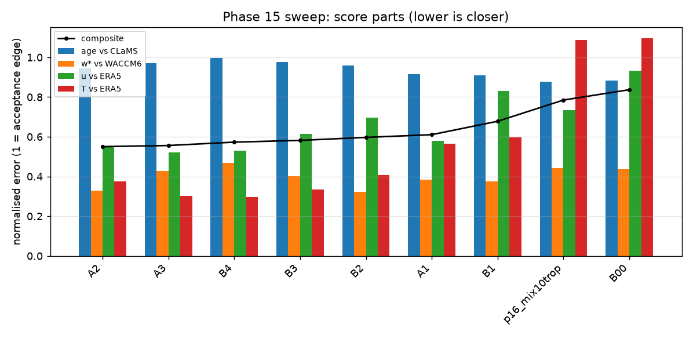
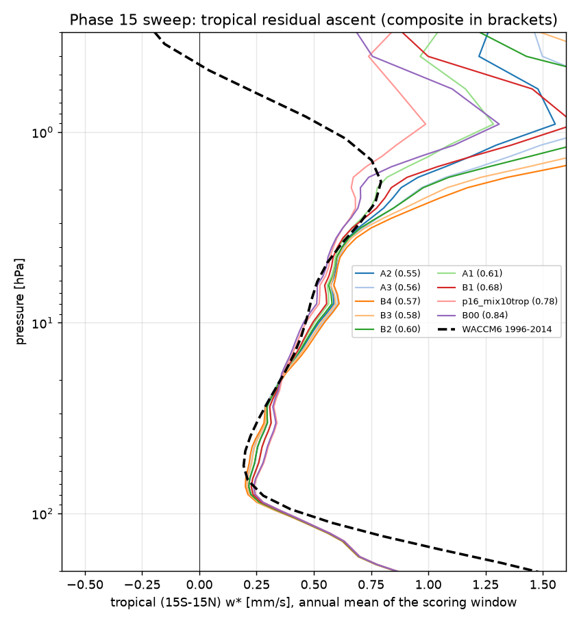
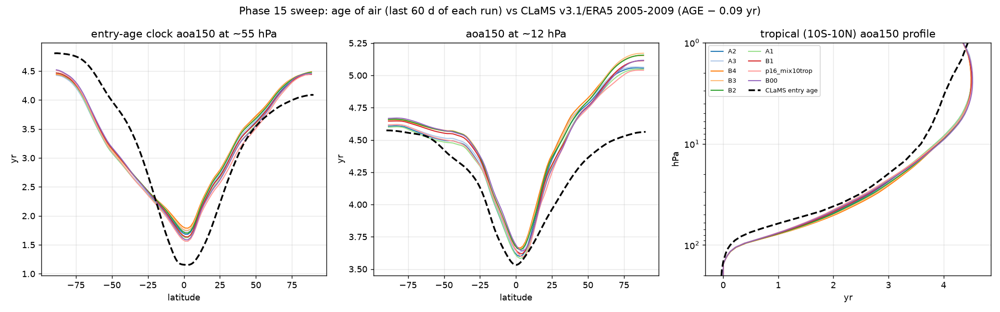

# Phase 17 — re-optimising the JFV equilibrium temperature toward ERA5 (strat81, GPUs 0/1/2)

Status: **running unattended** (tmux `strat_p17_A` / `strat_p17_B` / `strat_p17_B0`, logs `runs/p17_<track>.log`, branch
`phase17-teq`, worktree `/data/JCM_stripped/jcm-strat-phase17`). Susanne, 2026-10-01 01:00 PDT: "Yes, you can use GPU 0,1 and 2. I need
age of air to look like that of CLaMS, and the tropical upwelling needs to match ERA5 better too." The leaderboard and the run log
below are rewritten by the tracks after every run; nothing is pushed.

## Why

Susanne's reading of Phase 16: too much mixing, the waves break in the wrong place. The Phase 16 base (`p16_base10`, 1998–1999) against
ERA5 supports it:

* **Both winter jets sit too far equatorward.** JJA 60°S 5–30 hPa is 7–14 m/s too weak (10 hPa: 60 vs 73 m/s) while 30–40°S 20–50 hPa
  is 4–5 m/s too strong; DJF 60–80°N is 3–5 m/s too weak and 30–40°N 10–50 hPa 5–9 m/s too strong. Planetary waves propagate only in
  westerlies, so excess subtropical westerlies let them reach the edge of the tropical pipe and mix old air into it — the tropical entry
  age that is too old and still rising at ten years.
* **The subtropical jet error has one temperature source:** the tropical lower stratosphere is uniformly 3–6 K too warm at 50–70 hPa.
  Inside the QBO nudging window (|lat| < 25°) u is held to ERA5, so the offset shows up through thermal wind just outside it, as
  excess westerly shear 100→50 hPa at 30–40°.
* **The warm SH winter vortex is partly the Rayleigh drag:** SH winter cap 10–50 hPa +2.7 K without drag, +5.0 K with `ray30`,
  +7.1 K in the ten-year `ray30+n100` (u 10 hPa 60°S ~60 vs 73–75 m/s in all of them). The drag's induced circulation warms the pole.
* The upper stratosphere (1–5 hPa) is 5–15 K too warm everywhere, where tau is ~5 d and T follows T_e: JFV's radiative T_e is
  10–23 K warmer than ERA5 in the tropics there.

The JFV T_e is a radiative calculation, never tuned for this model (ERA5 nudging below 100 hPa, drag, strat81 lid). Correcting it so the
monthly zonal-mean T matches ERA5 matches the meridional gradients, and through thermal wind (from the nudged 100 hPa level up) the
jets that decide where the waves break. In steady state w* is set by the wave drag, not by T_e, so the correction moves T and u and
should leave the forcing of the circulation alone — except through where the waves now propagate and break, which is the point.

## Method

* `JuckerColumns(te_correction_file=...)` (`jcm_strat/jucker.py`): an additive dT_e(month, p, lat) in K on the JFV T_e, interpolated
  like the JFV table, applied above p_bd through the same blend; null = Phase 16 exactly.
* `scripts/teq_correction.py`: dT_e(new) = dT_e(prev) − 0.7 · S[T_model − T_ERA5], monthly zonal means, model over the last two years
  (every 6-hourly frame) vs the **ERA5 1990–1999 climatology** (not the same years: the correction should not chase individual
  warmings), ERA5 levels 100–1 hPa; S = 1-2-1 twice in latitude, once periodic in month; zero at and below 100 hPa, the 1 hPa value
  tapered linearly in log p to zero at 0.1 hPa (ERA5 stops at 1 hPa); capped at ±25 K. No region masks: a mask edge is itself a
  gradient. The correction files are tracked in `corrections/`.
* **ERA5 upwelling reference (new):** every w* until Phase 16 was compared with WACCM6 (the WeatherBench2 store stops at 50 hPa, the
  cached ERA5 zonal means are monthly, without eddy fluxes). `scripts/fetch_era5_tem.py` pulls 6-hourly v, T on 1–250 hPa (2.5°) from the
  CDS and keeps monthly means of [v], [T], [v'T'] (`cache/era5_ref/era5_tem_monthly_<Y>.nc`); `scripts/sweep_score.py` computes ERA5 w*
  of the window's own years with the same TEM code and, when present, scores w* against ERA5 instead of WACCM6 (`w_logerr_waccm` keeps
  the old number). Also new in the score: the **subtropical barrier age** (aoa150 at 55 hPa, 25–35° minus 0–10°) against CLaMS — the
  direct check on in-mixing.
* **Iterations** (`scripts/phase17_run.sh <track>`): each iteration runs 1998–1999 from Phase 16 `mix10trop`'s 1997 checkpoint (clocks
  eight years old; the 1990–1997 segments are links), scored on 1998–1999; at most four iterations, stop when the T RMSE gains < 0.2 K.
  Then the track's last correction runs **ten years 1990–1999 from ERA5 initial conditions** (ages comparable with Phase 16), with
  `aoa_vs_clams` and `phase12_compare` (stride 1) against `mix10trop` into `final/`.

## Tracks

| track / GPU | start | change | what it answers |
|---|---|---|---|
| A / 0 | Phase 16 `mix10trop` (Jucker, Rayleigh 30 d above 30 hPa, nudged < 100 hPa, tracer mixing K 10 at \|lat\| < 30°) — best Phase 16 age | T_e iterations A1…A4, then `A_final` (10 yr) | does an ERA5-like T (and so u) fix where the waves break, the barrier, the ages? |
| B / 1 | the same without the Rayleigh drag | T_e iterations B1…B4, then `B_final` (10 yr) | can a right T_e do the drag's job (NH vortex) without its spurious circulation and warm SH vortex? |
| B0 / 2 | the same without the Rayleigh drag | no correction (one 1998–1999 run) | attribution: the drag removal alone |

Iteration 0 of A is `mix10trop` itself (scored here as `p16_mix10trop` with the new score). GPU 2 is free after B0; a w*-targeted
follow-up is decided once the ERA5 w* reference is in (see the run log).

## Leaderboard

<!-- leaderboard:start -->
9 scored run(s) as of 2026-09-30 23:31 PDT. Composite = mean(age RMSE/0.5 yr, w* log-error/ln 1.5, u RMSE/5 m/s, T RMSE/5 K); lower is closer; the age term is the entry-age clock against CLaMS (AGE minus CLaMS' own 0.09 yr at 150 hPa), w* against WACCM6, u and T against ERA5 (same months).

**Best so far: `A2`** — mix10trop (Jucker + Rayleigh 30 d + tropical tracer mixing), iteration 2 (1998-1999 from mix10trop 1997): composite 0.550 (base 0.785); age RMSE 0.47 (base 0.44) yr, bias +0.16 (base +0.12); tropical w* 100/70/50/30/10 hPa 0.34/0.22/0.25/0.30/0.53 (base 0.35/0.24/0.29/0.33/0.47, WACCM6 0.40/0.21/0.20/0.26/0.47); u RMSE 2.7 (base 3.7) m/s, T RMSE 1.9 (base 5.4) K; `aoa150` 55 hPa tropics 1.78 (base 1.68) / 50-70 3.70 (base 3.68), 12 hPa tropics 3.67 (base 3.69) yr; cost 34 (base 34) min/yr.

Closer than the base (0.785): A2, A3, B4, B3, B2, A1, B1. Further from it: B00.

| rank | run | stage | composite | age RMSE `aoa150` vs CLaMS-entry [yr] | age bias | w* log-err | u RMSE [m/s] | T RMSE [K] | w* 100/70/50/30/10 hPa [mm/s] | `aoa150` 55 hPa trop / 50-70 | `aoa150` 12 hPa trop / 50-70 | `aoa_sfc` RMSE vs CLaMS | `aoa_sfc` 55 hPa trop (CLaMS 1.33) | `aoa500` 100 hPa trop [yr] (500->100 transit) | w* 1 hPa trop / NH / SH | w* ref | ERA5 w* 100/70/50/30/10 | barrier age 55 hPa (25-35 minus 0-10) | min/yr | what |
|---|---|---|---|---|---|---|---|---|---|---|---|---|---|---|---|---|---|---|---|---|
| 1 | **A2** | A | 0.550 | 0.47 | +0.16 | 0.13 | 2.7 | 1.9 | 0.34/0.22/0.25/0.30/0.53 | 1.78 / 3.70 | 3.67 / 4.71 | 1.28 | 2.95 | 1.07 | 1.55 / -2.00 / -2.34 | ERA5 | 0.42/0.24/0.27/0.33/0.44 | 0.92 | 34 | mix10trop (Jucker + Rayleigh 30 d + tropical tracer mixing), iteration 2 (1998-1999 from mix10trop 1997) |
| 2 | A3 | A | 0.556 | 0.49 | +0.18 | 0.17 | 2.6 | 1.5 | 0.33/0.21/0.23/0.28/0.54 | 1.83 / 3.72 | 3.70 / 4.73 | 1.31 | 3.01 | 1.09 | 1.81 / -1.88 / -2.24 | ERA5 | 0.42/0.24/0.27/0.33/0.44 | 0.89 | 34 | mix10trop (Jucker + Rayleigh 30 d + tropical tracer mixing), iteration 3 (1998-1999 from mix10trop 1997) |
| 3 | B4 | B | 0.573 | 0.50 | +0.22 | 0.19 | 2.6 | 1.5 | 0.33/0.20/0.22/0.29/0.55 | 1.88 / 3.77 | 3.74 / 4.77 | 1.33 | 3.06 | 1.10 | 2.52 / -1.65 / -2.04 | ERA5 | 0.42/0.24/0.27/0.33/0.44 | 0.90 | 34 | mix10trop without the Rayleigh drag, iteration 4 (1998-1999 from mix10trop 1997) |
| 4 | B3 | B | 0.582 | 0.49 | +0.22 | 0.16 | 3.1 | 1.7 | 0.33/0.21/0.23/0.29/0.53 | 1.85 / 3.76 | 3.73 / 4.77 | 1.32 | 3.02 | 1.09 | 2.28 / -1.73 / -2.16 | ERA5 | 0.42/0.24/0.27/0.33/0.44 | 0.92 | 34 | mix10trop without the Rayleigh drag, iteration 3 (1998-1999 from mix10trop 1997) |
| 5 | B2 | B | 0.597 | 0.48 | +0.21 | 0.13 | 3.5 | 2.0 | 0.34/0.22/0.25/0.30/0.52 | 1.81 / 3.76 | 3.73 / 4.77 | 1.30 | 2.97 | 1.08 | 1.99 / -1.92 / -2.30 | ERA5 | 0.42/0.24/0.27/0.33/0.44 | 0.95 | 34 | mix10trop without the Rayleigh drag, iteration 2 (1998-1999 from mix10trop 1997) |
| 6 | A1 | A | 0.611 | 0.46 | +0.14 | 0.16 | 2.9 | 2.8 | 0.34/0.23/0.27/0.31/0.51 | 1.73 / 3.69 | 3.66 / 4.69 | 1.24 | 2.89 | 1.05 | 1.28 / -2.15 / -2.45 | WACCM6 | —/—/—/—/— | 0.94 | 34 | mix10trop (Jucker + Rayleigh 30 d + tropical tracer mixing), iteration 1 (1998-1999 from mix10trop 1997) |
| 7 | B1 | B | 0.678 | 0.45 | +0.17 | 0.15 | 4.2 | 3.0 | 0.34/0.23/0.27/0.31/0.50 | 1.75 / 3.73 | 3.70 / 4.74 | 1.26 | 2.90 | 1.06 | 1.64 / -2.17 / -2.49 | WACCM6 | —/—/—/—/— | 0.97 | 34 | mix10trop without the Rayleigh drag, iteration 1 (1998-1999 from mix10trop 1997) |
| 8 | p16_mix10trop | ref | 0.785 | 0.44 | +0.12 | 0.18 | 3.7 | 5.4 | 0.35/0.24/0.29/0.33/0.47 | 1.68 / 3.68 | 3.69 / 4.69 | 1.21 | 2.82 | 1.03 | 0.99 / -2.26 / -2.57 | WACCM6 | —/—/—/—/— | 0.95 | 34 | Phase 16 mix10trop (the start state of every Phase 17 track) |
| 9 | B00 | B0 | 0.837 | 0.44 | +0.16 | 0.18 | 4.7 | 5.5 | 0.35/0.24/0.29/0.33/0.46 | 1.70 / 3.73 | 3.73 / 4.74 | 1.23 | 2.84 | 1.04 | 1.31 / -2.23 / -2.60 | WACCM6 | —/—/—/—/— | 0.99 | 34 | mix10trop without the Rayleigh drag, NO T_e correction, iteration 0 (1998-1999 from mix10trop 1997) |
| | *references* | | | CLaMS entry age (AGE − 0.09) | | WACCM6 | ERA5 | ERA5 | 0.40/0.21/0.20/0.26/0.47 | CLaMS 1.24 / 4.03 (WACCM entry 1.11 / 3.40) | CLaMS 3.59 / 4.47 (WACCM 2.82 / 4.18) | | | | full ECHAM 1994: +0.96 / −1.29 / −3.19 | | | CLaMS 1.57 | | |

<!-- leaderboard:end -->

## Results

_to be written when the tracks finish_

## Run log
- 2026-09-30 18:26 PDT — track A: started (mix10trop (Jucker + Rayleigh 30 d + tropical tracer mixing); GPU 0, commit 1ecb291, 4 iterations, alpha 0.7)
- 2026-09-30 18:26 PDT — track B: started (mix10trop without the Rayleigh drag; GPU 1, commit 1ecb291, 4 iterations, alpha 0.7)
- 2026-09-30 18:26 PDT — track B0: started (mix10trop without the Rayleigh drag, NO T_e correction; GPU 2, commit 1ecb291, 0 iterations, alpha 0.7)
- 2026-09-30 19:44 PDT — track A: **A1** (mix10trop (Jucker + Rayleigh 30 d + tropical tracer mixing), iteration 1 (1998-1999 from mix10trop 1997)): [score A1] composite 0.611 = mean(age 0.92, w* 0.38, u 0.58, T 0.56); age150 RMSE vs CLaMS-entry 0.46 yr (bias +0.14); tropical w* 100/70/50/30/10: 0.34/0.23/0.27/0.31/0.51 (WACCM 0.40/0.21/0.20/0.26/0.47); barrier age 55 hPa 0.94 (CLaMS 1.57); u RMSE 2.9 m/s, T RMSE 2.8 K; 34 min/yr -> /data/JCM_stripped/jcm-strat-phase17/docs/outputs/17_teq/scores/A1.json
- 2026-09-30 19:45 PDT — track B: **B1** (mix10trop without the Rayleigh drag, iteration 1 (1998-1999 from mix10trop 1997)): [score B1] composite 0.678 = mean(age 0.91, w* 0.38, u 0.83, T 0.60); age150 RMSE vs CLaMS-entry 0.45 yr (bias +0.17); tropical w* 100/70/50/30/10: 0.34/0.23/0.27/0.31/0.50 (WACCM 0.40/0.21/0.20/0.26/0.47); barrier age 55 hPa 0.97 (CLaMS 1.57); u RMSE 4.2 m/s, T RMSE 3.0 K; 34 min/yr -> /data/JCM_stripped/jcm-strat-phase17/docs/outputs/17_teq/scores/B1.json
- 2026-09-30 19:45 PDT — track B0: **B00** (mix10trop without the Rayleigh drag, NO T_e correction, iteration 0 (1998-1999 from mix10trop 1997)): [score B00] composite 0.837 = mean(age 0.88, w* 0.44, u 0.93, T 1.10); age150 RMSE vs CLaMS-entry 0.44 yr (bias +0.16); tropical w* 100/70/50/30/10: 0.35/0.24/0.29/0.33/0.46 (WACCM 0.40/0.21/0.20/0.26/0.47); barrier age 55 hPa 0.99 (CLaMS 1.57); u RMSE 4.7 m/s, T RMSE 5.5 K; 34 min/yr -> /data/JCM_stripped/jcm-strat-phase17/docs/outputs/17_teq/scores/B00.json
- 2026-09-30 19:46 PDT — track B0: finished
- 2026-09-30 21:00 PDT — track B: **B2** (mix10trop without the Rayleigh drag, iteration 2 (1998-1999 from mix10trop 1997)): [score B2] composite 0.597 = mean(age 0.96, w* 0.32, u 0.70, T 0.41); age150 RMSE vs CLaMS-entry 0.48 yr (bias +0.21); tropical w* 100/70/50/30/10: 0.34/0.22/0.25/0.30/0.52 (WACCM 0.40/0.21/0.20/0.26/0.47; ERA5 0.42/0.24/0.27/0.33/0.44); barrier age 55 hPa 0.95 (CLaMS 1.57); u RMSE 3.5 m/s, T RMSE 2.0 K; 34 min/yr -> /data/JCM_stripped/jcm-strat-phase17/docs/outputs/17_teq/scores/B2.json
- 2026-09-30 21:00 PDT — track A: **A2** (mix10trop (Jucker + Rayleigh 30 d + tropical tracer mixing), iteration 2 (1998-1999 from mix10trop 1997)): [score A2] composite 0.550 = mean(age 0.94, w* 0.33, u 0.55, T 0.38); age150 RMSE vs CLaMS-entry 0.47 yr (bias +0.16); tropical w* 100/70/50/30/10: 0.34/0.22/0.25/0.30/0.53 (WACCM 0.40/0.21/0.20/0.26/0.47; ERA5 0.42/0.24/0.27/0.33/0.44); barrier age 55 hPa 0.92 (CLaMS 1.57); u RMSE 2.7 m/s, T RMSE 1.9 K; 34 min/yr -> /data/JCM_stripped/jcm-strat-phase17/docs/outputs/17_teq/scores/A2.json
- 2026-09-30 22:14 PDT — track A: **A3** (mix10trop (Jucker + Rayleigh 30 d + tropical tracer mixing), iteration 3 (1998-1999 from mix10trop 1997)): [score A3] composite 0.556 = mean(age 0.97, w* 0.43, u 0.52, T 0.30); age150 RMSE vs CLaMS-entry 0.49 yr (bias +0.18); tropical w* 100/70/50/30/10: 0.33/0.21/0.23/0.28/0.54 (WACCM 0.40/0.21/0.20/0.26/0.47; ERA5 0.42/0.24/0.27/0.33/0.44); barrier age 55 hPa 0.89 (CLaMS 1.57); u RMSE 2.6 m/s, T RMSE 1.5 K; 34 min/yr -> /data/JCM_stripped/jcm-strat-phase17/docs/outputs/17_teq/scores/A3.json
- 2026-09-30 22:14 PDT — track B: **B3** (mix10trop without the Rayleigh drag, iteration 3 (1998-1999 from mix10trop 1997)): [score B3] composite 0.582 = mean(age 0.98, w* 0.40, u 0.61, T 0.33); age150 RMSE vs CLaMS-entry 0.49 yr (bias +0.22); tropical w* 100/70/50/30/10: 0.33/0.21/0.23/0.29/0.53 (WACCM 0.40/0.21/0.20/0.26/0.47; ERA5 0.42/0.24/0.27/0.33/0.44); barrier age 55 hPa 0.92 (CLaMS 1.57); u RMSE 3.1 m/s, T RMSE 1.7 K; 34 min/yr -> /data/JCM_stripped/jcm-strat-phase17/docs/outputs/17_teq/scores/B3.json
- 2026-09-30 23:31 PDT — track B: **B4** (mix10trop without the Rayleigh drag, iteration 4 (1998-1999 from mix10trop 1997)): [score B4] composite 0.573 = mean(age 1.00, w* 0.47, u 0.53, T 0.30); age150 RMSE vs CLaMS-entry 0.50 yr (bias +0.22); tropical w* 100/70/50/30/10: 0.33/0.20/0.22/0.29/0.55 (WACCM 0.40/0.21/0.20/0.26/0.47; ERA5 0.42/0.24/0.27/0.33/0.44); barrier age 55 hPa 0.90 (CLaMS 1.57); u RMSE 2.6 m/s, T RMSE 1.5 K; 34 min/yr -> /data/JCM_stripped/jcm-strat-phase17/docs/outputs/17_teq/scores/B4.json
